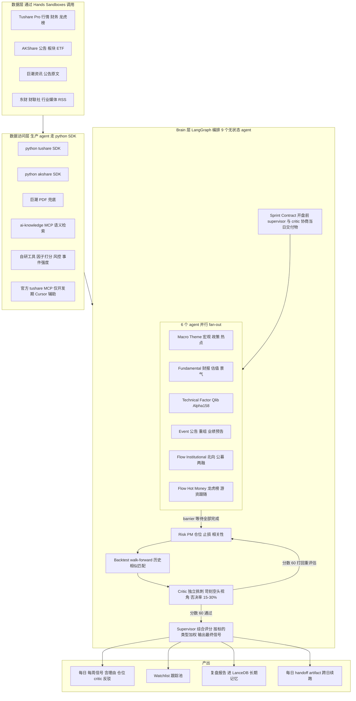

# A 股投资 Agent 系统：编排式多 Agent + 数据驱动决策框架

## 一、独立专业判断（动手前必须对齐）

作为顾问我必须把以下事实摆在前面，再投入资源：

1. **短周期 alpha 难，LLM 不是银弹，但"防御性 alpha"完全可达**。1 周-1 个月窗口由资金面 + 情绪 + 政策驱动，机构拼速度和数据深度，LLM 读公开信息很难稳定战胜机构（这是"进攻性 alpha"）。但 A 股散户成交量占比 60-70%、80% 散户长期亏损，**主要原因是行为错误（追涨杀跌、不止损、过度交易、加杠杆、消息面冲动），而不是认知问题**。一个能做到"信息整合 + 系统化纪律 + 强制风控"的 agent，**确实能让你跳出"行为韭菜"陷阱**——这是真实价值，且可达成。
2. **目标必须可衡量**——不要"战胜韭菜"这种空目标，重新定义为三层：
  - **防御目标（必达）**：避免 80% 散户的典型行为错误，**年最大回撤 ≤ 20%**
  - **进攻目标（争取）**：年化收益跑赢沪深 300 + 5%（即 alpha 5%，已是公募中位数水平）
  - **学习目标**：每月复盘所有错单进 findings.md，让系统累进进化
  - **达到前两个就站在 A 股个人投资者前 10%**——不是因为打败了韭菜，是因为没成为韭菜
3. **你的真实优势在中线波段**。你已经选对了——中线 2 周-3 个月窗口，行业景气 + 技术形态 + 估值修复都能发挥作用，agent 价值最大。题材博弈用小仓做"练手 + 试错"是对的，**严格设单标的 ≤ 3% 仓位上限**。
4. **回测必须防 look-ahead bias**。LLM 知识截止后的信息会"穿越"，必须做严格的信息切片（按交易日截断所有输入）+ walk-forward 滚动验证，否则回测结果是自欺欺人。
5. **半自动是正确选择**。全自动接券商需要 QMT/Ptrade（个人门槛高 + 风险大），先做半自动信号、人工执行 6-12 个月，跑出真实 PnL 后再决定是否升级。
6. **成本现实**：tushare Pro 6000 积分约 600 元/年（已确认方案，解锁同花顺 ths 板块系列 + hm_list 游资名录 + block_trade 大宗营业部 + stk_surv 机构调研）+ 研报接口已计划单独申请。**重要 limitation**：`hk_hold`（沪深港通个股持股明细）2024-08-20 后改季度披露，个股级日度北向数据需用 akshare 兜底（东财公开数据仍有），全市场北向日度总量 `moneyflow_hsgt` 仍可用。
7. **A 股 alpha 的两条腿**：经过华工科技、汇绿生态两个真实案例的事前推演，确认 A 股个人投资者可触达的 alpha 来源主要两类——**(A) 基本面驱动 + 题材共振**（如华工科技：CPO 龙头 + 业绩超预期 + 高频催化），**(B) 事件驱动 + 游资接力**（如汇绿生态：重组 + 业务切换 + 顶级游资入场）。架构必须同时覆盖这两条腿，所以 flow agent 拆为机构资金 + 游资两个子模块，并新增 event agent。
8. **工程层（harness）和业务层（agent 设计）必须独立投入**。参考 Anthropic 2026 年 [Harness design for long-running apps](https://www.anthropic.com/engineering/harness-design-long-running-apps) 和 [Scaling Managed Agents](https://www.anthropic.com/engineering/managed-agents)：**harness 假设会随模型升级过时**（Sonnet 4.5 需要 context resets，Opus 4.5 不需要）。如果只投入业务层（agent 设计、数据接口、回测、风控），跑 2-3 个月后会进入"调一次坏一次"的不可维护状态。**核心原则：解耦 Brain（无状态 harness）/ Hands（独立 sandbox 进程）/ Session（durable event log）三件套，凭证永不入 context，每季度 review harness 剥离冗余组件**。详见第十三节。

## 二、整体架构

本节是**业务流程视角**——展示 agent 如何协同产出信号。**技术工程视角**（Brain/Hands/Session 三件套解耦、独立 sandbox 进程、凭证 vault）见第十三节。




**关键设计原则**（融合 Anthropic [多 agent 研究系统](https://www.anthropic.com/engineering/multi-agent-research-system) + [Harness design](https://www.anthropic.com/engineering/harness-design-long-running-apps) + [Managed Agents](https://www.anthropic.com/engineering/managed-agents) 三篇方法论）：

- **Supervisor 不做决策，只编排和综合**。每个子 agent 只对自己专业域负责，避免"全能 agent"幻觉。
- **工具按需加载**（advanced tool use 模式），子 agent 只看到自己需要的 MCP 工具，避免 token 膨胀。
- **每个信号必须可审计**：包含数据来源、agent 推理链、置信度、critic 反方观点（独立挑刺非自评）。
- **Critic 独立 GAN 模式**：不能让 supervisor 自评，必须独立 agent + 独立 LLM context 做对抗式评审，否则 self-evaluation 必然失败。
- **每日 Sprint Contract**：开盘前 supervisor 和 critic 协商当日股票池范围 + 必出信号集 + 验收标准 + 风险红线，避免 supervisor 跑偏。
- **Brain / Hands / Session 三件套解耦**：所有 agent 是无状态 brain（pet vs cattle），数据 / 回测 / 风控 / 执行是独立 sandbox 进程，事件 / 记忆 / 复盘存 durable session（详见第十三节）。
- **凭证永不入 context**：tushare token / 券商账号 / LLM API key 通过 vault 代理注入，agent 全程不可见。

## 三、技术栈选型（最终方案）

- **编排**：[LangGraph](https://langchain-ai.github.io/langgraph/) — 节点 + 状态显式定义，确定性执行，可审计
- **量化底座**：[Microsoft Qlib](https://github.com/microsoft/qlib)（GitHub 40K+ stars）+ [RD-Agent](https://github.com/microsoft/RD-Agent)（NeurIPS 2025）。**作为工具集使用，不用其策略层**（策略层由我们的 LLM agent 取代）：
  - Qlib 用途 1（MVP 必用）：**Alpha158/360 因子库**，Technical/Factor Agent 直接调用，省去自写 158 个技术因子的 1-2 个月开发量
  - Qlib 用途 2（MVP 必用）：**walk-forward 回测引擎**，自动处理交易日历 / 复权 / 停复牌 / 分红，跑在 Backtest Sandbox 进程中
  - Qlib 用途 3（按需）：高速 binary 数据存储（性能瓶颈出现时使用）
  - Qlib 用途 4（不太用）：20+ ML 模型库（我们以 LLM 决策为主，传统 ML 模型用得少）
  - RD-Agent 定位：**Phase 4 后期升级**——自动因子挖掘 + 因子-模型联合优化，跑稳定后用它持续给 Technical Agent 喂新因子
- **轻量回测**：[vectorbt](https://github.com/polakowo/vectorbt)（向量化快速验证）+ [backtrader](https://www.backtrader.com/)（事件驱动精细回测）
- **数据 SDK**：[tushare](https://tushare.pro/) Pro + [akshare](https://akshare.akfamily.xyz/) + [efinance](https://github.com/Micro-sheep/efinance)（备用）。**生产 agent 直接 import python SDK**（走 router.py + vault 代理），**不走 MCP**——MCP 是给 LLM 客户端对话用的，agent 自动化代码用 SDK 更直接、更可调试
- **tushare 官方 MCP**（[doc 463](https://tushare.pro/document/1?doc_id=463)）：仅作**开发期 Cursor 内人工查数辅助**，URL 直连零部署，配置在 `~/.cursor/mcp.json` 用 `${TUSHARE_TOKEN}` env 注入避免明文泄漏。**不用第三方本地 MCP server**（erwanjun/tushare-mcp-server 等）
- **LLM**：**Kimi 一家全覆盖 + 四 Tier 调用策略**（已确认方案，运维最简 + 月成本 ¥700-1000）
  - **统一模型**：[kimi-k2.6](https://platform.kimi.com/docs/guide/kimi-k2-6-quickstart)（256K 上下文 / 原生中文金融语境 / 支持 thinking 开关 / [tool use 标准 OpenAI 格式](https://platform.moonshot.cn/docs/api/tool-use)）
  - **Tier A 实时核心决策**（同步 API + thinking 开启 + max_tokens=32768）：Supervisor / Critic / Risk Agent
  - **Tier B 实时业务 agent**（同步 API + thinking 按需）：Macro/Theme（thinking 开）/ Event（thinking 开）/ Flow Hot Money（thinking 开）/ Fundamental（thinking 关，召回优先）/ Technical（thinking 关）/ Flow Institutional（thinking 关）
  - **Tier C 准实时批量**（[Batch API](https://platform.kimi.com/docs/guide/use-batch-api) 60% 价 / 24h 完成窗口）：每日公告解析（200-1000 条）/ 研报每日摘要 / 行业 RSS 摘要 / 舆情打标 —— **T 日 16:00 收盘后启动 → 次日 8:30 开盘前结果 ready**
  - **Tier D 离线一次性回填**（Batch API 60% 价）：历史 5 年公告事件分类（数十万条）/ 历史业绩预告超预期样本 / 历史研报库 / 金标准案例数据切片
  - **关键约束**（K2.6 系列参数固化）：temperature/top_p/n/presence_penalty/frequency_penalty 全部官方强制，**只能调** thinking/tools/tool_choice/max_tokens/messages
  - **缓存优化**（重复 prompt 极便宜，¥0.16/M 读）：sprint contract / 5 段式 system prompt 等稳定 prompt 走缓存，再省 30%
- **向量库**：本地 [LanceDB](https://lancedb.github.io/lancedb/)（长期记忆 3 个 collection：信号 / 错单 / 知识）
- **任务调度**：[Prefect](https://www.prefect.io/) 或简单 cron + Python（每日 16:00 收盘后跑）
- **存储**：DuckDB（Session event log + 本地分析）+ Parquet（行情快照）+ SQLite（LangGraph checkpointer + 信号 / 持仓）

> **Harness 工程层（observability/vault/sandbox 进程化/checkpointer）的具体技术选型见第十三节 13.5**——本节只列业务层核心库，避免重复。

## 四、数据与接口申请清单（按优先级）

**接口路由原则**（重要）：tushare 与 akshare 不是替代关系，而是互补——**结构化标准数据走 tushare，半结构化聚合数据走 akshare**。在 `src/sandboxes/data/router.py` 里做统一路由层，**作为 Data Sandbox 的入口**（详见第十三节 13.2 三件套架构）。业务代码（agent）只调 `execute("data", "<api_name>", input)` 接口，不直接调 SDK，凭证由 vault 代理注入：

- **tushare 优先**：财务三表、行情、龙虎榜机构明细、北向资金、两融、业绩预告、公告全文（`anns_d`）
- **akshare 优先**：公告元数据列表 + 类型分类、概念板块、行业资金流、ETF、研报元数据、互动易问答、主营业务构成
- **巨潮 PDF 兜底**：tushare `anns_d` 截断或失败时回落到巨潮原始 PDF 解析

**P0 必须**：

- **Tushare Pro 充值 6000 积分**（约 600 元/年，已确认方案）—— 完整覆盖 9 个 agent 所需接口，按 agent 分组的核心接口清单：
  - **Macro/Theme Agent（6000 解锁的高价值接口）**：
    - **`npr` 国家政策法规库** ✅ **已开通权限**（单独权限）—— 110 类分类（科技 / 教育 / 卫生 / 能源 / 民航 / 农业 等）+ 国务院 / 各部委（发改委 / 工信部 / 央行 等）公开披露文件。输入 `org / start_date / end_date / ptype`；输出含**正文** + 发文字号 + 主题分类。**A 股政策驱动 alpha 核心数据源**
    - `ths_index`（同花顺板块指数，6000）—— A 股题材最权威分类源
    - `ths_member`（同花顺板块成分，6000）—— 识别题材龙头
    - `moneyflow_ind_ths` / `moneyflow_cnt_ths`（同花顺行业 / 概念资金流，6000）
    - `moneyflow_ind_dc`（东财板块资金流，6000）
    - `concept` / `concept_detail`（概念股分类，基础积分）
    - `index_classify`（申万行业分类，2000）
    - 宏观系列：`cn_m` / `cn_cpi` / `cn_ppi` / `cn_gdp` / `cn_pmi`
    - **akshare 财联社快讯 `stock_zh_a_alerts_cls`**（与 Event Agent 共用）—— 实时新闻源，主线突变快速捕捉
  - **Fundamental Agent**：
    - `income` / `balancesheet` / `cashflow` —— 三大报表
    - `fina_indicator` —— 财务关键指标
    - `fina_mainbz` —— **主营业务构成**（业务结构突变是最强事前 alpha 信号）
    - `forecast` / `express`（业绩预告 / 快报，2000）+ `forecast_vip` / `express_vip`（全市场扫盘，5000）
    - `dividend` / `stock_company` / `stk_holdernumber`（股东户数，600）
  - **Technical/Factor Agent**：
    - `daily` / `weekly` / `monthly` / `daily_basic`（每日指标 PE/PB/MV/换手，2000）
    - `adj_factor` / `limit_list_d` / `suspend_d` / `trade_cal`
  - **Event Agent**：
    - `anns_d`（**公告元数据 + 下载 url，2000 积分**）—— ⚠️ **不返回正文**，输出字段为 ann_date/ts_code/name/title/url/rec_time。公告全文需走标准流程：调 anns_d 拿 url → httpx 下载 PDF → pdfplumber 解析 → 缓存到 `data/anns_pdfs/`。akshare `stock_notice_report` 与之等价；tushare 真正优势是与其他 tushare 数据在 DuckDB 直接 JOIN
    - `share_float`（**限售解禁，仅 120 积分**，黑天鹅源）
    - `stk_holdertrade`（**大股东增减持，2000**，含 IN/DE 类型 + 股东类型 G/P/C）
    - `stk_managers`（高管信息，2000，识别核心人员变动）
    - **`research_report`** ✅ **已开通权限**（券商研究报告，单独权限）—— 历史数据从 2017-01-01 / 每天更新 2 次 / 单次最大 1000 条。输出字段：`abstr / title / author / inst_csname / report_type / ind_name / url`。**默认用 `abstr` 摘要**（覆盖 80% 价值：评级 / 目标价 / 核心观点）+ 关键标的按需 `httpx` 下载 PDF + pdfplumber 解析 → 缓存到 `data/research_report_pdfs/`。典型 alpha 信号：5 家券商一周内集体上调评级
    - **akshare 财联社快讯** `stock_zh_a_alerts_cls`（**完全免费，10000 条/次**）—— A 股机构圈公认的"实时快讯第一源"，盘前 / 盘中 / 盘后所有政策 / 业绩 / 大宗 / 异动都先在这里出
    - **akshare 金十数据** `js_news`（**完全免费，最近 4 小时**）—— 外盘 / 央行 / 大宗商品标杆，与财联社互补
    - 注：tushare `news` 接口（doc 143）9 源新闻**不申请**——akshare 财联社 + 金十已覆盖 80% 价值，1 小时配置 + 0 维护成本
  - **Flow Institutional Agent**（注意 hk_hold 限制，详见 P1 警告）：
    - `moneyflow_hsgt`（沪深港通资金流，**全市场日度仍可用**）
    - `hsgt_top10`（沪深股通十大成交股，仍可用）
    - `margin` / `margin_detail` / `margin_secs`（融资融券）
    - `top10_holders` / `top10_floatholders`（前十大股东，看公募 / 社保进出）
  - **Flow Hot Money Agent**（重大简化：tushare 原生 hm_list 替代手工 csv）：
    - `**hm_list`（游资名录，5000 积分）—— 500+ 知名游资 + 营业部映射 + 风格描述**，[官方文档](https://tushare.pro/document/2?doc_id=311)，覆盖陈小群 / 章盟主 / 欢乐海 / 赵老哥 / 量化基金 / 思明南路 / 宁波桑田路等
    - `top_list`（龙虎榜每日明细，含上榜营业部）
    - `top_inst`（龙虎榜机构席位明细，5000）
    - `**block_trade`（大宗交易，仅 300 积分！含买卖营业部）** —— 被低估的高价值接口，可识别"陈小群大宗买入 1.5 亿"
    - `**stk_surv`（机构调研，5000）** —— 哪些机构在调研哪些公司，情绪先行指标
  - **Risk/PM Agent**：
    - `pledge_stat`（股权质押统计，2000）/ `pledge_detail`（明细，500）—— 高质押率黑名单
    - `stk_holdertrade`（大股东减持，已含）
    - `stock_basic` 的 `list_status` —— ST/退市风险
    - `share_float`（解禁压力，已含）
    - `fina_indicator` 的商誉 / 应收账款字段
  - **Backtest Agent**：
    - `adj_factor` / `suspend_d` / `trade_cal` / `limit_list_d` —— 回测 4 件套
    - `index_daily` / `index_weight` —— 基准指数 + 成份变化（避免幸存者偏差）
- **AKShare 安装**：完全免费，作为 tushare 的兜底 + 部分独家数据源：
  - 巨潮 / 东财公告元数据：`stock_notice_report` / `stock_zh_a_disclosure_report_cninfo`
  - 深交所互动易问答：`stock_irm_cninfo` + `stock_irm_ans_cninfo`（**良率 / 产能等敏感数字主要在这里**）
  - 研报元数据：`stock_research_report_em`（评级 / 目标价，研报权限申请前的兜底）
  - 主营业务构成：`stock_zygc_em`（与 tushare 互校）
  - 北向个股级日度数据：作为 hk_hold 停更后的兜底（东财公开数据仍有）
  - 行业资金流：`stock_sector_fund_flow_rank`（同花顺接口的免费替代）
- **LLM API**：Claude（Anthropic API）+ DeepSeek API（双模型策略）
- **事件结构化库**：解析 tushare `anns_d` + `share_float` + `stk_holdertrade` + `forecast`，按类型打标签（业绩预告超预期 / 重大资产重组 / 借壳 / 定增 / 解禁 / 大股东减持 / 高管增持 / 股权激励 / 回购等），每类事件维护历史样本（近 5 年所有同类案例的 T+5/T+20/T+60 走势分布）作为 Event Agent 的先验

**关键警告**（必读，影响数据策略）：

- ⚠️ `**hk_hold`（沪深港通个股持股明细）2024-08-20 后停止日度发布，改为季度披露**——原计划"哪只股票被外资增持多少"的日度信号失效。**替代方案**：
  - 全市场北向资金日度总量：`moneyflow_hsgt` 仍可用
  - 个股级日度北向：用 akshare 兜底（东财公开数据仍有）
  - 季度级别外资动向：`hk_hold` 改为季度跟踪（粗粒度）
- ✅ **`research_report` + `npr` 已开通权限**（2026-05-02 确认）——立即可用，不再需要兜底方案

**P1 推荐**（剩余可询价的单独权限接口 + 其他增强源）：

- **`cctv_news` 新闻联播文字稿**（询价中）：A 股政策风向标，pending 期间用央视网 [tv.cctv.com/lm/xwlb/](https://tv.cctv.com/lm/xwlb/) 自建爬虫兜底（1-2 天工作量）
- **`irm_sse` / `irm_szse` 上证 / 深证互动易**（询价中）：Event Agent 敏感数字（良率 / 产能）核心源，pending 期间用 akshare `stock_irm_cninfo` 兜底
- **巨潮资讯爬虫**：作为 tushare `anns_d` 公告 PDF 下载的 url 来源（公告全文获取的主路径下游环节）
- **聚宽研究版** / **米筐研究版**：免费研究环境，作为数据 cross-check
- **行业媒体 RSS 订阅**：[C114](https://www.c114.com.cn/)、爱集微、半导体行业观察、芯思想等公众号，做 LLM 摘要 + 入 LanceDB 向量库，给 Macro/Theme Agent 检索用
- ~~**财联社电报 API**~~：**已升级到 P0**（akshare `stock_zh_a_alerts_cls` 替代 tushare news 接口）
- **Wind 万得 API**：有公司 / 学校账号优先接入，个人无法获取

**P2 增强（可后期补）**：

- **同花顺 iFinD 学生版**：约 800 元/年，含独家概念板块、龙虎榜深度
- **雪球私募基金 API**：跟踪知名私募调仓
- **微博 / 雪球 / 东财股吧爬虫**：舆情数据（注意合规和反爬）

## 五、热门 Skill / MCP / CLI 复用清单

**MCP 使用策略**（重要认知校准）：MCP 是**给 LLM 客户端对话用的**（如 Cursor 内 / Claude Desktop），**生产 agent 自动化（Python 代码）根本不需要 MCP**——直接 `import tushare as ts; pro = ts.pro_api(token); pro.daily(...)` 即可，更直接、更可调试、stack trace 更清晰。砍掉本地 MCP 等于砍掉一个 sandbox 进程 + 一份依赖维护 + 一份 bug 来源。

**实际使用的 MCP（仅 2 个，仅开发辅助）**：

- **官方 tushare MCP**（[doc 463](https://tushare.pro/document/1?doc_id=463)）：开发期 Cursor 内人工查数（如"华工科技最近 PE 多少"对话即查），URL 直连，token 用 `${TUSHARE_TOKEN}` env 注入避免配置文件明文
- **ai-knowledge MCP**（你已有）：研报 / 公告 / 历史复盘的语义检索后端，开发期 + 生产期均可用

**不用的 MCP（明确剔除，避免 over-engineering）**：

- ~~erwanjun/tushare-mcp-server~~ —— Python agent 直接调 SDK 更简单
- ~~zhewenzhang/tushare_MCP~~ —— 同上
- ~~sjzsdu/mcp-server-akshare~~ —— Python agent 直接调 akshare SDK

**Cursor 内可用 Skill**：

- `superpowers/brainstorming` — 设计每个 agent prompt 前先做需求探索
- `superpowers/writing-plans` — 大功能拆分计划
- `superpowers/test-driven-development` — 信号生成函数 TDD（关键）
- `superpowers/systematic-debugging` — 回测 bug 排查
- `superpowers/executing-plans` — 分阶段执行
- `superpowers/dispatching-parallel-agents` — 多 agent 并行研究多个标的
- `planning-with-files` — 用 task_plan.md 跟踪每周策略迭代
- `vercel-react-best-practices` — 如果做信号面板 UI

**CLI / 框架**：

- [Claude Code](https://docs.claude.com/en/docs/claude-code/overview) / Cursor CLI — 主 agent 开发环境
- [qlib CLI](https://qlib.readthedocs.io/en/latest/) — 因子回测、滚动训练
- [rd-agent](https://github.com/microsoft/RD-Agent) CLI — 自动因子挖掘
- [Goose](https://github.com/block/goose) / [Cline] — 备用 agent runtime

## 六、回测与评估体系（最容易翻车的部分）

**两层评估**：

1. **策略回测（数值）**：
  - **Walk-forward 滚动**：训练窗口 2 年 + 验证窗口 3 个月，每月滚动重训练
  - **核心指标**：年化收益、夏普比率（目标 > 1.5）、Calmar 比率、最大回撤（控制 < 20%）、胜率、**盈亏比**（目标 > 1.8）、换手率
  - **基准对比**：沪深 300 + 中证 500 + 你的历史人工成绩
  - **场景测试**：2018 熊市、2020 牛市、2022 震荡、2024 极端行情
2. **Agent 评估（LLM-as-judge，参考 Anthropic）**：
  - **信号一致性**：相同输入多次运行的信号方差
  - **信号 IC（信息系数）**：agent 评分与未来 N 日收益的 Spearman 相关
  - **信号衰减曲线**：1/3/5/10/20 日衰减率
  - **理由可信度**：单 LLM judge 评分 0-1，rubric 含事实准确、引用准确、逻辑严密、风险充分识别
  - **失败模式记录**：每周复盘错单，进 findings.md 累积

**严格防 look-ahead**：

- 所有数据按 trade_date 切片，agent 只能看到 T-1 及之前的数据
- 财报数据按 ann_date（公告日）而非 report_date 切片
- 所有 LLM 输入剥离时间戳和"未来词"
- 单元测试：随机抽 20 个历史日期，验证 agent 输入中无任何未来信息泄漏

**金标准回放案例**（Phase 2 验收必须通过）：

这两个案例覆盖 A 股两类典型 alpha 来源，是验证 agent 真实能力的最低门槛：

- **案例 A：华工科技 000988（基本面驱动 + 题材共振）**
  - 截断点 T = 2026-01-07（800G LPO 海外交付公告日）
  - 事前可见信号：CPO 主线持续、800G/1.6T 业务结构突变、AI 算力光模块占比从 2.6% → 18.5%、行业景气度高
  - 验收：Fundamental + Macro/Theme + Flow Institutional 三 agent 协同，T+10 内输出"加入核心仓 watchlist + 1.6T 公告作为入场触发条件 + 5-8% 仓位建议 + 止损位"
  - 后续观察期 T+30，要求方向正确
- **案例 B：汇绿生态 001267（事件驱动 + 游资接力）**
  - 截断点 T = 2025-10-28（陈小群等游资龙虎榜入场日）
  - 事前可见信号：2025-07 停牌重组公告 + 收购光模块资产（业务从园林切换到 CPO）+ 龙虎榜顶级游资集体入场 + CPO 主线
  - 验收：Event + Flow Hot Money + Macro/Theme 三 agent 协同，T+1 内输出"卫星仓 watchlist + 跟随陈小群入场 + 2-3% 仓位（卫星仓上限）+ 严格止损位"
  - 后续观察期 T+30，要求方向正确

**金标准的意义不是"必须预测对"**，而是验证：(1) 数据通路是否完整 (2) agent 是否能识别真实信号 (3) Supervisor 是否能正确路由不同类型机会 (4) Risk Agent 是否给出与机会类型匹配的仓位

## 七、风控与组合管理（强约束）

- **总仓位**：根据市场环境动态调整（牛市 80-100%，震荡 50-70%，熊市 30%）
- **单标的上限**：核心仓 ≤ 15%，卫星题材仓 ≤ 3%
- **行业暴露**：申万一级单行业 ≤ 30%
- **相关性约束**：组合内任意两标的 60 日相关性 < 0.7
- **止损规则**：
  - 中线仓：跌破 60 日均线或基本面恶化触发减仓
  - 题材仓：单日跌幅 > 5% 或 3 日跌幅 > 10% 强平
  - 全组合：周回撤 > 8% 暂停新开仓 + 触发复盘
- **黑名单**：ST/*ST、近 1 年退市风险预警、日均成交额 < 5000 万、商誉 / 净资产 > 50%、近 3 月有大股东减持公告
- **凯利公式简化版**：单仓位 = min(15%, 0.5 × 凯利分数)，避免过度押注

## 八、Agent 详细设计（每个含输入 / 工具 / 输出）

每个 agent 是一个 LangGraph 节点，状态共享 `MarketState` 对象（含日期、股票池、持仓、信号、复盘等）。**flow 拆为机构资金与游资两个子 agent，新增 event agent 专门处理事件驱动型机会**——这个调整是基于对汇绿生态、华工科技两个真实案例的事前推演得出的：A 股的真实 alpha 来源是"基本面驱动"和"事件 + 游资驱动"两条腿，不能合并到一个 agent。

每个 agent 标注 **Tier（A 同步实时核心 / B 同步实时业务 / C Batch 准实时 / D Batch 离线回填）+ thinking 开关**：

- **Supervisor**【Tier A · thinking 开】：路由 + 综合评分（按"标的类型"动态加权——基本面票偏重 fund/macro，事件题材票偏重 event/flowHot）+ 输出最终信号；max_tokens=32768
- **Macro/Theme Agent**【Tier B · thinking 开】：核心数据源 = **`npr` 国家政策法规库（已开通，A 股政策驱动 alpha 核心源）** + `ths_index` + `ths_member` + `moneyflow_ind_ths` + `moneyflow_cnt_ths`（同花顺板块 + 资金流，6000 积分解锁）+ 宏观系列（cn_m/cpi/ppi/gdp/pmi）+ **akshare 财联社快讯 `stock_zh_a_alerts_cls` + 金十数据 `js_news`**（实时新闻，免费）+ 行业媒体 RSS 摘要（向量检索）→ 输出 top 5 热门题材 + 评分 + 主线持续性判断（如 CPO/光模块/算力链是否还在主升浪）+ **政策驱动主线提前预警**（部委文件落地 → 主题 → 概念股映射）
- **Fundamental Agent**【Tier B · thinking 关 召回优先】：核心数据源 = `income/balancesheet/cashflow/fina_indicator` + `fina_mainbz`（**业务结构突变是最强事前信号**）+ `forecast_vip/express_vip`（全市场业绩预告超预期扫盘）+ `stock_company` + `stk_holdernumber`（散户进出）→ 输出基本面评分（0-100）+ 业务结构突变率
- **Technical/Factor Agent**【Tier B · thinking 关 数值任务】：核心数据源 = Qlib Alpha158 因子（基于 daily/daily_basic）+ `limit_list_d`（涨跌停形态）+ 自定义技术形态（突破、回踩、缠论中枢）→ 输出因子评分
- **Event Agent**【Tier B · thinking 开】：核心数据源 = `anns_d`（**公告元数据 + url，正文需 httpx 下载 PDF + pdfplumber 解析**）+ `share_float`（**限售解禁，120 积分**）+ `stk_holdertrade`（**大股东增减持，含 IN/DE 类型**）+ `stk_managers`（高管变动）+ `forecast`/`express`（业绩预告）+ akshare 互动易问答（敏感数字，pending tushare irm 询价）+ **`research_report` ✅ 已开通**（`abstr` 摘要默认 + 关键标的按需 PDF 下载到 `data/research_report_pdfs/`，**典型 alpha 信号：5 家券商一周内集体上调评级**）+ **akshare 财联社 `stock_zh_a_alerts_cls`**（事件触发实时源）→ 输出事件类型 + **事件强度评分**（按附录 B 规则）+ 历史同类事件 T+5/T+20/T+60 走势分布；**注意**：批量公告 PDF 解析 + NLP 走 Tier C Batch API（每日盘后启动，次日开盘前 ready）
- **Flow Institutional Agent**【Tier B · thinking 关】：核心数据源 = `moneyflow_hsgt`（**全市场北向日度，仍可用**）+ `hsgt_top10`（沪深股通十大成交股）+ `margin/margin_detail`（融资融券）+ `top10_holders/top10_floatholders`（季度公募 / 社保动向）+ akshare 北向个股级兜底（**因 hk_hold 2024-08 后停日度**）→ 输出机构资金评分
- **Flow Hot Money Agent**【Tier B · thinking 开】：核心数据源 = `**hm_list`（500+ 知名游资名录 + 营业部映射 + 风格描述，5000 积分）** + `top_list`（龙虎榜每日明细）+ `top_inst`（机构席位 5000）+ `**block_trade`（大宗交易含买卖营业部，仅 300 积分）** + `stk_surv`（机构调研 5000）→ 联表识别"今天哪个游资买了哪只股票多少钱" + 游资接力链路 + 板块龙一龙二识别 + 跟随建议
- **Risk/PM Agent**【Tier A · thinking 开 决策类】：硬约束检查 + 风控数据源 = `pledge_stat/pledge_detail`（**股权质押**，高质押率黑名单）+ `stk_holdertrade`（**近 3 月大股东减持**）+ `stock_basic` 的 list_status（ST/退市风险）+ `share_float`（解禁压力时点）+ `fina_indicator` 的商誉 / 应收账款（财务雷字段）→ 输出最终仓位建议 + 风险标注；区分核心仓与卫星仓不同风控参数
- **Backtest Agent**【Tier B · thinking 关 数值任务】：对当前信号做"假设回测"（最近 30 日 walk-forward）+ 历史相似形态匹配（输入当前 K 线 + 因子，找 5 年内最相似 10 个案例及其后续走势），给出预期夏普 / 回撤 / 胜率
- **Critic Agent**【Tier A · thinking 开 max_tokens=32768 必备】（独立挑刺角色，参考 Anthropic [GAN-inspired generator-evaluator 模式](https://www.anthropic.com/engineering/harness-design-long-running-apps)）：在 supervisor 输出最终信号前介入，prompt 角色 = "苛刻的对冲基金风控总监 + 资深空头分析师"，从反方角度系统性挑刺：
  - 数据是否被过度乐观解读？是否忽略关键负面信息（大股东减持 / 商誉 / 应收账款 / 行业拐点）？
  - 历史相似形态后续走势如何？最坏情况损失？
  - 信号是否经得起"反向验证"（如果方向相反，理由是什么）？
  - 给 0-100 分，**< 60 直接打回让 supervisor 重新评估**；< 40 进 reject_log 不进任何信号
  - **关键设计**：必须独立调 LLM（不和 supervisor 共享 context），用 few-shot 校准（喂 30 个历史错单案例 + 人工评分），定期人工审计 critic 评分质量
  - **预期否决率**：15-30%（太低=橡皮图章；太高=误杀；持续监控）

## 九、分阶段交付计划

详见下方 todos。每个阶段结束有明确验收标准，**不通过不进下一阶段**。

## 十、项目目录结构（建议）

将在 `~/Projects/astock-agent/` 创建（或你指定路径），结构示例：

```
astock-agent/
├── README.md
├── pyproject.toml
├── .env.example                # tushare token 等
├── data/
│   ├── raw/                    # parquet 行情快照
│   ├── factors/                # qlib 因子缓存
│   ├── duckdb/                 # 分析数据库
│   ├── anns_pdfs/              # 公告 PDF 缓存（按 ann_date/ts_code 组织）
│   ├── research_report_pdfs/   # 研报 PDF 缓存（按需下载，关键标的）
│   ├── policy_text/            # npr 政策原文缓存（JSON + 索引）
│   └── batch_jobs/             # Kimi Batch API（jsonl 输入 + output_file_id 结果）
│       ├── inputs/             # T 日 16:00 生成的 jsonl 输入
│       └── outputs/            # 次日 8:00 拉取的批量结果
├── src/
│   ├── agents/                 # 9 个子 agent（含 critic 独立挑刺）
│   │   ├── supervisor.py
│   │   ├── critic.py           # 独立 GAN 式挑刺者
│   │   ├── macro.py / fund.py / tech.py / event.py
│   │   ├── flow_institutional.py / flow_hot_money.py
│   │   ├── risk.py / backtest.py
│   │   └── prompts/            # 5 段式 prompt 模板（per agent .md）
│   ├── harness/                # Brain 层：无状态编排
│   │   ├── orchestrator.py     # langgraph 编排（每日新 session）
│   │   ├── sprint_contract.py  # 每日交付物协商
│   │   └── handoff.py          # 跨日 handoff artifact 读写
│   ├── session/                # Session 层：durable 存储
│   │   ├── events.py           # DuckDB append-only event log
│   │   ├── checkpointer.py     # langgraph SQLite checkpointer
│   │   ├── notes.py            # 每日 notes/<date>.md 读写
│   │   └── memory.py           # LanceDB 长期记忆（信号/错单/知识）
│   ├── sandboxes/              # Hands 层：独立进程化执行
│   │   ├── data/               # 数据 sandbox（python SDK + 巨潮兜底）
│   │   │   ├── router.py       # 接口路由层（tushare/akshare/巨潮 自动选择）
│   │   │   ├── tushare_client.py / akshare_client.py
│   │   │   ├── cninfo_scraper.py     # 巨潮 PDF 下载 + pdfplumber 解析
│   │   │   ├── seats_db.py           # 游资席位（调 hm_list 入库 + 缓存 + 风格描述）
│   │   │   ├── seats_join.py         # 联表 top_list × hm_list × block_trade（"今日游资动向"）
│   │   │   ├── events_db.py          # 事件分类 + 历史样本（调 anns_d/share_float/stk_holdertrade）
│   │   │   ├── theme_db.py           # 同花顺板块 ths_index/ths_member 缓存
│   │   │   ├── policy_db.py          # npr 国家政策法规库入库 + 110 类 ptype 索引 + 政策→主题映射
│   │   │   ├── research_report_db.py # 研报 abstr 摘要入库 + 评级变化追踪 + PDF 按需下载缓存
│   │   │   └── news_aggregator.py    # 财联社 stock_zh_a_alerts_cls + 金十 js_news 聚合 + 去重 + LLM 摘要打标
│   │   ├── backtest/           # 回测 sandbox（独立进程：qlib + vectorbt）
│   │   ├── risk/               # 风控引擎 sandbox（独立进程）
│   │   └── execute/            # 执行 sandbox（模拟盘 / 未来券商）
│   ├── vault/                  # 凭证隔离层
│   │   ├── proxy.py            # 凭证代理（agent 不可见 token）
│   │   └── secrets.py          # 从 .env 加载（MOONSHOT_API_KEY / TUSHARE_TOKEN 等），仅 vault 层可访问
│   ├── llm_clients/            # Kimi 一家方案 + 四 Tier 调用
│   │   ├── kimi_sync.py        # Tier A/B 同步调用（langchain-moonshot 包装）
│   │   ├── kimi_batch.py       # Tier C/D Batch API（JSONL 上传 + 24h 轮询 + 结果入库）
│   │   ├── tier_router.py      # 按 agent + 任务类型路由 thinking 开关 + max_tokens
│   │   └── cache_manager.py    # 重复 prompt 缓存优化（sprint contract / system prompt）
│   ├── tools/                  # 自研 tool（标准化 schema + 失败返回）
│   │   ├── schema.py           # tool 描述规范（name/description/when_to_use/failure_modes）
│   │   ├── scoring.py          # 因子打分
│   │   └── event_strength.py   # 事件强度标注
│   ├── observability/          # 可观测性
│   │   ├── langfuse_client.py
│   │   └── dashboard.py        # 每日 dashboard
│   └── signals/                # 信号生成 + 持久化（SQLite）
├── tests/                      # TDD 测试
├── notebooks/                  # 研究 / 复盘
├── configs/                    # yaml 配置
└── docs/
    ├── strategy.md             # 策略说明
    ├── eval-report.md          # 评估报告
    └── playbook.md             # 操作手册
```

## 十一、关键风险与缓解

- **数据质量**：tushare 偶尔有数据错误 → cross-check akshare + 异常告警
- **API 限流**：tushare 200 次/分钟 → 本地缓存 + 增量更新
- **LLM 幻觉**：所有 agent 输出必须引用数据源（带 trade_date + 字段名）
- **过拟合**：walk-forward 严格执行 + out-of-sample 测试 + 不允许"事后调参"
- **成本失控**：DeepSeek 跑批量 + Claude 只跑决策 + 按月预算告警
- **合规**：仅作为个人投资决策辅助，**不对外提供投资建议**，不爬取付费数据

## 十二、需要你后续确认的细节

- 项目放哪个目录？默认建议 `~/Projects/astock-agent/`
- 资金规模（决定是否需要分批建仓 / 滑点模型）？
- 当前可投入时间（每周小时数）？决定 MVP 节奏
- 是否已有券商账号能拿到独家研报 / 数据？
- LLM 偏好（Claude / GPT / DeepSeek）？决定 API 配置

## 十三、Agent Harness 系统设计（核心章节）

本章是整个系统能否生产可用的关键。**业务层（agent 设计、数据、回测、风控）做得再好，工程层（harness）薄弱也会让系统在 2-3 个月内进入"调一次坏一次"的不可维护状态**。本章综合 Anthropic 2026 年三篇核心文章的方法论：

- [Effective context engineering for AI agents](https://www.anthropic.com/engineering/effective-context-engineering-for-ai-agents)
- [Harness design for long-running application development](https://www.anthropic.com/engineering/harness-design-long-running-apps)
- [Scaling Managed Agents: Decoupling the brain from the hands](https://www.anthropic.com/engineering/managed-agents)

### 13.1 顶层设计原则（10 条铁律）

1. **简化优先**（来自 Anthropic Building Effective Agents）：每个 harness 组件必须可解释为"对模型缺陷的假设"。组件越多 = 假设越多 = 越容易过时
2. **季度 review**：每次主力 LLM 大版本升级（Claude/GPT/DeepSeek）触发 harness review，剥离不再 load-bearing 的组件，写入 `harness-changelog.md`
3. **Brain / Hands / Session 三件套解耦**：每个组件独立失败、独立替换，通过稳定接口通信
4. **Pet vs Cattle**：所有组件设计为可丢弃可重启（任何组件死亡，新实例 + session 续跑即可）
5. **接口稳定 > 实现演进**：业务代码只依赖接口（emitEvent/getEvents/execute），不依赖具体实现（DuckDB/Qlib/Claude）
6. **凭证永不入 context / sandbox**：tushare token / 券商账号 / LLM API key 通过 vault 代理注入，agent 全程不可见
7. **Session ≠ Context**：context 是窗口（per-task 可压缩），session 是完整 durable log（永远保留）
8. **Generator-Evaluator 分离**：独立 Critic Agent 是必须的，不能让 supervisor 自评（self-evaluation 必然失败）
9. **Sprint Contract**：每日开盘前 supervisor 和 critic 协商当日交付物 + 验收标准
10. **Planner 不写实现细节**：macro/event 等 planner 类 agent 只定 spec 和方向，不指定具体股票或仓位（避免错误级联）

### 13.2 三件套架构

```mermaid
flowchart TB
    subgraph brains [Brain 层 无状态 harness 多个可并行]
        sup[Supervisor Brain 编排]
        critic[Critic Brain 独立挑刺]
        subAgents[8 个子 agent brain<br>macro fund tech event<br>flowInst flowHot risk backtest]
    end

    subgraph session [Session 层 durable 永远保留]
        eventLog["DuckDB agent_events 表<br>append-only 全链路日志"]
        checkpointer["LangGraph SQLite checkpointer<br>状态恢复"]
        notes["notes 每日复盘 md"]
        memory["LanceDB 长期记忆<br>历史信号 错单 知识"]
    end

    subgraph hands [Hands 层 独立进程 各自 cattle]
        dataHand["Data Sandbox<br>MCP tushare akshare 巨潮"]
        backtestHand["Backtest Sandbox<br>Qlib vectorbt"]
        riskHand["Risk Sandbox<br>风控规则引擎"]
        executeHand["Execute Sandbox<br>模拟盘 未来券商"]
    end

    subgraph vault [Vault 凭证隔离]
        secrets["tushare token<br>券商账号<br>LLM API key"]
    end

    brains -->|emitEvent getEvents| session
    brains -->|execute name input| hands
    hands -.->|proxy 注入凭证| vault
    brains -.x|永不可见| vault
```


### 13.3 标准接口规范

所有跨层调用必须走标准接口，业务代码不可绕过：

- **Session 接口**
  - `emitEvent(session_id, event_type, payload)` —— 写事件
  - `getEvents(session_id, filter, slice)` —— 任意切片读
  - `wake(session_id)` —— 启动新 brain 续跑
- **Sandbox 接口**
  - `execute(sandbox_name, tool_name, input) → result` —— 统一调用
  - `provision(sandbox_spec)` —— 按需启动 sandbox
  - 失败返回标准化：`{status: "error", error_code, retry_hint, fallback_suggestion}`
- **Vault 接口**
  - `proxy.call(service_name, params)` —— 代理调用（自动注入凭证）
  - agent 永远不能直接读 `secrets.py` 或 `.env`

### 13.4 6 层 harness 实现细节（落到具体技术选型）

**Layer 1 上下文管理**

- 每个 agent 独立 5 段式 system prompt：`<role>` `<inputs>` `<outputs>` `<constraints>` `<examples>`
- Token budget：子 agent 32K 输入 + 4K 输出，supervisor 64K + 8K，critic 32K + 2K
- 启用 Claude tool result clearing（[官方 feature](https://docs.claude.com/en/docs/build-with-claude/tool-use)）
- Context 优先级：当前数据 > 风控规则 > Sprint Contract > 历史相似案例 > 通用知识
- 时间切片：所有数据按 trade_date 截断（防 look-ahead）

**Layer 2 工具系统**

- 每个 tool 一个 schema 文件：`name / description / when_to_use / when_not_to_use / inputs / outputs / failure_modes`
- 按 agent 类型预定义工具集（fund agent 只看到 10 个财务相关工具，不看到 173 个）
- 工具失败统一返回 `{status, error_code, retry_hint, fallback_suggestion}`

**Layer 3 执行编排**

- LangGraph 节点路由：fan-out 并行（macro/fund/tech/event/flowInst/flowHot）→ barrier 等待 → risk 串行 → backtest 串行 → critic 串行 → supervisor 综合
- 每日 sprint contract：`contracts/<date>.json`，含股票池范围 / 必须输出信号集 / 验收标准 / 风险红线
- 早终止：3 个 agent 评分都 < 30 分 → 跳过该标的
- 失败降级：单 agent 失败 → 历史 30 日均值兜底 + 降低权重 + 标注 `agent_degraded`

**Layer 4 状态与记忆**

- **Session（DuckDB）**：表 `agent_events`，字段 `event_id, ts, session_id, agent_name, event_type, input_hash, output, tokens, cost, parent_event_id, model, latency_ms`
- **Working Memory**：MarketState 对象（每日开盘 wake 时从 session 重组）
- **Long-term Memory（LanceDB）**：3 个 collection
  - `historical_signals`：所有历史信号 + T+5/T+20/T+60 实际走势
  - `failure_cases`：所有错单 + 根因分析 + 教训
  - `industry_knowledge`：研报 / 公告 / 行业新闻语义化
- **Notes（filesystem）**：每日 `notes/<date>.md` 由 critic 写、次日 supervisor 读

**Layer 5 评估与观测**

- **Critic Agent 独立挑刺**（GAN 模式，详见第八节）
- **pass^k 严格指标**：金融决策必须用 pass^k(5,4)——同一标的 5 次独立运行至少 4 次一致才进 watchlist
- **Observability：Langfuse 自部署**（数据不出本地）
  - 全链路 trace（含 prompt / tool call / cost / latency）
  - 每日 dashboard：按 agent 拆分调用次数 / 成本 / 失败率 / 平均评分
- **LLM-as-judge rubric**：事实准确 + 数据引用 + 逻辑严密 + 风险识别（参考 Anthropic [multi-agent research system](https://www.anthropic.com/engineering/multi-agent-research-system)）
- **Eval awareness 防护**：回测和实盘的输入特征分布每周 KL 散度检查（[Eval awareness](https://www.anthropic.com/engineering/eval-awareness-browsecomp)）

**Layer 6 约束与恢复**

- API 调用统一走 [tenacity](https://tenacity.readthedocs.io/) 装饰器：3 次指数退避 + 失败熔断 5 分钟
- LLM fallback 链：Claude Opus → Claude Sonnet → DeepSeek-V3 → 报错（**决策类绝不降级到次选模型，只能跳过该标的**）
- 安全降级：任何不可恢复故障 → 输出"今日不操作 + 持仓不变 + 推送告警"
- 黑天鹅检测：单标的建议仓位 > 历史 99% 分位 OR 单日新增信号数 > 30 → 强制人工审核
- Checkpointing：用 LangGraph 内建的 [checkpointer](https://langchain-ai.github.io/langgraph/concepts/persistence/) (SQLite for MVP, Postgres for prod)
- 季度安全降级演练：断网 / API 失败 / LLM 失败 / sandbox 崩溃 各演练一次

### 13.5 关键架构选型（具体到产品 / 版本）

- **编排**：LangGraph（节点 + 状态显式定义，token 成本比 CrewAI 低 36%）
- **Checkpointer**：MVP 用 SQLite（langgraph 内建），生产升级 Postgres
- **Session log**：DuckDB（本地分析友好 + 列式存储）
- **Long-term memory**：LanceDB（轻量 + 本地部署 + 多模态）
- **Observability**：Langfuse 自部署（开源 + 数据不出本地，金融场景必须）
- **Vault**：MVP 用 `.env` + 自写 proxy 层（HashiCorp Vault 等生产再上）
- **Sandbox 进程通信**：MVP 用同进程 + 子进程隔离，生产升级到 Docker / gRPC
- **凭证管理**：[python-decouple](https://github.com/HBNetwork/python-decouple) + 自写代理
- **LLM 客户端**：
  - LangChain 适配器：`**langchain-moonshot`**（**不能用** `langchain_openai.ChatOpenAI` 兼容层，[bug 67](https://github.com/MoonshotAI/Kimi-K2/issues/67) 让 max_tokens > 1024 不生效）
  - 同步调用：openai SDK + `base_url="https://api.moonshot.cn/v1"`（K2.6 完全兼容 OpenAI 格式）
  - Batch 调用：openai SDK 的 `client.files.create(purpose="batch")` + `client.batches.create(completion_window="24h")`，JSONL 格式每行一个请求
  - 批量调度框架：Prefect 或简单 cron——T 日 16:00 触发 Batch 提交、次日 8:00 拉取结果入库
- **Kimi 工程注意事项**（4 个易踩坑）：
  1. **参数固化**：K2.6/K2.5 的 temperature/top_p/n/presence_penalty/frequency_penalty 全部官方强制，调了会报错——业务代码不要尝试设置
  2. **思考模式约束**：`tool_choice` 只能 `"auto"`/`"none"`；多步工具调用必须把 `reasoning_content` 保留在 messages 中传给下一轮，否则报错；内置 `$web_search` 与 thinking 不兼容
  3. **max_tokens 设置**：思考模式下 reasoning + answer 共享预算，**必须 ≥ 16000，推荐 32768**
  4. **流式输出 reasoning_content 单独字段**：`delta.reasoning_content`（非 `delta.content`），跨节点状态传递时不能丢这个字段

### 13.6 反向决策：为什么不直接用 Anthropic Managed Agents

[Anthropic Managed Agents](https://www.anthropic.com/engineering/managed-agents)（2026-04-08 发布）是一个完整的 meta-harness 服务，理论上可以替代我们自建工程。但我们**不采用**，原因：

- **多模型策略**：决策类用 Claude Opus，批量类用 DeepSeek-V3（成本 1/10），DeepSeek 不在 Anthropic 平台
- **数据合规**：A 股数据 + tushare token + 券商账号涉及国内合规，不宜走美国 SaaS
- **可观测性**：Langfuse 本地部署可看全链路，Managed Agents 是黑盒
- **成本控制**：自建可以精细控制每个 agent 的模型选型和 token 预算

**但严格借鉴 Managed Agents 的接口设计**——这是经过 Anthropic 实战验证的、对未来 LLM 演进鲁棒的接口契约。

## 附录 A：信号 → 数据源 → 接口完整映射表

A 股事前可获取信号分四类，每类对应不同数据源、不同 agent。**Event Agent 需要按"事件强度"打标签**——这是后续 Supervisor 加权的核心依据。

### A 类：法定公告（强结构化，强信号）

- **覆盖**：业绩预告 / 业绩快报 / 重大资产重组 / 收购 / 定增 / 解禁 / 大股东减持 / 高管增持 / 股权激励 / 回购 / 关联交易
- **权威源**：[巨潮资讯网](http://www.cninfo.com.cn/)（证监会指定信披平台）
- **接口路由**（agent 走 `execute("data", "<api_name>", input)` 不直接调 SDK，router.py 内部通过 vault 取 token 调 python SDK）：
  - 元数据列表：`akshare.stock_notice_report(symbol)` —— 免费，含日期 / 标题 / 类型
  - 全文（首选）：`pro.anns_d(ts_code, start_date, end_date)` —— 2000 积分包含
  - 全文（兜底）：巨潮 PDF 直接下载 + pdfplumber 解析
  - **结构化事件接口（新增 P0）**：
    - `pro.share_float(ts_code, ann_date)` —— **限售解禁明细，仅 120 积分**（解禁日 / 比例 / 股东）
    - `pro.stk_holdertrade(ts_code, ann_date, trade_type=IN/DE)` —— 大股东增减持（2000 积分）
    - `pro.forecast(ts_code)` / `pro.forecast_vip()` —— 业绩预告（5000 全市场）
    - `pro.express(ts_code)` / `pro.express_vip()` —— 业绩快报
    - `pro.stk_managers(ts_code)` —— 高管变动
- **事件强度标注**：法定公告 = **强**（权重 1.0）
- **典型用例**：华工科技 2026-01-07 "800G LPO 海外交付"、2026-02-02 "1.6T 量产"；汇绿生态 2025-07 重组停牌公告

### B 类：互动 / 调研 / 纪要（半结构化，中等信号）

- **覆盖**：投资者互动问答、业绩说明会、调研纪要、投资者关系活动公告、券商深度报告
- **数据源**：
  - 深交所互动易：`akshare.stock_irm_cninfo(symbol)` + `stock_irm_ans_cninfo(question_id)`
  - 投资者关系活动：巨潮公告类型 = "投资者关系活动" + tushare `anns_d`
  - 券商研报元数据：`akshare.stock_research_report_em(symbol)` —— 免费，含评级 / 目标价
  - 券商研报全文：tushare `research_report`（需申请权限）或第三方爬虫
- **事件强度标注**：互动 / 纪要 = **中**（权重 0.6）
- **关键陷阱**：良率、产能、客户名等"敏感数字"通常**不在法定公告**，而在这类半结构化文本里
- **典型用例**：华工科技 "1.6T 良率 82.3% 预期 Q3 供货英伟达 GB200"

### C 类：财务 / 业务结构（强结构化，慢信号）

- **覆盖**：三大报表、主营业务构成、分部数据、关键财务指标
- **接口路由**：
  - 三表：tushare `income` / `balancesheet` / `cashflow`
  - 主营业务构成：`tushare.fina_mainbz(ts_code, period)` 或 `akshare.stock_zygc_em(symbol)`
  - 关键财务指标：tushare `fina_indicator`
- **事件强度标注**：业务结构突变 = **强**（权重 0.9）；常规财务变化 = **弱**（权重 0.3）
- **核心技巧**：对比多年 `fina_mainbz` 自动算"业务结构突变率"，**业务结构突变是最强的事前 alpha 信号之一**
- **典型用例**：华工科技 AI 算力光模块占比 2.6%（2023）→ 18.5%（2025），结构突变率 +611%

### D 类：行业景气 / 海外催化（半结构化，外部信号）

- **覆盖**：行业产能、市场规模、海外大厂供应链、宏观政策
- **数据源**：
  - 第三方调研：LightCounting / Yole / Omdia / Counterpoint（付费，**MVP 不投入**）
  - 国内行业媒体：[C114](https://www.c114.com.cn/)、[爱集微](https://www.laoyaoba.com/)、半导体行业观察、芯思想公众号 → RSS 订阅 + LLM 摘要 + 入 LanceDB
  - 海外催化：英伟达 GTC / 财报 + [财联社电报](https://www.cls.cn/telegraph) 国内同步
  - 公司年报正文（含产能、销售额同比等夸张数据）：巨潮 PDF + pdfplumber 解析
- **事件强度标注**：第三方权威报告 = 中；行业媒体 = 弱；公司年报披露 = 强
- **典型用例**：800G+ 光模块销售额 +13974%（年报正文）、英伟达 GB200 出货预期（GTC）

### E 类：资金流 / 题材识别（强结构化，中等信号 但非常实操）

- **覆盖**：游资动向、机构资金、北向资金、龙虎榜、大宗交易、机构调研、同花顺概念板块
- **接口路由**：
  - **游资名录**：`tushare.hm_list()` —— **500+ 知名游资 + 营业部 + 风格描述（5000 积分）**
  - **龙虎榜每日**：`tushare.top_list(trade_date)` + `tushare.top_inst(trade_date)`（机构席位 5000）
  - **大宗交易**：`tushare.block_trade(ts_code, trade_date)` —— **仅 300 积分，含买卖营业部**，可识别游资大宗动作
  - **机构调研**：`tushare.stk_surv(ts_code)` —— 哪些机构在调研（5000，情绪先行）
  - **北向资金（受 hk_hold 限制）**：
    - 全市场日度：`tushare.moneyflow_hsgt(trade_date)` ✓
    - 沪深股通十大成交股：`tushare.hsgt_top10(trade_date)` ✓
    - 个股级日度：用 akshare 兜底（hk_hold 2024-08 后改季度）
  - **融资融券**：`tushare.margin(trade_date)` / `margin_detail(ts_code)` / `margin_secs`
  - **同花顺板块（6000 积分解锁）**：
    - 板块指数：`tushare.ths_index(type=N/I)` —— 概念 / 行业指数
    - 板块成分：`tushare.ths_member(ts_code)` —— 识别题材龙头
    - 板块资金流：`tushare.moneyflow_ind_ths(trade_date)` / `moneyflow_cnt_ths(trade_date)`
- **事件强度标注**：龙虎榜上榜 + hm_list 命中 = **强**；大宗交易 + hm_list 命中 = **强**；机构调研活跃 = 中；板块资金流连续 3 日净流入 = 中
- **典型用例**：汇绿生态 2025-10-28 陈小群 + 长江上海等顶级游资集体入场（top_list × hm_list 联表）；CPO 概念板块 2026 年 3 月连续多日资金净流入（moneyflow_cnt_ths）

## 附录 B：Kimi API 调用规范（四 Tier 模板）

### Tier A/B 同步调用模板（thinking 开/关）

```python
# Tier A 决策类（supervisor/critic/risk）— thinking 开 + 大 max_tokens
from openai import OpenAI
client = OpenAI(api_key=vault.get("MOONSHOT_API_KEY"), base_url="https://api.moonshot.cn/v1")

response = client.chat.completions.create(
    model="kimi-k2.6",
    messages=[...],
    tools=tools,
    tool_choice="auto",   # thinking 开时只能 auto/none
    max_tokens=32768,     # thinking 开必须 >=16000，推荐 32768
    extra_body={"thinking": {"type": "enabled"}},
)
# 多步工具调用：必须把 response.choices[0].message.reasoning_content 保留进下一轮 messages
```

```python
# Tier B 召回/数值类（fund/tech/backtest）— thinking 关 + 标准 max_tokens
response = client.chat.completions.create(
    model="kimi-k2.6",
    messages=[...],
    tools=tools,
    max_tokens=8192,
    extra_body={"thinking": {"type": "disabled"}},
)
```

### Tier C/D Batch API 模板（60% 价 + 24h 完成窗口）

**Step 1：构造 JSONL 输入**（每行一个请求，含 custom_id）

```python
# data/batch_jobs/inputs/anns_parse_20260502.jsonl
{"custom_id": "ann_000988_20260502_001", "method": "POST", "url": "/v1/chat/completions", "body": {"model": "kimi-k2.6", "messages": [{"role": "user", "content": "解析以下公告..."}], "max_tokens": 4096, "extra_body": {"thinking": {"type": "disabled"}}}}
{"custom_id": "ann_000988_20260502_002", ...}
# 单文件最多 50,000 行 / 500MB
```

**Step 2：上传 + 提交 Batch**

```python
# T 日 16:00 触发
file_object = client.files.create(file=Path("data/batch_jobs/inputs/anns_parse_20260502.jsonl"), purpose="batch")
batch = client.batches.create(input_file_id=file_object.id, endpoint="/v1/chat/completions", completion_window="24h")
# 持久化 batch.id 进 session
```

**Step 3：次日 8:00 拉取结果**

```python
batch = client.batches.retrieve(batch_id)
if batch.status == "completed":
    output = client.files.content(batch.output_file_id)
    # 解析 jsonl 结果 → 按 custom_id 关联回原任务 → 入库 DuckDB
```

### 4 个易踩坑（必读）

1. **参数固化**：K2.6 的 temperature/top_p/n/presence_penalty/frequency_penalty 全部官方强制，业务代码不要尝试设置——会报错
2. **思考模式约束**：`tool_choice` 只能 `"auto"`/`"none"`；多步工具调用必须把 `reasoning_content` 保留在 messages 中传给下一轮；内置 `$web_search` 与 thinking 不兼容
3. **max_tokens**：思考模式下 reasoning + answer 共享预算，**必须 ≥ 16000，推荐 32768**
4. **LangChain 集成**：必须用 `langchain-moonshot` 包，**不能**用 `langchain_openai.ChatOpenAI` 兼容层（[bug 67](https://github.com/MoonshotAI/Kimi-K2/issues/67) 让 max_tokens > 1024 不生效）

### 缓存优化建议（再省 30%）

- sprint contract 模板 / 5 段式 system prompt / 风控规则文本 等稳定 prompt 走缓存（写 ¥1.10/M，读 ¥0.16/M）
- 实现：将稳定部分放在 messages 数组前端，Kimi 自动命中缓存
- 监控：Langfuse 标注 cache_hit 字段，每日统计缓存命中率

## 附录 C：Event Agent 事件强度标注规则（Supervisor 加权依据）

事件强度 = 来源权重 × 事实性权重 × 时效性权重，输出 0-1 区间分数：

- **来源权重**：法定公告 1.0 / 业绩说明会纪要 0.8 / 互动易问答 0.6 / 券商研报 0.6 / 行业媒体 0.4 / 股吧雪球 0.2
- **事实性权重**：明确数字（良率 / 订单金额 / 客户名）1.0 / 定性描述（"批量出货"）0.7 / 预期 / 计划 0.4 / 传闻 0.2
- **时效性权重**：T 当日 1.0 / T-3 0.8 / T-7 0.5 / T-30 0.2 / 超过 30 日 0.1
- **聚合规则**：同一事件多源交叉验证时，取最高强度，并标注"已验证"
- **黑名单**：来源仅为股吧 / 微博 + 事实性 < 0.4 的，**不进 agent 上下文**（防止幻觉污染）

