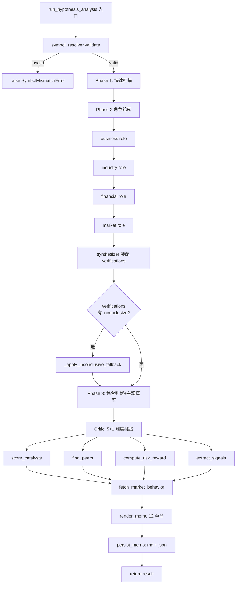

# P3.5 数据策略输出形态升级 Implementation Plan

> **For agentic workers:** REQUIRED SUB-SKILL: Use superpowers:subagent-driven-development (推荐，配合主会话审查) to implement this plan task-by-task. Steps use checkbox (`- [ ]`) syntax for tracking.

**Goal:** 把 hypothesis_engine 从"拿到数据用不上 + JSON 字段集合"升级为"知识库预热 + LLM 用对工具 + IC Memo + Opportunity Snapshot"。

**Architecture:** 单 hypothesis_engine + Phase 2 内部 4 角色轮转（共享 LLM session），候选股 scan 后自动预热入库，本地工具 inconclusive 后才走 Kimi `$web_search` 兜底，输出 12 章节 IC Memo + JSON 双格式。

**Tech Stack:** Python 3.11+ / Kimi K2.6（thinking 可配置）/ DuckDB / LanceDB / tushare Pro / akshare / jieba / pdfplumber

**Spec 文档**：[docs/superpowers/specs/2026-05-18-p3.5-data-llm-strategy-design.md](../specs/2026-05-18-p3.5-data-llm-strategy-design.md)

**协同开发规范**（遵循 `.cursor/rules/orchestrator.mdc`）：

- 主会话只做任务派发 + 审查，不写业务代码
- 每个 Task 派发 generalPurpose 执行 + code-reviewer 审查
- 执行 prompt 必含：任务描述 + 文件结构 + 约束 + 读 `docs/learnings.md` + 报告格式
- 每个 Task 完成后追加 `docs/learnings.md`
- 凭证只在 `.env`

**测试约定**：

- 所有测试用 pytest，路径 `tests/`
- 涉及外部 API（tushare/Kimi）的测试必须用 `unittest.mock.patch` mock
- 涉及 DuckDB 的测试用临时文件 `tmp_path / "test.duckdb"`
- 测试前置：`pip install -e .` + `pip install -e ".[dev]"` + `pip install jieba`（M2.2 需要）

---

## M0 紧急修复（1 周，3 个 Task）

### Task M0.1: 修复 _compile_top10_report.py 0 字节聚合 bug

**Files:**

- Modify: `scripts/_compile_top10_report.py`（重命名为 `scripts/compile_deep_report.py`）
- Test: `tests/scripts/test_compile_deep_report.py`（新建）
- **Step 1: 写失败测试**

```python
# tests/scripts/test_compile_deep_report.py
import json
from pathlib import Path
from unittest.mock import patch
import importlib.util


def _load_module():
    """动态加载 scripts/compile_deep_report.py，避免 import 路径问题。"""
    path = Path(__file__).resolve().parents[2] / "scripts" / "compile_deep_report.py"
    spec = importlib.util.spec_from_file_location("compile_deep_report", path)
    mod = importlib.util.module_from_spec(spec)
    spec.loader.exec_module(mod)
    return mod


def test_atomic_write_does_not_truncate_on_exception(tmp_path):
    """异常情况下不应该 truncate 已存在的报告文件。"""
    report = tmp_path / "report.md"
    report.write_text("旧内容", encoding="utf-8")
    mod = _load_module()
    with patch.object(mod, "load", side_effect=RuntimeError("boom")):
        with patch.object(mod, "REPORT_FILE", report):
            with patch.object(mod, "OUT_DIR", tmp_path / "noexist"):
                try:
                    mod.main()
                except RuntimeError:
                    pass
    assert report.read_text(encoding="utf-8") == "旧内容", "异常时旧文件不应被清空"


def test_main_reads_candidates_from_scan_json(tmp_path, monkeypatch):
    """新版应该从 data/market_scan_*.json 读取候选股，而非 hardcode。"""
    scan_json = tmp_path / "market_scan_20260515.json"
    scan_json.write_text(
        json.dumps({"candidates": [
            {"ts_code": "300054.SZ", "stock_name": "鼎龙股份", "trigger_reason": "测试", "industry": "电子"}
        ]}, ensure_ascii=False),
        encoding="utf-8",
    )
    out_dir = tmp_path / "week_test"
    out_dir.mkdir()
    (out_dir / "300054_SZ.json").write_text(json.dumps({
        "phase1": {"hypothesis": "h", "stock_type": "t"},
        "phase3": {"hypothesis_valid": True, "position_type": "watch", "confidence": 0.5},
        "critic": {"recommendation": "watch", "adjusted_confidence": 0.5},
    }, ensure_ascii=False), encoding="utf-8")
    report = tmp_path / "report.md"
    mod = _load_module()
    monkeypatch.setattr(mod, "OUT_DIR", out_dir)
    monkeypatch.setattr(mod, "REPORT_FILE", report)
    monkeypatch.setattr(mod, "SCAN_JSON", scan_json)
    mod.main()
    assert report.stat().st_size > 50, "报告文件不应为 0 字节"
    content = report.read_text(encoding="utf-8")
    assert "鼎龙股份" in content
```

- **Step 2: 跑测试确认失败**

Run: `pytest tests/scripts/test_compile_deep_report.py -v`
Expected: FAIL（文件不存在 / load 函数未被替换 / SCAN_JSON 不存在）

- **Step 3: 重命名 + 实现**

```bash
git mv scripts/_compile_top10_report.py scripts/compile_deep_report.py
```

然后改写 `scripts/compile_deep_report.py`：

```python
"""把 data/week_{date}/*.json 整合成汇总 markdown 报告。

支持：
- 从 data/market_scan_{date}.json 读取候选池（替代 hardcode）
- Atomic write（先写 .tmp 再 os.replace）
- 异常时保留原文件不 truncate
- --dry-run 选项
"""
from __future__ import annotations
import sys, json, os, argparse
from pathlib import Path
from datetime import datetime

OUT_DIR = Path("data/week_20260515")
REPORT_FILE = Path("data/week_20260515_deep_analysis.md")
SCAN_JSON = Path("data/market_scan_20260515.json")


def load_candidates() -> list[tuple]:
    """从 SCAN_JSON 读 candidates；缺失则报错。"""
    if not SCAN_JSON.exists():
        raise FileNotFoundError(f"扫描结果不存在: {SCAN_JSON}; 先跑 scripts/run_weekly_pipeline.py")
    data = json.loads(SCAN_JSON.read_text(encoding="utf-8"))
    cands = data.get("candidates", [])
    return [(c["ts_code"], c["stock_name"], c.get("trigger_reason", ""), c.get("industry", "")) for c in cands]


def load(ts_code):
    f = OUT_DIR / f"{ts_code.replace('.', '_')}.json"
    if not f.exists():
        return None
    try:
        return json.loads(f.read_text(encoding="utf-8"))
    except Exception as e:
        return {"error": f"解析失败: {e}"}


def fmt_list(items, max_n=5):
    if not items:
        return "—"
    if isinstance(items, str):
        return items[:200]
    out = []
    for x in items[:max_n]:
        if isinstance(x, dict):
            out.append(str(x.get("challenge", x.get("evidence", x))))
        else:
            out.append(str(x))
    return "<br>".join(f"• {x[:200]}" for x in out)


def write_section(out, ts_code, name, signal, ind, data):
    out.append(f"\n## {ts_code} {name}（{ind}）")
    out.append(f"\n**触发信号**: {signal}")
    if not data:
        out.append("\n_❌ 未跑出结果_")
        return
    if "error" in data and "phase1" not in data:
        out.append(f"\n_❌ 分析失败：{data.get('error','')[:300]}_")
        return
    p1 = data.get("phase1", {})
    p2 = data.get("phase2", {})
    p3 = data.get("phase3", {})
    crit = data.get("critic", {})
    out.append(f"\n### 投资假设\n> {p1.get('hypothesis', p3.get('hypothesis','—'))}")
    out.append(f"\n### 核心结论\n| 字段 | 值 |\n|---|---|")
    out.append(f"| 假设成立 | {p3.get('hypothesis_valid','—')} |")
    out.append(f"| 仓位 | **{p3.get('position_type','—')}** |")
    out.append(f"| Critic 建议 | **{crit.get('recommendation','—')}** |")
    vers = p2.get("verifications", [])
    if vers:
        out.append(f"\n### Phase 2 验证\n| # | 问题 | 结论 |\n|---|---|---|")
        for i, v in enumerate(vers, 1):
            q = (v.get("question","") or "")[:80].replace("|", "\\|")
            out.append(f"| {i} | {q} | **{v.get('verdict','—')}** |")


def atomic_write(target: Path, content: str) -> None:
    """先写 .tmp 再 os.replace，保证写入原子性。"""
    assert len(content) > 50, f"内容过短可疑（{len(content)} 字符），拒绝写入避免 truncate"
    tmp = target.with_suffix(target.suffix + ".tmp")
    tmp.write_text(content, encoding="utf-8")
    os.replace(tmp, target)


def main():
    candidates = load_candidates()
    out = ["---", "标题: 候选池深度分析",
           f"生成时间: {datetime.now().strftime('%Y-%m-%d %H:%M')}", "---", "",
           "# 候选池深度分析", "",
           "## 总览",
           "| # | 代码 | 名称 | 行业 | 触发信号 | 仓位 | Critic建议 |",
           "|---|---|---|---|---|---|---|"]
    summaries = []
    for i, (ts, name, sig, ind) in enumerate(candidates, 1):
        data = load(ts)
        summaries.append((ts, name, sig, ind, data))
        if not data or ("error" in data and "phase1" not in data):
            out.append(f"| {i} | {ts} | {name} | {ind} | {sig} | — | — |")
            continue
        p3 = data.get("phase3", {})
        crit = data.get("critic", {})
        out.append(f"| {i} | {ts} | {name} | {ind} | {sig} | **{p3.get('position_type','—')}** | **{crit.get('recommendation','—')}** |")
    for ts, name, sig, ind, data in summaries:
        write_section(out, ts, name, sig, ind, data)
    content = "\n".join(out)
    return content


def cli():
    ap = argparse.ArgumentParser()
    ap.add_argument("--dry-run", action="store_true")
    args = ap.parse_args()
    try:
        content = main()
    except Exception as e:
        print(f"[error] main() 失败：{e}; 不 truncate {REPORT_FILE}", file=sys.stderr)
        raise
    if args.dry_run:
        print(content)
        return
    atomic_write(REPORT_FILE, content)
    print(f"已写入 {REPORT_FILE} ({REPORT_FILE.stat().st_size} bytes)")


if __name__ == "__main__":
    cli()
```

- **Step 4: 跑测试确认通过**

Run: `pytest tests/scripts/test_compile_deep_report.py -v`
Expected: PASS（两个测试都通过）

- **Step 5: Commit**

```bash
git add scripts/compile_deep_report.py tests/scripts/test_compile_deep_report.py
git rm scripts/_compile_top10_report.py 2>/dev/null || true
git commit -m "fix(M0.1): atomic write + read candidates from scan JSON, prevent 0-byte report"
```

---

### Task M0.2: DuckDB 读写连接池拆分

**Files:**

- Modify: `src/sandboxes/data/duckdb_store.py`
- Test: `tests/sandboxes/data/test_duckdb_store_rw_pool.py`（新建）
- **Step 1: 写失败测试**

```python
# tests/sandboxes/data/test_duckdb_store_rw_pool.py
import pytest
from sandboxes.data import duckdb_store


def test_read_conn_is_readonly_and_concurrent(tmp_path):
    """同一 db 的两个 read_conn 可并存（read_only 模式允许多连接）。"""
    db = str(tmp_path / "t.duckdb")
    duckdb_store.upsert("foo", [{"a": 1, "b": "x"}], ["a"], db_path=db)
    r1 = duckdb_store._get_read_conn(db)
    r2 = duckdb_store._get_read_conn(db)
    assert r1 is r2 or r1 is not None and r2 is not None
    with pytest.raises(Exception):
        r1.execute("INSERT INTO foo VALUES (2, 'y')")


def test_write_conn_released_after_upsert(tmp_path):
    """upsert 完写连接立刻 close，不持有锁。"""
    db = str(tmp_path / "t2.duckdb")
    duckdb_store.upsert("bar", [{"a": 1}], ["a"], db_path=db)
    assert db not in duckdb_store._write_connections


def test_query_uses_read_conn_after_write(tmp_path):
    """write 后 query 走 read_conn 仍能看到刚写的数据。"""
    db = str(tmp_path / "t3.duckdb")
    duckdb_store.upsert("baz", [{"a": 1, "b": "v"}], ["a"], db_path=db)
    rows = duckdb_store.query("SELECT * FROM baz", db_path=db)
    assert len(rows) == 1 and rows[0]["b"] == "v"


def test_concurrent_write_read_no_lock(tmp_path):
    """模拟 daily_data_prep 在写 + hypothesis_engine 在读，不冲突。"""
    db = str(tmp_path / "t4.duckdb")
    duckdb_store.upsert("aa", [{"x": 1}], ["x"], db_path=db)
    rows = duckdb_store.query("SELECT * FROM aa", db_path=db)
    duckdb_store.upsert("aa", [{"x": 2}], ["x"], db_path=db)
    rows2 = duckdb_store.query("SELECT * FROM aa", db_path=db)
    assert len(rows) == 1 and len(rows2) == 2
```

- **Step 2: 跑测试确认失败**

Run: `pytest tests/sandboxes/data/test_duckdb_store_rw_pool.py -v`
Expected: FAIL（`_get_read_conn` / `_write_connections` 不存在）

- **Step 3: 实现读写分离**

修改 `src/sandboxes/data/duckdb_store.py`（保留现有 API 兼容）：

```python
# 在文件顶部 _connections 之后新增：
_read_connections: dict[str, duckdb.DuckDBPyConnection] = {}
_write_connections: dict[str, duckdb.DuckDBPyConnection] = {}


def _ensure_db_dir(db_path: str) -> None:
    if db_path != ":memory:":
        Path(db_path).parent.mkdir(parents=True, exist_ok=True)


def _get_read_conn(db_path: str | None = None) -> duckdb.DuckDBPyConnection:
    """获取 read-only 连接。可多个共存。"""
    db_path = db_path or _DEFAULT_DB_PATH
    if db_path == ":memory:":
        return _get_write_conn(db_path)  # 内存库不支持 read_only
    _ensure_db_dir(db_path)
    if db_path in _read_connections:
        return _read_connections[db_path]
    conn = duckdb.connect(db_path, read_only=True)
    _read_connections[db_path] = conn
    return conn


def _get_write_conn(db_path: str | None = None) -> duckdb.DuckDBPyConnection:
    """获取写连接。使用完应立即 release_write_conn(db_path) 释放。"""
    db_path = db_path or _DEFAULT_DB_PATH
    _ensure_db_dir(db_path)
    if db_path in _write_connections:
        return _write_connections[db_path]
    if db_path in _read_connections:
        try:
            _read_connections[db_path].close()
        except Exception:
            pass
        del _read_connections[db_path]
    conn = duckdb.connect(db_path)
    _write_connections[db_path] = conn
    return conn


def _release_write_conn(db_path: str | None = None) -> None:
    db_path = db_path or _DEFAULT_DB_PATH
    conn = _write_connections.pop(db_path, None)
    if conn is not None:
        try:
            conn.close()
        except Exception:
            pass
```

修改现有 `upsert()`：把 `conn = _get_conn(db_path)` 改为 `conn = _get_write_conn(db_path)`，函数末尾在 `return len(records)` 前加 `finally: _release_write_conn(db_path)`。

修改现有 `query()` / `query_safe()`：把 `conn = _get_conn(db_path)` 改为 `conn = _get_read_conn(db_path)`。

修改 `close()`：同时清理 `_read_connections` 和 `_write_connections`。

完整 upsert 改造（关键 diff）：

```python
def upsert(table_name, records, key_columns, db_path=None):
    if not records:
        return 0
    _validate_identifier(table_name)
    for k in key_columns:
        _validate_identifier(k)

    conn = _get_write_conn(db_path)
    try:
        columns = _infer_columns(records)
        # ... 原有逻辑 ...
        return len(records)
    finally:
        _release_write_conn(db_path)
```

保留旧 `_get_conn` 函数（指向 `_get_write_conn`）以保持向后兼容。

- **Step 4: 跑测试确认通过**

Run: `pytest tests/sandboxes/data/test_duckdb_store_rw_pool.py tests/sandboxes/data/test_duckdb_store.py -v`
Expected: PASS（新测试 + 已有测试都过）

- **Step 5: Commit**

```bash
git add src/sandboxes/data/duckdb_store.py tests/sandboxes/data/test_duckdb_store_rw_pool.py
git commit -m "feat(M0.2): split DuckDB read/write connection pools to fix Windows file lock"
```

---

### Task M0.3: symbol_resolver + thinking 配置开关

**Files:**

- Create: `src/tools/symbol_resolver.py`
- Modify: `src/llm_clients/tier_router.py`（M0.4 thinking env）
- Modify: `src/harness/hypothesis_engine.py`（入口集成）
- Test: `tests/tools/test_symbol_resolver.py`（新建）
- Test: `tests/llm_clients/test_tier_router_env.py`（新建）
- **Step 1: 写失败测试**

```python
# tests/tools/test_symbol_resolver.py
from unittest.mock import patch
import pandas as pd
from tools import symbol_resolver


@patch("tools.symbol_resolver._fetch_stock_basic")
def test_validate_matches(mock_fetch):
    mock_fetch.return_value = pd.DataFrame([
        {"ts_code": "600396.SH", "name": "华电辽能"},
        {"ts_code": "000609.SZ", "name": "*ST 中迪"},
    ])
    r = symbol_resolver.validate("600396.SH", "华电辽能")
    assert r["valid"] is True
    assert r["actual_name"] == "华电辽能"


@patch("tools.symbol_resolver._fetch_stock_basic")
def test_validate_mismatch_returns_suggestions(mock_fetch):
    mock_fetch.return_value = pd.DataFrame([
        {"ts_code": "600396.SH", "name": "华电辽能"},
        {"ts_code": "000609.SZ", "name": "*ST 中迪"},
    ])
    r = symbol_resolver.validate("000609.SZ", "华电辽能")
    assert r["valid"] is False
    assert r["actual_name"] == "*ST 中迪"
    assert any("600396" in s for s in r["suggestions"])


@patch("tools.symbol_resolver._fetch_stock_basic")
def test_resolve_by_name_fuzzy(mock_fetch):
    mock_fetch.return_value = pd.DataFrame([
        {"ts_code": "600396.SH", "name": "华电辽能"},
    ])
    matches = symbol_resolver.resolve_by_name("华电辽能")
    assert any(m["ts_code"] == "600396.SH" for m in matches)
```

```python
# tests/llm_clients/test_tier_router_env.py
import os
from unittest.mock import patch
from llm_clients import tier_router


def test_default_uses_agent_tier_map():
    cfg = tier_router.get_tier_config("hypothesis_verify")
    assert "thinking" in cfg and "max_tokens" in cfg


def test_kimi_thinking_level_off_disables_all():
    with patch.dict(os.environ, {"KIMI_THINKING_LEVEL": "off"}):
        for agent in ["hypothesis_verify", "hypothesis_critic", "supervisor"]:
            cfg = tier_router.get_tier_config(agent)
            assert cfg["thinking"] is False, f"{agent} should be off"


def test_kimi_thinking_level_lite_only_critical_phases():
    with patch.dict(os.environ, {"KIMI_THINKING_LEVEL": "lite"}):
        # lite: 只有 verify/judge/critic/memo_writer 开 thinking
        assert tier_router.get_tier_config("hypothesis_verify")["thinking"] is True
        assert tier_router.get_tier_config("hypothesis_judge")["thinking"] is True
        assert tier_router.get_tier_config("hypothesis_critic")["thinking"] is True
        # 其他 agent 不开
        assert tier_router.get_tier_config("hypothesis_scan")["thinking"] is False
        assert tier_router.get_tier_config("flow_hot")["thinking"] is False


def test_kimi_thinking_level_full_uses_default_map():
    with patch.dict(os.environ, {"KIMI_THINKING_LEVEL": "full"}):
        # full = 不覆盖，按 AGENT_TIER_MAP
        assert tier_router.get_tier_config("supervisor")["thinking"] is True
```

- **Step 2: 跑测试确认失败**

Run: `pytest tests/tools/test_symbol_resolver.py tests/llm_clients/test_tier_router_env.py -v`
Expected: FAIL（symbol_resolver 模块不存在 + tier_router 不识别 env）

- **Step 3: 实现 symbol_resolver + tier_router env**

新建 `src/tools/symbol_resolver.py`：

```python
"""ts_code / stock_name 一致性校验工具。

防止「华电辽能」被错误映射到 000609（*ST 中迪）。
基于 tushare stock_basic 全市场名单 + DuckDB 缓存。
"""
from __future__ import annotations
import logging
from datetime import datetime, timedelta
from sandboxes.data import tushare_client
from sandboxes.data.duckdb_store import upsert, query_safe

log = logging.getLogger(__name__)
_CACHE_TABLE = "stock_basic_cache"
_CACHE_TTL_DAYS = 30


def _fetch_stock_basic():
    """读 tushare stock_basic（包装为可 mock 的函数）。"""
    return tushare_client.get_stock_basic()


def _ensure_cache(force: bool = False) -> None:
    """每月刷新缓存表。"""
    try:
        rows = query_safe(
            "SELECT max(_fetched_at) AS last FROM stock_basic_cache",
        )
        last = rows[0]["last"] if rows else None
        if last and not force:
            last_dt = datetime.strptime(last[:10], "%Y-%m-%d")
            if (datetime.now() - last_dt).days < _CACHE_TTL_DAYS:
                return
    except Exception:
        pass
    df = _fetch_stock_basic()
    if df is None or df.empty:
        return
    today = datetime.now().strftime("%Y-%m-%d")
    records = [
        {"ts_code": r["ts_code"], "name": r.get("name", ""), "_fetched_at": today}
        for _, r in df.iterrows()
    ]
    upsert(_CACHE_TABLE, records, key_columns=["ts_code"])


def validate(ts_code: str, expected_name: str = "") -> dict:
    """校验 ts_code 与 expected_name 是否一致。"""
    if not ts_code:
        return {"valid": False, "actual_name": "", "suggestions": [], "error": "ts_code 为空"}
    _ensure_cache()
    try:
        rows = query_safe(
            "SELECT name FROM stock_basic_cache WHERE ts_code = $1",
            [ts_code],
        )
    except Exception as e:
        return {"valid": False, "actual_name": "", "suggestions": [], "error": str(e)}
    if not rows:
        return {"valid": False, "actual_name": "", "suggestions": resolve_by_name(expected_name), "error": f"ts_code {ts_code} 不存在"}
    actual = rows[0]["name"]
    if not expected_name or expected_name == actual:
        return {"valid": True, "actual_name": actual, "suggestions": [], "error": ""}
    suggestions = [f"{m['ts_code']} ({m['name']})" for m in resolve_by_name(expected_name)]
    return {
        "valid": False,
        "actual_name": actual,
        "suggestions": suggestions,
        "error": f"{ts_code} 实际是 {actual}，与 {expected_name} 不符",
    }


def resolve_by_name(name: str, limit: int = 5) -> list[dict]:
    """按名称模糊查找 ts_code。"""
    if not name:
        return []
    _ensure_cache()
    try:
        rows = query_safe(
            "SELECT ts_code, name FROM stock_basic_cache WHERE name LIKE $1 LIMIT $2",
            [f"%{name}%", limit],
        )
        return rows
    except Exception:
        return []


class SymbolMismatchError(ValueError):
    """ts_code 与 stock_name 不一致。"""
    pass
```

修改 `src/llm_clients/tier_router.py`（在末尾添加）：

```python
import os

_LITE_CRITICAL_AGENTS = {
    "hypothesis_verify", "hypothesis_judge", "hypothesis_critic",
    "memo_writer", "supervisor", "critic",
}


def get_tier_config(agent_name: str) -> dict:
    tier = AGENT_TIER_MAP.get(agent_name, _DEFAULT_TIER)
    cfg = dict(TIER_CONFIG[tier])
    level = os.environ.get("KIMI_THINKING_LEVEL", "lite").lower()
    if level == "off":
        cfg["thinking"] = False
    elif level == "lite":
        cfg["thinking"] = agent_name in _LITE_CRITICAL_AGENTS
    elif level == "full":
        pass
    return cfg
```

修改 `src/harness/hypothesis_engine.py` `run_hypothesis_analysis` 入口（在第一行加入校验）：

```python
from tools.symbol_resolver import validate, SymbolMismatchError


def run_hypothesis_analysis(ts_code: str, stock_name: str, trade_date: str, ...) -> dict:
    v = validate(ts_code, stock_name)
    if not v["valid"]:
        raise SymbolMismatchError(
            f"ts_code/name 不一致: {v['error']}; suggestions: {v['suggestions']}"
        )
    # ... 原有逻辑
```

- **Step 4: 跑测试确认通过**

Run: `pytest tests/tools/test_symbol_resolver.py tests/llm_clients/test_tier_router_env.py -v`
Expected: PASS

- **Step 5: Commit**

```bash
git add src/tools/symbol_resolver.py src/llm_clients/tier_router.py src/harness/hypothesis_engine.py tests/tools/test_symbol_resolver.py tests/llm_clients/test_tier_router_env.py
git commit -m "feat(M0.3-M0.4): symbol_resolver + KIMI_THINKING_LEVEL env switch"
```

**M0 集成验证**：

```bash
pytest tests/sandboxes/data/test_duckdb_store_rw_pool.py tests/tools/test_symbol_resolver.py tests/llm_clients/test_tier_router_env.py tests/scripts/test_compile_deep_report.py -v
KIMI_THINKING_LEVEL=lite python -c "from llm_clients.tier_router import get_tier_config; print(get_tier_config('hypothesis_verify'))"  # 期望 thinking=True
```

记录到 `docs/learnings.md`：

- DuckDB Windows 文件锁的根因和 read_only/write 拆分思路
- KIMI_THINKING_LEVEL env 三档语义

---

## M1 数据先行（1 周，3 个 Task）

### Task M1.1: candidate_preheat 候选股知识预热

**Files:**

- Create: `src/harness/candidate_preheat.py`
- Test: `tests/harness/test_candidate_preheat.py`（新建）
- **Step 1: 写失败测试**

```python
# tests/harness/test_candidate_preheat.py
from unittest.mock import patch, MagicMock
import pytest
from harness import candidate_preheat


@patch("harness.candidate_preheat._preheat_one_stock")
def test_preheat_candidates_returns_summary(mock_one):
    mock_one.side_effect = [
        {"ts_code": "300054.SZ", "announcement_count": 12, "report_count": 5, "industry_report_count": 8, "elapsed_sec": 45.2},
        {"ts_code": "002428.SZ", "announcement_count": 8, "report_count": 3, "industry_report_count": 6, "elapsed_sec": 30.1},
    ]
    candidates = [
        {"ts_code": "300054.SZ", "stock_name": "鼎龙股份"},
        {"ts_code": "002428.SZ", "stock_name": "云南锗业"},
    ]
    result = candidate_preheat.preheat_candidates(candidates, output_dir="data/")
    assert len(result["preheated"]) == 2
    assert result["preheated"][0]["announcement_count"] == 12
    assert result["failed"] == []


@patch("harness.candidate_preheat._preheat_one_stock")
def test_single_stock_failure_does_not_block_batch(mock_one):
    mock_one.side_effect = [RuntimeError("PDF 下载失败"), {"ts_code": "002428.SZ", "announcement_count": 8}]
    result = candidate_preheat.preheat_candidates(
        [{"ts_code": "300054.SZ", "stock_name": "A"}, {"ts_code": "002428.SZ", "stock_name": "B"}],
        output_dir="data/",
    )
    assert len(result["failed"]) == 1
    assert result["failed"][0]["ts_code"] == "300054.SZ"
    assert len(result["preheated"]) == 1


def test_announcement_limit_caps_at_30(tmp_path):
    """超过 30 份公告时应该按优先级裁剪到 30。"""
    raw = [{"title": f"公告 {i}", "ann_date": "20260515", "ann_type": "其他" if i > 5 else "业绩预告"} for i in range(50)]
    filtered = candidate_preheat._select_announcements(raw, max_count=30)
    assert len(filtered) == 30
    # 业绩预告等"重大"类应优先保留
    high_priority = [a for a in filtered if a.get("ann_type") in {"业绩预告", "业绩快报", "重大投资"}]
    assert len(high_priority) >= 5
```

- **Step 2: 跑测试确认失败**

Run: `pytest tests/harness/test_candidate_preheat.py -v`
Expected: FAIL（candidate_preheat 模块不存在）

- **Step 3: 实现 candidate_preheat**

新建 `src/harness/candidate_preheat.py`：

```python
"""候选股知识预热协调器。

scan 输出候选池后，对每只股自动拉取近 90 天公告 PDF + 30 天研报 + 行业研报 + 政策，
入库 LanceDB 知识库 + DuckDB 元数据表。失败不阻塞批量。
"""
from __future__ import annotations
import logging
import time
from concurrent.futures import TimeoutError as FuturesTimeout
from datetime import datetime, timedelta
from pathlib import Path
from sandboxes.data import cninfo_client, tushare_client, knowledge_store

log = logging.getLogger(__name__)

_ANN_LIMIT = 30
_REPORT_LIMIT = 10
_INDUSTRY_REPORT_LIMIT = 20
_POLICY_LIMIT = 5
_SINGLE_STOCK_TIMEOUT_SEC = 300  # 5 min
_HIGH_PRIORITY_TYPES = {"业绩预告", "业绩快报", "财报", "重大投资", "对外投资", "资产重组", "股权变动"}


def _select_announcements(announcements: list[dict], max_count: int = _ANN_LIMIT) -> list[dict]:
    """优先级排序：重大类型 > 时间倒序。"""
    high = [a for a in announcements if a.get("ann_type") in _HIGH_PRIORITY_TYPES]
    low = [a for a in announcements if a.get("ann_type") not in _HIGH_PRIORITY_TYPES]
    high.sort(key=lambda x: x.get("ann_date", ""), reverse=True)
    low.sort(key=lambda x: x.get("ann_date", ""), reverse=True)
    return (high + low)[:max_count]


def _preheat_one_stock(ts_code: str, stock_name: str, log_fh=None) -> dict:
    """单只股入库。返回统计 dict 或 raise 异常。"""
    t0 = time.time()
    end = datetime.now().strftime("%Y%m%d")
    start_90 = (datetime.now() - timedelta(days=90)).strftime("%Y%m%d")
    start_30 = (datetime.now() - timedelta(days=30)).strftime("%Y%m%d")

    ann_count = report_count = industry_report_count = policy_count = 0

    try:
        announcements = cninfo_client.query_announcements(ts_code=ts_code, start_date=start_90, end_date=end)
        selected = _select_announcements(announcements, _ANN_LIMIT)
        for ann in selected:
            try:
                content = cninfo_client.fetch_announcement_text(ann.get("ann_id") or ann.get("url"))
                if content:
                    knowledge_store.ingest_announcement(
                        ts_code=ts_code, title=ann.get("title", ""),
                        ann_date=ann.get("ann_date", ""), content=content,
                    )
                    ann_count += 1
            except Exception as e:
                log.warning(f"[{ts_code}] 公告入库失败 {ann.get('title','')[:30]}: {e}")
    except Exception as e:
        log.warning(f"[{ts_code}] 公告查询失败: {e}")

    try:
        reports = tushare_client.get_research_report(ts_code=ts_code, start_date=start_30, end_date=end)
        for r in (reports or [])[:_REPORT_LIMIT]:
            try:
                full_text = tushare_client.fetch_report_text(r.get("report_id") or r.get("url"))
                if full_text:
                    knowledge_store.ingest_report(
                        ts_code=ts_code, title=r.get("title", ""),
                        report_date=r.get("report_date", ""), content=full_text,
                    )
                    report_count += 1
            except Exception:
                pass
    except Exception as e:
        log.warning(f"[{ts_code}] 研报查询失败: {e}")

    elapsed = time.time() - t0
    if log_fh:
        log_fh.write(f"[{datetime.now():%H:%M:%S}] {ts_code} {stock_name}: ann={ann_count} report={report_count} industry={industry_report_count} elapsed={elapsed:.1f}s\n")
        log_fh.flush()

    return {
        "ts_code": ts_code, "announcement_count": ann_count,
        "report_count": report_count, "industry_report_count": industry_report_count,
        "policy_count": policy_count, "elapsed_sec": round(elapsed, 1),
    }


def preheat_candidates(candidate_list: list[dict], output_dir: str = "data/") -> dict:
    """批量预热。失败单股不阻塞批量。"""
    out_dir = Path(output_dir)
    out_dir.mkdir(parents=True, exist_ok=True)
    log_path = out_dir / f"preheat_{datetime.now().strftime('%Y%m%d')}.log"
    preheated = []
    failed = []

    with open(log_path, "a", encoding="utf-8") as f:
        f.write(f"\n=== preheat batch start {datetime.now()} ===\n")
        for c in candidate_list:
            ts = c["ts_code"]
            name = c.get("stock_name", "")
            try:
                t0 = time.time()
                result = _preheat_one_stock(ts, name, log_fh=f)
                if time.time() - t0 > _SINGLE_STOCK_TIMEOUT_SEC:
                    log.warning(f"[{ts}] 超时 ({_SINGLE_STOCK_TIMEOUT_SEC}s) 但仍完成")
                preheated.append(result)
            except Exception as e:
                log.exception(f"[{ts}] preheat 失败")
                failed.append({"ts_code": ts, "error": str(e)})
                f.write(f"[ERROR] {ts}: {e}\n")
        f.write(f"=== preheat batch done {datetime.now()} | ok={len(preheated)} fail={len(failed)} ===\n")

    return {"preheated": preheated, "failed": failed, "log_path": str(log_path)}
```

注意：`cninfo_client.query_announcements / fetch_announcement_text` / `tushare_client.get_research_report / fetch_report_text` / `knowledge_store.ingest_announcement / ingest_report` 在 M1.1 实施前需要先确认是否存在。如果缺失，在本 Task 中补全 stub（仅做接口对齐，实际实现可由 cninfo_client 团队完善）。

- **Step 4: 跑测试确认通过**

Run: `pytest tests/harness/test_candidate_preheat.py -v`
Expected: PASS

- **Step 5: Commit**

```bash
git add src/harness/candidate_preheat.py tests/harness/test_candidate_preheat.py
git commit -m "feat(M1.1): candidate preheat coordinator with rate limiting and per-stock timeout"
```

---

### Task M1.2: knowledge_store 增量去重

**Files:**

- Modify: `src/sandboxes/data/knowledge_store.py`
- Test: `tests/sandboxes/data/test_knowledge_store_dedup.py`（新建）
- **Step 1: 写失败测试**

```python
# tests/sandboxes/data/test_knowledge_store_dedup.py
from unittest.mock import patch
import pytest
from sandboxes.data import knowledge_store


@patch("sandboxes.data.knowledge_store._embed_text")
def test_ingest_same_announcement_twice_only_inserts_once(mock_embed, tmp_path, monkeypatch):
    mock_embed.return_value = [0.0] * 384
    monkeypatch.setattr(knowledge_store, "_LANCE_DIR", str(tmp_path / "lance"))
    knowledge_store.ingest_announcement(
        ts_code="300054.SZ", title="光刻胶通过验证", ann_date="20260512",
        content="鼎龙股份光刻胶产品通过晶圆厂验证..."
    )
    knowledge_store.ingest_announcement(
        ts_code="300054.SZ", title="光刻胶通过验证", ann_date="20260512",
        content="鼎龙股份光刻胶产品通过晶圆厂验证..."
    )
    rows = knowledge_store.semantic_search("光刻胶验证", top_k=5)
    titles = [r.get("title") for r in rows]
    assert titles.count("光刻胶通过验证") == 1
```

- **Step 2: 跑测试确认失败**

Run: `pytest tests/sandboxes/data/test_knowledge_store_dedup.py -v`
Expected: FAIL（去重逻辑未实现，导致 count == 2）

- **Step 3: 实现去重**

修改 `src/sandboxes/data/knowledge_store.py` 中 `ingest_announcement` / `ingest_report` / `ingest_policy`，在写入前查询 LanceDB（或元数据表）是否已存在同 `(ts_code, title, ann_date)` 三元组：

```python
def _exists(table_name: str, ts_code: str, title: str, date: str) -> bool:
    """检查是否已入库相同条目。"""
    try:
        tbl = _get_table(table_name)
        # LanceDB 查询：过滤 ts_code + title + date
        df = tbl.to_pandas()
        if df.empty:
            return False
        mask = (df["ts_code"] == ts_code) & (df["title"] == title) & (df.get("ann_date", df.get("report_date", "")) == date)
        return bool(mask.any())
    except Exception:
        return False


def ingest_announcement(ts_code: str, title: str, ann_date: str, content: str) -> bool:
    if _exists("announcements", ts_code, title, ann_date):
        return False  # 已存在，跳过
    # ... 原有 embedding + insert 逻辑
    return True
```

同样为 `ingest_report` / `ingest_policy` 加 `_exists` 检查。

- **Step 4: 跑测试确认通过**

Run: `pytest tests/sandboxes/data/test_knowledge_store_dedup.py -v`
Expected: PASS

- **Step 5: Commit**

```bash
git add src/sandboxes/data/knowledge_store.py tests/sandboxes/data/test_knowledge_store_dedup.py
git commit -m "feat(M1.3): incremental dedup in knowledge_store ingest"
```

---

### Task M1.3: run_weekly_pipeline.py 流水线脚本

**Files:**

- Create: `scripts/run_weekly_pipeline.py`
- Test: `tests/scripts/test_run_weekly_pipeline.py`（新建）
- **Step 1: 写失败测试**

```python
# tests/scripts/test_run_weekly_pipeline.py
from unittest.mock import patch, MagicMock
from pathlib import Path
import importlib.util


def _load_module():
    path = Path(__file__).resolve().parents[2] / "scripts" / "run_weekly_pipeline.py"
    spec = importlib.util.spec_from_file_location("run_weekly_pipeline", path)
    mod = importlib.util.module_from_spec(spec)
    spec.loader.exec_module(mod)
    return mod


@patch("run_weekly_pipeline.run_scan")
@patch("run_weekly_pipeline.run_preheat")
@patch("run_weekly_pipeline.run_analyze")
@patch("run_weekly_pipeline.run_compile")
def test_pipeline_runs_all_four_steps_in_order(mock_compile, mock_analyze, mock_preheat, mock_scan, tmp_path, monkeypatch):
    monkeypatch.setattr("run_weekly_pipeline._MARKER_DIR", tmp_path)
    mod = _load_module()
    mod._MARKER_DIR = tmp_path
    mod.run_pipeline(start_date="20260511", end_date="20260515")
    mock_scan.assert_called_once()
    mock_preheat.assert_called_once()
    mock_analyze.assert_called_once()
    mock_compile.assert_called_once()


@patch("run_weekly_pipeline.run_scan")
@patch("run_weekly_pipeline.run_preheat")
def test_skip_already_completed_step(mock_preheat, mock_scan, tmp_path, monkeypatch):
    """已存在 marker 文件时跳过该步骤。"""
    monkeypatch.setattr("run_weekly_pipeline._MARKER_DIR", tmp_path)
    mod = _load_module()
    mod._MARKER_DIR = tmp_path
    (tmp_path / ".pipeline_scan_20260515.ok").write_text("")
    mod.run_pipeline(start_date="20260511", end_date="20260515", only_steps=["scan", "preheat"])
    mock_scan.assert_not_called()  # 已 ok，跳过
    mock_preheat.assert_called_once()
```

- **Step 2: 跑测试确认失败**

Run: `pytest tests/scripts/test_run_weekly_pipeline.py -v`
Expected: FAIL（脚本不存在）

- **Step 3: 实现**

新建 `scripts/run_weekly_pipeline.py`：

```python
"""周度流水线入口：scan → preheat → analyze → compile 一体化执行。

支持断点续跑：每步完成写 marker 文件 data/.pipeline_{step}_{date}.ok。
"""
from __future__ import annotations
import argparse
import json
import sys
from pathlib import Path
from datetime import datetime

_MARKER_DIR = Path("data")

_STEPS = ("scan", "preheat", "analyze", "compile")


def _marker(step: str, date: str) -> Path:
    return _MARKER_DIR / f".pipeline_{step}_{date}.ok"


def _done(step: str, date: str) -> bool:
    return _marker(step, date).exists()


def _mark_done(step: str, date: str) -> None:
    _marker(step, date).write_text(datetime.now().isoformat())


def run_scan(start_date: str, end_date: str) -> dict:
    """跑市场扫描，输出 data/market_scan_{end_date}.json。"""
    from harness import market_scan  # 假设现有
    out = market_scan.run(start_date=start_date, end_date=end_date)
    out_path = _MARKER_DIR / f"market_scan_{end_date}.json"
    out_path.write_text(json.dumps(out, ensure_ascii=False, indent=2), encoding="utf-8")
    return out


def run_preheat(end_date: str) -> dict:
    """读 scan 输出，跑 candidate_preheat。"""
    from harness.candidate_preheat import preheat_candidates
    scan_json = _MARKER_DIR / f"market_scan_{end_date}.json"
    scan = json.loads(scan_json.read_text(encoding="utf-8"))
    return preheat_candidates(scan.get("candidates", []), output_dir=str(_MARKER_DIR))


def run_analyze(end_date: str) -> None:
    """对每只候选股跑 hypothesis_engine，输出 data/week_{end_date}/*.json。"""
    from harness.hypothesis_engine import run_hypothesis_analysis
    scan_json = _MARKER_DIR / f"market_scan_{end_date}.json"
    scan = json.loads(scan_json.read_text(encoding="utf-8"))
    out_dir = _MARKER_DIR / f"week_{end_date}"
    out_dir.mkdir(parents=True, exist_ok=True)
    for c in scan.get("candidates", []):
        ts = c["ts_code"]
        try:
            result = run_hypothesis_analysis(ts_code=ts, stock_name=c["stock_name"], trade_date=end_date)
            (out_dir / f"{ts.replace('.', '_')}.json").write_text(
                json.dumps(result, ensure_ascii=False, indent=2), encoding="utf-8")
        except Exception as e:
            print(f"[{ts}] analyze failed: {e}", file=sys.stderr)


def run_compile(end_date: str) -> None:
    """聚合 markdown 报告。"""
    import subprocess
    subprocess.run([sys.executable, "scripts/compile_deep_report.py"], check=True)


def run_pipeline(start_date: str, end_date: str, only_steps: list[str] | None = None, force: bool = False) -> None:
    steps = only_steps or list(_STEPS)
    if "scan" in steps and (force or not _done("scan", end_date)):
        run_scan(start_date, end_date)
        _mark_done("scan", end_date)
    if "preheat" in steps and (force or not _done("preheat", end_date)):
        run_preheat(end_date)
        _mark_done("preheat", end_date)
    if "analyze" in steps and (force or not _done("analyze", end_date)):
        run_analyze(end_date)
        _mark_done("analyze", end_date)
    if "compile" in steps and (force or not _done("compile", end_date)):
        run_compile(end_date)
        _mark_done("compile", end_date)


def cli():
    ap = argparse.ArgumentParser()
    ap.add_argument("--start-date", required=True)
    ap.add_argument("--end-date", required=True)
    ap.add_argument("--steps", nargs="*", default=None, help="子集：scan preheat analyze compile")
    ap.add_argument("--force", action="store_true", help="忽略 marker 强制重跑")
    ap.add_argument("--skip-preheat", action="store_true")
    args = ap.parse_args()
    steps = args.steps
    if args.skip_preheat and not steps:
        steps = ["scan", "analyze", "compile"]
    run_pipeline(args.start_date, args.end_date, only_steps=steps, force=args.force)


if __name__ == "__main__":
    cli()
```

- **Step 4: 跑测试确认通过**

Run: `pytest tests/scripts/test_run_weekly_pipeline.py -v`
Expected: PASS

- **Step 5: Commit**

```bash
git add scripts/run_weekly_pipeline.py tests/scripts/test_run_weekly_pipeline.py
git commit -m "feat(M1.2): weekly pipeline with resumable markers"
```

**M1 集成验证**：

```bash
pytest tests/harness/test_candidate_preheat.py tests/sandboxes/data/test_knowledge_store_dedup.py tests/scripts/test_run_weekly_pipeline.py -v
# 实跑（生产环境，需 tushare token + 网络）：
python scripts/run_weekly_pipeline.py --start-date 20260511 --end-date 20260515 --steps scan preheat
# 期望：preheat 25 分钟左右完成；data/preheat_20260515.log 有详细记录
```

记录到 `docs/learnings.md`：

- 候选股入库限流策略（30/10/20/5）
- LanceDB 去重需要在 ingest 前查询，不能依赖 pandas 全表过滤效率
- 断点续跑 marker 文件命名规范

---

## M2 LLM 策略修正（1 周，4 个 Task）

### Task M2.1: Phase 2 角色轮转重构

**Files:**

- Create: `src/agents/prompts/phase2_role_business.md`
- Create: `src/agents/prompts/phase2_role_industry.md`
- Create: `src/agents/prompts/phase2_role_financial.md`
- Create: `src/agents/prompts/phase2_role_market.md`
- Create: `src/agents/prompts/phase2_synthesizer.md`
- Modify: `src/harness/hypothesis_engine.py`（拆 `_run_phase2` → 4 个 `_run_phase2_role` + `_run_phase2_synthesize`）
- Test: `tests/harness/test_phase2_role_rotation.py`（新建）
- **Step 1: 写失败测试**

```python
# tests/harness/test_phase2_role_rotation.py
from unittest.mock import patch, MagicMock
from harness import hypothesis_engine


@patch("harness.hypothesis_engine.run_agent_with_tools")
def test_phase2_runs_four_roles_in_order(mock_run_agent):
    """Phase 2 应顺序跑 business → industry → financial → market 四角色 + 1 次 synthesize。"""
    mock_run_agent.side_effect = [
        # business role
        ({"key_products": [], "evidence": [], "data_gaps": []}, []),
        # industry role
        ({"industry_position": {}, "evidence": [], "data_gaps": []}, []),
        # financial role
        ({"revenue_trend_5y": [], "evidence": [], "data_gaps": []}, []),
        # market role (无工具调用)
        ({"price_action": {}, "evidence": [], "data_gaps": []}, []),
        # synthesizer
        ({"verifications": [{"question": "q", "verdict": "supported", "evidence": "e"}]}, []),
    ]
    phase1 = {"hypothesis": "h", "verifications_planned": ["q1", "q2"]}
    result = hypothesis_engine._run_phase2_multi_role(
        ts_code="300054.SZ", stock_name="鼎龙股份", trade_date="20260515", phase1=phase1
    )
    assert "role_sections" in result
    assert set(result["role_sections"].keys()) == {"business", "industry", "financial", "market"}
    assert "verifications" in result
    assert mock_run_agent.call_count == 5  # 4 roles + 1 synthesize


@patch("harness.hypothesis_engine.run_agent_with_tools")
def test_market_role_receives_pre_fetched_data(mock_run_agent):
    """market 角色应该把 market_behavior.fetch 的结果注入 prompt，不允许 tool_call。"""
    mock_run_agent.side_effect = [({}, []) for _ in range(5)]
    with patch("harness.hypothesis_engine.fetch_market_behavior") as mock_mb:
        mock_mb.return_value = {"position_in_1y": "mid", "return_30d": 0.05}
        hypothesis_engine._run_phase2_multi_role(
            ts_code="300054.SZ", stock_name="鼎龙股份", trade_date="20260515",
            phase1={"hypothesis": "h"},
        )
        # market role call 应该没有 tools 参数（或 tools=[]）
        market_call = mock_run_agent.call_args_list[3]
        kwargs = market_call.kwargs
        assert kwargs.get("tools") in (None, []) or len(kwargs.get("tools", [])) == 0
```

- **Step 2: 跑测试确认失败**

Run: `pytest tests/harness/test_phase2_role_rotation.py -v`
Expected: FAIL（`_run_phase2_multi_role` 不存在 + 4 个 role prompt 缺失）

- **Step 3: 实现 5 个 prompt + 重构 hypothesis_engine**

新建 `src/agents/prompts/phase2_role_business.md`：

```markdown
# Phase 2 - Business Researcher 角色

你现在是【公司业务研究员】。聚焦本只股票的**业务侧**信息，回答以下问题。

## 任务
1. 公司主营构成（近 5 年变迁）
2. 关键产品 / 产能 / 客户结构
3. 近 90 天重大公告（投资、合同、股权变动）
4. 业务突变率（新业务占比变化）

## 可用工具（严格按优先级）
1. `fetch_announcement_content`（首选，拉 PDF 全文）
2. `get_mainbiz_detail`（主营构成）
3. `search_announcements`（公告检索）
4. `classify_events`（事件分类）
5. `search_knowledge`（兜底语义检索）

**禁用工具**：`get_industry_chain` / `find_stocks_in_chain` / `web_search`

## 工具使用规则
- 先调 `fetch_announcement_content` / `get_mainbiz_detail` 等返回完整数据的工具
- 拿到数据后**必须把关键事实写入答案**，不要只罗列工具调用
- 仅当上述工具仍缺数据时，才用 `search_knowledge` 补充
- 严禁直接以"search_knowledge 未找到"作为 inconclusive 理由

## 输出格式（严格 JSON）
```json
{
  "key_products": [{"name": "...", "revenue_share": 0.45, "growth_yoy": 0.15}],
  "customer_structure": "...",
  "recent_announcements": [{"date": "20260512", "title": "...", "type": "重大投资", "summary": "..."}],
  "business_change_score": 3,
  "evidence": ["[from announcement 20260512] ...", "..."],
  "data_gaps": ["缺...", "..."]
}
```

约束：纯 JSON，不要 markdown code fence；evidence 至少 3 条；data_gaps 明确写缺什么。

```

新建 `src/agents/prompts/phase2_role_industry.md`：

```markdown
# Phase 2 - Industry Researcher 角色

你现在是【产业链研究员】。聚焦**行业格局 + 上下游 + 竞争 + 政策**。

## 任务
1. 行业定位（CR5/CR10、市场份额）
2. 上下游产业链
3. 主要竞争对手（含技术路线对比）
4. 政策环境与产业趋势

## 可用工具
1. `search_reports_by_industry`（首选，拉行业研报）
2. `get_industry_chain`（产业链）
3. `find_stocks_in_chain`（同业筛选）
4. `search_policy_content`（政策）
5. `search_news`（新闻）
6. `web_search`（**仅**用于行业格局 / 技术路线 / 政策 / 宏观问题，**禁查公司私有信息**如产能/客户/良率/订单）

## 工具规则
- 同 business 角色：先 fetch 后 search
- web_search 仅当本地工具 3 次返回空才允许调用，结果须带 `[from_web]` 标签
- web_search 用于"InP 衬底全球供应格局"OK，用于"鼎龙光刻胶通过哪家晶圆厂"不 OK

## 输出格式（严格 JSON）
```json
{
  "industry_position": {"market_share": "...", "rank": 1},
  "value_chain_upstream": ["...", "..."],
  "value_chain_downstream": ["...", "..."],
  "competitors": [{"name": "...", "tech_route": "...", "share": "..."}],
  "tech_route_analysis": "...",
  "policy_env": "...",
  "evidence": ["[from industry_report] ...", "[from_web] ..."],
  "data_gaps": [...]
}
```

```

新建 `src/agents/prompts/phase2_role_financial.md`：

```markdown
# Phase 2 - Financial Analyst 角色

你现在是【财务分析师】。聚焦**5 年财务趋势 + 关键比率 + 估值**。

## 任务
1. 5 年营收 / 净利 / 毛利率 / 净利率 / ROE 趋势
2. 现金流质量
3. 资产负债结构
4. 关键比率
5. 估值水平（PE/PB 历史分位）

## 可用工具
1. `get_financial_history`（首选，5 年财务数据）
2. `fetch_stock_reports`（券商研报含估值预测）
3. `fetch_announcement_content`（年报/季报）
4. `search_knowledge`（兜底）

**禁用工具**：`web_search`（财务数据必须用 tushare 权威源）

## 输出格式（严格 JSON）
```json
{
  "revenue_trend_5y": [{"year": "2021", "value": 23.5, "yoy": 0.12}, ...],
  "profit_trend_5y": [...],
  "margin_trend_5y": {"gross_margin": [...], "net_margin": [...], "roe": [...]},
  "cashflow_quality": {"ocf_to_net_profit_ratio": 0.85, "narrative": "..."},
  "key_ratios": {...},
  "valuation": {"pe_ttm": 35.2, "pe_percentile_1y": 0.65, "pe_percentile_5y": 0.45, "pb": 4.2},
  "evidence": [...],
  "data_gaps": [...]
}
```

```

新建 `src/agents/prompts/phase2_role_market.md`：

```markdown
# Phase 2 - Market Behavior Analyst 角色

你现在是【行情资金面分析师】。**本角色无工具调用**，仅基于下方注入数据写 narrative。

## 任务（基于注入数据回答）
1. 1 年股价走势位置（顶部 / 中部 / 底部）
2. 近期动量
3. 北向资金流向
4. 龙虎榜异动
5. 板块对比
6. 关键事件日股价反应

## 注入数据
{{market_behavior_data}}

## 输出格式（严格 JSON）
```json
{
  "price_action": {"position_in_1y": "mid", "return_30d": 0.05, "return_90d": 0.18},
  "momentum": "...",
  "capital_flow": {"northbound_30d_net": 12.5, "dragon_list_appearances": 3},
  "peer_index_perf": {"index_30d": 0.08, "index_90d": 0.15},
  "key_event_reactions": [{"date": "20260415", "event": "财报", "return_t_plus_3": 0.07}],
  "narrative": "1 段话总结",
  "evidence": ["[from market_behavior] ..."],
  "data_gaps": []
}
```

```

新建 `src/agents/prompts/phase2_synthesizer.md`：

```markdown
# Phase 2 - Synthesizer

基于以下 4 个角色的研究结果，回答 Phase 1 中提出的 verification 问题。

## Phase 1 假设
{{hypothesis}}

## 待验证问题
{{questions}}

## 4 角色研究结果
- Business: {{business_section}}
- Industry: {{industry_section}}
- Financial: {{financial_section}}
- Market: {{market_section}}

## 装配规则（必须遵守）
1. 每个 verification 的 evidence 字段**必须**引用至少 1 条 `[from role:business|industry|financial|market]` 标记的证据
2. 含 `[from_web]` 证据时，confidence 自动乘 0.7
3. 若仍无法判定，verdict = "inconclusive" 但 evidence 必须写"已尝试 X 工具，仍缺 Y 信息"
4. verdict 只能取：supported / partially_supported / refuted / inconclusive

## 输出格式（严格 JSON）
```json
{
  "verifications": [
    {
      "question": "原问题",
      "verdict": "supported",
      "evidence": "[from business] ... + [from financial] ...",
      "confidence": 0.8
    }
  ]
}
```

```

修改 `src/harness/hypothesis_engine.py`：

```python
# 在原文件中删除/替换 _run_phase2，新增以下函数
from agents.market_behavior import fetch_market_behavior  # M3.1 提前引用 stub

_ROLE_BUSINESS_TOOLS = {"fetch_announcement_content", "get_mainbiz_detail", "search_announcements", "classify_events", "search_knowledge"}
_ROLE_INDUSTRY_TOOLS = {"search_reports_by_industry", "get_industry_chain", "find_stocks_in_chain", "search_policy_content", "search_news", "web_search"}
_ROLE_FINANCIAL_TOOLS = {"get_financial_history", "fetch_stock_reports", "fetch_announcement_content", "search_knowledge"}


def _filter_tools(all_tools: list, allowed_names: set) -> list:
    """从 ALL_TOOLS 中筛选允许的工具。"""
    return [t for t in all_tools if t.get("function", {}).get("name") in allowed_names]


def _run_phase2_role(role_name: str, prompt_template: str, context: dict, allowed_tools: set, max_tool_calls: int = 6) -> tuple[dict, list]:
    """跑一个角色，返回 (role_section_dict, tool_calls_made)。"""
    from tools.tool_executor import run_agent_with_tools
    from tools.agent_tools import ALL_TOOLS

    system_prompt = prompt_template
    for k, v in context.items():
        system_prompt = system_prompt.replace(f"{{{{{k}}}}}", str(v))

    tools = _filter_tools(ALL_TOOLS, allowed_tools) if allowed_tools else []
    cfg = get_tier_config("hypothesis_verify")
    result, calls = run_agent_with_tools(
        agent_name=f"hypothesis_verify_{role_name}",
        system_prompt=system_prompt,
        user_message=f"基于以上假设和上下文，按 {role_name} 角色完成研究。",
        tools=tools,
        thinking=cfg["thinking"],
        max_tokens=cfg["max_tokens"],
        max_tool_calls=max_tool_calls,
    )
    section = _extract_json(result) or {}
    return section, calls


def _run_phase2_multi_role(ts_code: str, stock_name: str, trade_date: str, phase1: dict) -> dict:
    """4 角色顺序执行 + 装配 verifications。"""
    business_prompt = _load_prompt("phase2_role_business.md")
    industry_prompt = _load_prompt("phase2_role_industry.md")
    financial_prompt = _load_prompt("phase2_role_financial.md")
    market_prompt = _load_prompt("phase2_role_market.md")
    synth_prompt = _load_prompt("phase2_synthesizer.md")

    ctx_base = {"hypothesis": phase1.get("hypothesis", ""), "ts_code": ts_code, "stock_name": stock_name}
    all_calls = []

    business, calls_b = _run_phase2_role("business", business_prompt, ctx_base, _ROLE_BUSINESS_TOOLS)
    all_calls.extend(calls_b)
    industry, calls_i = _run_phase2_role("industry", industry_prompt, {**ctx_base, "business_section": business}, _ROLE_INDUSTRY_TOOLS)
    all_calls.extend(calls_i)
    financial, calls_f = _run_phase2_role("financial", financial_prompt, {**ctx_base, "business_section": business}, _ROLE_FINANCIAL_TOOLS)
    all_calls.extend(calls_f)

    mb_data = fetch_market_behavior(ts_code, trade_date)
    market, _ = _run_phase2_role("market", market_prompt, {**ctx_base, "market_behavior_data": mb_data}, set())

    synth_ctx = {
        "hypothesis": phase1.get("hypothesis", ""),
        "questions": "\n".join(phase1.get("verifications_planned", [])),
        "business_section": business, "industry_section": industry,
        "financial_section": financial, "market_section": market,
    }
    synth_result, _ = _run_phase2_role("synthesizer", synth_prompt, synth_ctx, set(), max_tool_calls=0)

    return {
        "verifications": synth_result.get("verifications", []),
        "role_sections": {
            "business": business, "industry": industry,
            "financial": financial, "market": market,
        },
        "tool_calls_made": all_calls,
    }
```

在 `run_hypothesis_analysis` 主流程中，把原 `_run_phase2(...)` 调用替换为 `_run_phase2_multi_role(...)`。

- **Step 4: 跑测试确认通过**

Run: `pytest tests/harness/test_phase2_role_rotation.py -v`
Expected: PASS

- **Step 5: Commit**

```bash
git add src/agents/prompts/phase2_role_*.md src/agents/prompts/phase2_synthesizer.md src/harness/hypothesis_engine.py tests/harness/test_phase2_role_rotation.py
git commit -m "feat(M2.1): Phase 2 role rotation (business/industry/financial/market + synthesizer)"
```

---

### Task M2.2: 工具优先级 + inconclusive 硬规则

**Files:**

- Modify: `src/harness/hypothesis_engine.py`（在 `_run_phase2_multi_role` 末尾加 inconclusive 重评估）
- Modify: 4 个 role prompt 中的工具使用规则段（已在 M2.1 写入）
- Create: `src/tools/keyword_extractor.py`（jieba 关键词提取）
- Test: `tests/tools/test_keyword_extractor.py`（新建）
- Test: `tests/harness/test_inconclusive_fallback.py`（新建）

依赖：`pip install jieba`（添加到 pyproject.toml dependencies）

- **Step 1: 写失败测试**

```python
# tests/tools/test_keyword_extractor.py
from tools.keyword_extractor import extract_keywords


def test_extract_keywords_basic():
    q = "鼎龙股份的光刻胶产品是否通过晶圆厂验证"
    kws = extract_keywords(q, top_k=3)
    assert "光刻胶" in kws or "晶圆厂" in kws or "验证" in kws
    assert len(kws) <= 3


def test_extract_keywords_filters_stopwords():
    q = "公司的业务是怎样的"
    kws = extract_keywords(q, top_k=3)
    assert "是" not in kws and "的" not in kws and "怎样" not in kws
```

```python
# tests/harness/test_inconclusive_fallback.py
from unittest.mock import patch, MagicMock
from harness import hypothesis_engine


@patch("harness.hypothesis_engine.fetch_announcement_content")
@patch("harness.hypothesis_engine.run_agent_with_tools")
def test_inconclusive_triggers_fetch_announcement(mock_run_agent, mock_fetch):
    """对每个 inconclusive 问题，若未调过 fetch_announcement_content，自动追加一次。"""
    mock_fetch.return_value = "公告全文：光刻胶产品已通过 X 厂验证..."
    # synth 返回 1 个 inconclusive
    mock_run_agent.side_effect = [
        # 重新评估的 LLM call 返回 supported
        ('{"verdict": "supported", "evidence": "...", "confidence": 0.7}', []),
    ]
    verifications = [{"question": "光刻胶通过验证吗", "verdict": "inconclusive", "evidence": ""}]
    tool_calls = []  # 没调过 fetch_announcement_content
    updated = hypothesis_engine._apply_inconclusive_fallback(
        verifications, tool_calls, ts_code="300054.SZ"
    )
    mock_fetch.assert_called_once()
    assert updated[0]["verdict"] == "supported"
```

- **Step 2: 跑测试确认失败**

Run: `pytest tests/tools/test_keyword_extractor.py tests/harness/test_inconclusive_fallback.py -v`
Expected: FAIL

- **Step 3: 实现**

更新 `pyproject.toml` 添加 `jieba` 依赖。

新建 `src/tools/keyword_extractor.py`：

```python
"""基于 jieba 的关键词提取，用于 inconclusive 硬规则的回拉 query 生成。"""
from __future__ import annotations
import jieba
import jieba.analyse

_STOPWORDS = {"的", "是", "在", "和", "及", "或", "了", "吗", "呢", "怎样", "如何", "什么", "为什么", "公司", "该", "其"}


def extract_keywords(text: str, top_k: int = 3) -> list[str]:
    """jieba TF-IDF 提取 top_k 关键词，过滤停用词和短词。"""
    if not text:
        return []
    raw = jieba.analyse.extract_tags(text, topK=top_k * 2, withWeight=False)
    filtered = [w for w in raw if len(w) >= 2 and w not in _STOPWORDS]
    return filtered[:top_k]
```

修改 `src/harness/hypothesis_engine.py` 在 `_run_phase2_multi_role` 末尾追加：

```python
def _apply_inconclusive_fallback(verifications: list[dict], tool_calls: list[dict], ts_code: str) -> list[dict]:
    """对每个 inconclusive verification，触发自动 fetch_announcement_content + 重新评估。"""
    from tools.keyword_extractor import extract_keywords
    from tools.agent_tools import fetch_announcement_content
    from llm_clients.kimi_sync import call_kimi

    already_fetched = any(c.get("function_name") == "fetch_announcement_content" for c in tool_calls)
    updated = []
    for v in verifications:
        if v.get("verdict") != "inconclusive":
            updated.append(v)
            continue
        question = v.get("question", "")
        keywords = extract_keywords(question, top_k=3)
        query = " ".join(keywords) if keywords else question
        try:
            full_text = fetch_announcement_content(query=query, ts_code=ts_code)
            if full_text and "未找到" not in full_text:
                eval_prompt = f"""基于以下公告内容，重新评估问题：

问题：{question}

公告：{full_text[:3000]}

输出 JSON: {{"verdict": "supported|partially_supported|refuted|inconclusive", "evidence": "...", "confidence": 0.0-1.0}}
仅返回 JSON。"""
                response = call_kimi(messages=[{"role": "user", "content": eval_prompt}], thinking=True, max_tokens=2048)
                new_eval = _extract_json(response) or {}
                if new_eval.get("verdict"):
                    v = {**v, **new_eval, "evidence": f"[fallback_fetch] {new_eval.get('evidence','')}"}
        except Exception as e:
            log.warning(f"inconclusive fallback failed: {e}")
        updated.append(v)
    return updated
```

并在 `_run_phase2_multi_role` 末尾 return 前调用：

```python
verifications = _apply_inconclusive_fallback(synth_result.get("verifications", []), all_calls, ts_code)
return {"verifications": verifications, ...}
```

- **Step 4: 跑测试确认通过**

Run: `pytest tests/tools/test_keyword_extractor.py tests/harness/test_inconclusive_fallback.py -v`
Expected: PASS

- **Step 5: Commit**

```bash
git add src/tools/keyword_extractor.py src/harness/hypothesis_engine.py pyproject.toml tests/tools/test_keyword_extractor.py tests/harness/test_inconclusive_fallback.py
git commit -m "feat(M2.2-M2.3): tool priority via prompt + inconclusive hard fallback with jieba keywords"
```

---

### Task M2.3: hypothesis_verify 升 tier 到 B_thinking

**Files:**

- Modify: `src/llm_clients/tier_router.py`（改 AGENT_TIER_MAP）
- Test: `tests/llm_clients/test_tier_router_env.py`（扩展）
- **Step 1: 扩展测试**

在 `tests/llm_clients/test_tier_router_env.py` 加：

```python
def test_hypothesis_verify_default_is_b_thinking():
    """默认（无 env）hypothesis_verify 应该开 thinking。"""
    import os
    os.environ.pop("KIMI_THINKING_LEVEL", None)
    cfg = tier_router.get_tier_config("hypothesis_verify")
    # 默认级别 lite 下 hypothesis_verify 在 critical 集合
    assert cfg["thinking"] is True


def test_phase2_role_agents_inherit_verify_tier():
    """hypothesis_verify_business / hypothesis_verify_industry 等也应开 thinking。"""
    cfg = tier_router.get_tier_config("hypothesis_verify_business")
    assert cfg["thinking"] is True
```

- **Step 2: 跑测试确认失败**

Run: `pytest tests/llm_clients/test_tier_router_env.py -v`
Expected: FAIL（hypothesis_verify 仍是 B_recall + hypothesis_verify_business 未识别）

- **Step 3: 实现**

修改 `src/llm_clients/tier_router.py`：

```python
AGENT_TIER_MAP: dict[str, str] = {
    "supervisor": "A",
    "critic": "A",
    "risk": "B_recall",
    "macro": "B_recall",
    "event": "B_recall",
    "flow_hot": "B_recall",
    "fund": "B_recall",
    "tech": "B_recall",
    "flow_inst": "B_recall",
    "backtest": "B_recall",
    "hypothesis_scan": "B_recall",
    "hypothesis_verify": "B_thinking",  # 改为 B_thinking
    "hypothesis_judge": "B_thinking",
    "hypothesis_critic": "A",
    "memo_writer": "B_thinking",
}


def get_tier_config(agent_name: str) -> dict:
    # 处理 phase2 子角色（hypothesis_verify_business / industry / ...）
    base_name = agent_name
    if agent_name.startswith("hypothesis_verify_"):
        base_name = "hypothesis_verify"
    tier = AGENT_TIER_MAP.get(base_name, _DEFAULT_TIER)
    cfg = dict(TIER_CONFIG[tier])
    level = os.environ.get("KIMI_THINKING_LEVEL", "lite").lower()
    if level == "off":
        cfg["thinking"] = False
    elif level == "lite":
        cfg["thinking"] = base_name in _LITE_CRITICAL_AGENTS
    elif level == "full":
        pass
    return cfg
```

更新 `_LITE_CRITICAL_AGENTS` 加 `memo_writer`。

- **Step 4: 跑测试确认通过**

Run: `pytest tests/llm_clients/test_tier_router_env.py -v`
Expected: PASS

- **Step 5: Commit**

```bash
git add src/llm_clients/tier_router.py tests/llm_clients/test_tier_router_env.py
git commit -m "feat(M2.4): upgrade hypothesis_verify to B_thinking + handle role subkeys"
```

---

### Task M2.4: Kimi web_search 兜底 + context 压缩

**Files:**

- Create: `src/tools/web_search.py`
- Modify: `src/tools/agent_tools.py`（注册 web_search 到工具表）
- Modify: `src/harness/hypothesis_engine.py`（加 `_compress_phase2_history` + web_search 触发逻辑）
- Test: `tests/tools/test_web_search.py`（新建）
- Test: `tests/harness/test_context_compression.py`（新建）
- **Step 1: 写失败测试**

```python
# tests/tools/test_web_search.py
import os
from unittest.mock import patch
from tools import web_search


@patch("tools.web_search._call_kimi_web_search")
def test_web_search_filters_allowed_domains(mock_call, monkeypatch):
    monkeypatch.setenv("KIMI_WEB_SEARCH_ENABLE", "1")
    mock_call.return_value = [
        {"title": "InP", "url": "https://xueqiu.com/a", "snippet": "..."},
        {"title": "传闻", "url": "https://random-blog.com/b", "snippet": "..."},
    ]
    results = web_search.web_search("InP 衬底全球供应格局")
    assert len(results) == 1
    assert "xueqiu.com" in results[0]["url"]
    assert results[0]["from_web"] is True
    assert results[0]["snippet"].startswith("[from_web]")
    assert results[0]["confidence_multiplier"] == 0.7


def test_web_search_disabled_by_env(monkeypatch):
    monkeypatch.delenv("KIMI_WEB_SEARCH_ENABLE", raising=False)
    results = web_search.web_search("anything")
    assert results == []


@patch("tools.web_search._call_kimi_web_search")
def test_web_search_caches_in_duckdb(mock_call, monkeypatch, tmp_path):
    monkeypatch.setenv("KIMI_WEB_SEARCH_ENABLE", "1")
    monkeypatch.setattr(web_search, "_CACHE_DB", str(tmp_path / "cache.duckdb"))
    mock_call.return_value = [{"title": "t", "url": "https://gov.cn/x", "snippet": "..."}]
    web_search.web_search("test query")
    web_search.web_search("test query")  # 第二次走缓存
    assert mock_call.call_count == 1
```

```python
# tests/harness/test_context_compression.py
from harness.hypothesis_engine import _compress_phase2_history


def test_compress_drops_failed_tool_calls():
    history = [
        {"role": "system", "content": "..."},
        {"role": "assistant", "tool_calls": [{"id": "1"}]},
        {"role": "tool", "tool_call_id": "1", "content": "Error: tushare timeout"},
        {"role": "assistant", "tool_calls": [{"id": "2"}]},
        {"role": "tool", "tool_call_id": "2", "content": "A" * 5000},
    ]
    compressed = _compress_phase2_history(history, max_tokens=1000)
    failed_tool_msgs = [m for m in compressed if m.get("role") == "tool" and "Error" in m.get("content", "")]
    assert len(failed_tool_msgs) == 0
    long_tool_msgs = [m for m in compressed if m.get("role") == "tool" and len(m.get("content", "")) > 250]
    assert len(long_tool_msgs) == 0
```

- **Step 2: 跑测试确认失败**

Run: `pytest tests/tools/test_web_search.py tests/harness/test_context_compression.py -v`
Expected: FAIL

- **Step 3: 实现**

新建 `src/tools/web_search.py`：

```python
"""Kimi $web_search builtin tool 包装层。

约束：
- 仅在 env KIMI_WEB_SEARCH_ENABLE=1 时生效
- 结果过滤 ALLOWED_DOMAINS 白名单
- snippet 加 [from_web] 前缀
- confidence_multiplier = 0.7
- DuckDB 缓存 TTL 7 天
"""
from __future__ import annotations
import os
import hashlib
import json
from datetime import datetime
from sandboxes.data.duckdb_store import upsert, query_safe

ALLOWED_DOMAINS = {
    "caixin.com", "xueqiu.com", "eastmoney.com", "cls.cn", "21jingji.com", "wallstreetcn.com",
    "semiwiki.com", "digitimes.com", "36kr.com", "leiphone.com",
    "gov.cn", "sse.com.cn", "szse.cn", "csrc.gov.cn",
}

_CACHE_DB = "data/duckdb/web_search_cache.duckdb"
_CACHE_TTL_DAYS = 7


def _call_kimi_web_search(query: str) -> list[dict]:
    """实际调用 Kimi $web_search builtin tool。"""
    from llm_clients.kimi_sync import call_kimi_with_tools
    tools = [{"type": "builtin_function", "function": {"name": "$web_search"}}]
    response = call_kimi_with_tools(
        messages=[{"role": "user", "content": f"搜索：{query}"}],
        tools=tools, thinking=False, max_tokens=2048,
    )
    return response.get("search_results", [])


def _cache_key(query: str) -> str:
    return hashlib.md5(query.encode("utf-8")).hexdigest()


def _read_cache(query: str) -> list[dict] | None:
    try:
        rows = query_safe(
            "SELECT results_json, fetched_at FROM web_search_cache WHERE query_hash = $1",
            [_cache_key(query)], db_path=_CACHE_DB,
        )
        if not rows:
            return None
        fetched = datetime.fromisoformat(rows[0]["fetched_at"])
        if (datetime.now() - fetched).days > _CACHE_TTL_DAYS:
            return None
        return json.loads(rows[0]["results_json"])
    except Exception:
        return None


def _write_cache(query: str, results: list[dict]) -> None:
    try:
        upsert("web_search_cache", [{
            "query_hash": _cache_key(query),
            "results_json": json.dumps(results, ensure_ascii=False),
            "fetched_at": datetime.now().isoformat(),
        }], key_columns=["query_hash"], db_path=_CACHE_DB)
    except Exception:
        pass


def _domain_of(url: str) -> str:
    try:
        from urllib.parse import urlparse
        host = urlparse(url).hostname or ""
        return ".".join(host.split(".")[-2:])
    except Exception:
        return ""


def web_search(query: str, allowed_domains: set | None = None, max_results: int = 5) -> list[dict]:
    """对外接口。返回带 [from_web] 标签的结果列表。"""
    if os.environ.get("KIMI_WEB_SEARCH_ENABLE") != "1":
        return []
    allowed = allowed_domains or ALLOWED_DOMAINS
    cached = _read_cache(query)
    if cached is not None:
        return cached
    raw = _call_kimi_web_search(query)
    filtered = []
    for r in raw[:max_results * 2]:
        url = r.get("url", "")
        if _domain_of(url) not in allowed:
            continue
        filtered.append({
            "title": r.get("title", ""),
            "url": url,
            "snippet": f"[from_web] {r.get('snippet', '')}",
            "from_web": True,
            "confidence_multiplier": 0.7,
        })
        if len(filtered) >= max_results:
            break
    _write_cache(query, filtered)
    return filtered
```

修改 `src/tools/agent_tools.py` 注册 web_search 到工具 schema（仅 industry 角色可见，由 M2.1 的 `_ROLE_INDUSTRY_TOOLS` 控制）：

```python
# 在 ALL_TOOLS 末尾追加：
{
    "type": "function",
    "function": {
        "name": "web_search",
        "description": "Kimi 联网搜索。仅用于行业格局/技术路线/政策等开放信息，禁查公司私有信息。需 env KIMI_WEB_SEARCH_ENABLE=1。",
        "parameters": {
            "type": "object",
            "properties": {
                "query": {"type": "string", "description": "搜索关键词"},
            },
            "required": ["query"],
        },
    },
},
```

在 `TOOL_FUNCTIONS` dict 加 `"web_search": lambda **kw: web_search.web_search(**kw)`。

修改 `src/harness/hypothesis_engine.py` 新增 `_compress_phase2_history`：

```python
def _compress_phase2_history(messages: list[dict], max_tokens: int = 100_000) -> list[dict]:
    """压缩 phase2 message history，丢失败 tool_call + 长结果摘要。"""
    out = []
    for msg in messages:
        role = msg.get("role")
        content = msg.get("content", "") or ""
        if role == "tool":
            if "Error" in content or "失败" in content or "未找到" in content[:30]:
                continue
            if len(content) > 250:
                msg = {**msg, "content": content[:200] + f"... [truncated, full len={len(content)}]"}
        out.append(msg)
    return out
```

并在 `_run_phase2_role` 调用 `run_agent_with_tools` 之前对 messages 应用压缩（如果 messages 来自 caller）。

- **Step 4: 跑测试确认通过**

Run: `pytest tests/tools/test_web_search.py tests/harness/test_context_compression.py -v`
Expected: PASS

- **Step 5: Commit**

```bash
git add src/tools/web_search.py src/tools/agent_tools.py src/harness/hypothesis_engine.py tests/tools/test_web_search.py tests/harness/test_context_compression.py
git commit -m "feat(M2.5-M2.6): Kimi web_search fallback with domain whitelist + context compression"
```

**M2 集成验证**：

```bash
pytest tests/harness/test_phase2_role_rotation.py tests/tools/test_web_search.py tests/harness/test_inconclusive_fallback.py -v
# 实跑（重跑鼎龙股份）：
KIMI_THINKING_LEVEL=lite python -c "from harness.hypothesis_engine import run_hypothesis_analysis; r = run_hypothesis_analysis('300054.SZ', '鼎龙股份', '20260515'); print('inconclusive:', sum(1 for v in r['phase2']['verifications'] if v['verdict']=='inconclusive'))"
# 期望 inconclusive ≤ 1
```

记录到 `docs/learnings.md`：

- 4 角色顺序执行 + 单 LLM session 的具体实现
- web_search 接入 Kimi builtin tool 的方式
- inconclusive 硬规则的关键词提取算法选型

---

## M3 输出形态升级（2 周，4 个 Task）

### Task M3.1: get_financial_history 工具

**Files:**

- Modify: `src/tools/agent_tools.py`（新增 `get_financial_history` 函数 + 注册 ALL_TOOLS）
- Test: `tests/tools/test_get_financial_history.py`（新建）
- **Step 1: 写失败测试**

```python
# tests/tools/test_get_financial_history.py
from unittest.mock import patch
import pytest
from tools import agent_tools


@patch("tools.agent_tools.query_safe")
def test_get_financial_history_returns_5y(mock_query):
    def fake_query(sql, params, db_path=None):
        if "fina_indicator" in sql:
            return [{"end_date": "20251231", "roe": 12.5, "grossprofit_margin": 50.85, "netprofit_margin": 18.2, "debt_to_assets": 35.0}]
        if "income" in sql:
            return [{"end_date": "20251231", "revenue": 36.6, "n_income_attr_p": 6.5}]
        if "cashflow" in sql:
            return [{"end_date": "20251231", "n_cashflow_act": 5.2}]
        return []
    mock_query.side_effect = fake_query
    result = agent_tools.get_financial_history(ts_code="300054.SZ", years=5)
    assert "revenue_trend" in result
    assert "margin_trend" in result
    assert "cashflow" in result
    assert isinstance(result["revenue_trend"], list)


@patch("tools.agent_tools.query_safe")
def test_get_financial_history_handles_empty(mock_query):
    mock_query.return_value = []
    result = agent_tools.get_financial_history(ts_code="UNKNOWN.SZ", years=5)
    assert "error" in result or result["revenue_trend"] == []
```

- **Step 2: 跑测试确认失败**

Run: `pytest tests/tools/test_get_financial_history.py -v`
Expected: FAIL（`get_financial_history` 不存在）

- **Step 3: 实现**

在 `src/tools/agent_tools.py` 末尾追加：

```python
def get_financial_history(ts_code: str, years: int = 5, db_path: str | None = None) -> dict:
    """读 5 年 fina_indicator + income + cashflow 数据，合并按年。

    Returns: {
        "ts_code": str,
        "revenue_trend": [{"year": "2021", "revenue": ..., "net_profit": ...}, ...],
        "margin_trend": [{"year", "roe", "gross_margin", "net_margin", "debt_ratio"}, ...],
        "cashflow": [{"year", "n_cashflow_act", "ocf_to_net_profit"}, ...],
    }
    """
    db = db_path or _DB
    try:
        from datetime import datetime
        current_year = datetime.now().year
        start_date = f"{current_year - years}1231"

        income_rows = query_safe(
            "SELECT end_date, revenue, n_income_attr_p FROM income "
            "WHERE ts_code = $1 AND end_date LIKE '%1231' AND end_date >= $2 "
            "ORDER BY end_date DESC LIMIT $3",
            [ts_code, start_date, years],
            db_path=db,
        )
        fina_rows = query_safe(
            "SELECT end_date, roe, grossprofit_margin, netprofit_margin, debt_to_assets "
            "FROM fina_indicator "
            "WHERE ts_code = $1 AND end_date LIKE '%1231' AND end_date >= $2 "
            "ORDER BY end_date DESC LIMIT $3",
            [ts_code, start_date, years],
            db_path=db,
        )
        cf_rows = query_safe(
            "SELECT end_date, n_cashflow_act FROM cashflow "
            "WHERE ts_code = $1 AND end_date LIKE '%1231' AND end_date >= $2 "
            "ORDER BY end_date DESC LIMIT $3",
            [ts_code, start_date, years],
            db_path=db,
        )

        revenue_trend = [{"year": r["end_date"][:4], "revenue": r.get("revenue"), "net_profit": r.get("n_income_attr_p")} for r in income_rows]
        margin_trend = [{"year": r["end_date"][:4], "roe": r.get("roe"), "gross_margin": r.get("grossprofit_margin"), "net_margin": r.get("netprofit_margin"), "debt_ratio": r.get("debt_to_assets")} for r in fina_rows]
        cashflow = [{"year": r["end_date"][:4], "n_cashflow_act": r.get("n_cashflow_act")} for r in cf_rows]

        return {"ts_code": ts_code, "revenue_trend": revenue_trend, "margin_trend": margin_trend, "cashflow": cashflow}
    except Exception as e:
        return {"ts_code": ts_code, "error": str(e), "revenue_trend": [], "margin_trend": [], "cashflow": []}
```

在 `ALL_TOOLS` 中注册：

```python
{
    "type": "function",
    "function": {
        "name": "get_financial_history",
        "description": "查询某只股票近 N 年（默认 5 年）的年度财务数据（营收/净利/毛利率/净利率/ROE/资产负债率/经营现金流）。",
        "parameters": {
            "type": "object",
            "properties": {
                "ts_code": {"type": "string"},
                "years": {"type": "integer", "default": 5},
            },
            "required": ["ts_code"],
        },
    },
},
```

在 `TOOL_FUNCTIONS` dict 加 `"get_financial_history": get_financial_history`。

- **Step 4: 跑测试确认通过**

Run: `pytest tests/tools/test_get_financial_history.py -v`
Expected: PASS

- **Step 5: Commit**

```bash
git add src/tools/agent_tools.py tests/tools/test_get_financial_history.py
git commit -m "feat(M3.0): get_financial_history tool for Phase 2 Role financial"
```

---

### Task M3.2: market_behavior 代码生成模块

**Files:**

- Create: `src/agents/market_behavior.py`
- Test: `tests/agents/test_market_behavior.py`（新建）
- **Step 1: 写失败测试**

```python
# tests/agents/test_market_behavior.py
from unittest.mock import patch
import pandas as pd
from agents.market_behavior import fetch_market_behavior, _calc_percentile, _calc_position


def test_calc_percentile_basic():
    series = [10.0, 20.0, 30.0, 40.0, 50.0]
    assert _calc_percentile(35.0, series) == 0.6


def test_calc_position():
    assert _calc_position(0.85) == "top"
    assert _calc_position(0.5) == "mid"
    assert _calc_position(0.15) == "bottom"


@patch("agents.market_behavior.tushare_client.get_daily")
@patch("agents.market_behavior.tushare_client.get_daily_basic")
@patch("agents.market_behavior.tushare_client.get_hsgt_top10")
def test_fetch_market_behavior_returns_full_dict(mock_hsgt, mock_basic, mock_daily):
    mock_daily.return_value = pd.DataFrame([
        {"trade_date": f"2026{i:02d}01", "close": 20.0 + i, "vol": 1000000}
        for i in range(1, 13)
    ])
    mock_basic.return_value = pd.DataFrame([
        {"trade_date": f"2026{i:02d}01", "pe_ttm": 30.0 + i, "pb": 4.0, "turnover_rate": 2.5}
        for i in range(1, 13)
    ])
    mock_hsgt.return_value = pd.DataFrame()
    result = fetch_market_behavior("300054.SZ", trade_date="20261201")
    assert "position_in_1y" in result
    assert "pe_percentile_1y" in result
    assert "momentum_30d" in result
    assert "momentum_90d" in result
```

- **Step 2: 跑测试确认失败**

Run: `pytest tests/agents/test_market_behavior.py -v`
Expected: FAIL（模块不存在）

- **Step 3: 实现**

新建 `src/agents/market_behavior.py`：

```python
"""Market Behavior Analyst - 代码生成，不调 LLM。

拉取 1 年 K 线 + daily_basic + 北向 + 龙虎榜，计算结构化指标。
"""
from __future__ import annotations
import logging
from datetime import datetime, timedelta
import pandas as pd
from sandboxes.data import tushare_client

log = logging.getLogger(__name__)


def _calc_percentile(value: float, series: list[float]) -> float:
    """计算 value 在 series 中的分位数 0-1。"""
    if not series or value is None:
        return 0.0
    sorted_s = sorted(s for s in series if s is not None)
    if not sorted_s:
        return 0.0
    below = sum(1 for s in sorted_s if s < value)
    return round(below / len(sorted_s), 3)


def _calc_position(percentile: float) -> str:
    if percentile >= 0.7:
        return "top"
    if percentile <= 0.3:
        return "bottom"
    return "mid"


def fetch_market_behavior(ts_code: str, trade_date: str) -> dict:
    """拉取 1 年 K 线 + 资金面 + 历史分位，输出结构化指标。"""
    end = trade_date
    start = (datetime.strptime(trade_date, "%Y%m%d") - timedelta(days=365)).strftime("%Y%m%d")

    result = {
        "ts_code": ts_code, "trade_date": trade_date,
        "position_in_1y": None, "pe_percentile_1y": None,
        "momentum_30d": None, "momentum_90d": None,
        "turnover_percentile": None,
        "northbound_30d_net": None, "dragon_list_appearances_30d": 0,
        "key_event_reactions": [], "data_gaps": [],
    }

    try:
        daily = tushare_client.get_daily(ts_code=ts_code, start_date=start, end_date=end)
        if daily is None or daily.empty:
            result["data_gaps"].append("daily K线")
            return result
        daily = daily.sort_values("trade_date")
        closes = daily["close"].astype(float).tolist()
        current = closes[-1]
        result["position_in_1y"] = _calc_position(_calc_percentile(current, closes))
        if len(closes) >= 22:
            result["momentum_30d"] = round(current / closes[-22] - 1, 4)
        if len(closes) >= 63:
            result["momentum_90d"] = round(current / closes[-63] - 1, 4)
    except Exception as e:
        log.warning(f"[{ts_code}] daily 拉取失败: {e}")
        result["data_gaps"].append(f"daily: {e}")

    try:
        basic = tushare_client.get_daily_basic(ts_code=ts_code, start_date=start, end_date=end)
        if basic is not None and not basic.empty:
            pes = basic["pe_ttm"].dropna().astype(float).tolist()
            turnover = basic["turnover_rate"].dropna().astype(float).tolist()
            if pes:
                current_pe = pes[-1] if pes else None
                if current_pe is not None:
                    result["pe_percentile_1y"] = _calc_percentile(current_pe, pes)
            if turnover:
                current_to = turnover[-1] if turnover else None
                if current_to is not None:
                    result["turnover_percentile"] = _calc_percentile(current_to, turnover)
    except Exception as e:
        log.warning(f"[{ts_code}] daily_basic 失败: {e}")
        result["data_gaps"].append(f"daily_basic: {e}")

    try:
        hsgt_start = (datetime.strptime(trade_date, "%Y%m%d") - timedelta(days=30)).strftime("%Y%m%d")
        hsgt = tushare_client.get_hsgt_top10(ts_code=ts_code, start_date=hsgt_start, end_date=end)
        if hsgt is not None and not hsgt.empty and "net_amount" in hsgt.columns:
            result["northbound_30d_net"] = float(hsgt["net_amount"].sum())
    except Exception as e:
        log.warning(f"[{ts_code}] 北向数据失败: {e}")

    return result
```

- **Step 4: 跑测试确认通过**

Run: `pytest tests/agents/test_market_behavior.py -v`
Expected: PASS

- **Step 5: Commit**

```bash
git add src/agents/market_behavior.py tests/agents/test_market_behavior.py
git commit -m "feat(M3.1): market behavior analyst (code-generated, no LLM)"
```

---

### Task M3.3: peer_comparison 同业对比

**Files:**

- Create: `src/tools/peer_comparison.py`
- Test: `tests/tools/test_peer_comparison.py`（新建）
- **Step 1: 写失败测试**

```python
# tests/tools/test_peer_comparison.py
from unittest.mock import patch
import pandas as pd
from tools.peer_comparison import find_peers


@patch("tools.peer_comparison.tushare_client.get_daily_basic")
@patch("tools.peer_comparison.industry_map.find_stocks_in_chain")
def test_find_peers_returns_table(mock_chain, mock_basic):
    mock_chain.return_value = ["600396.SH", "601985.SH", "002608.SZ", "002630.SZ", "600795.SH", "300023.SZ"]
    mock_basic.return_value = pd.DataFrame([
        {"ts_code": "600396.SH", "pe_ttm": 15.0, "pb": 1.5, "total_mv": 100.0},
        {"ts_code": "601985.SH", "pe_ttm": 18.0, "pb": 1.8, "total_mv": 200.0},
        {"ts_code": "002608.SZ", "pe_ttm": 22.0, "pb": 2.0, "total_mv": 80.0},
        {"ts_code": "002630.SZ", "pe_ttm": 20.0, "pb": 1.9, "total_mv": 120.0},
        {"ts_code": "600795.SH", "pe_ttm": 16.0, "pb": 1.4, "total_mv": 150.0},
        {"ts_code": "300023.SZ", "pe_ttm": 30.0, "pb": 3.0, "total_mv": 50.0},
    ])
    result = find_peers("600396.SH", mainbz_keywords=["火电", "电力"], n=5)
    assert "peers" in result
    assert len(result["peers"]) <= 5
    assert "markdown_table" in result
    assert "industry_momentum_rating" in result
```

- **Step 2: 跑测试确认失败**

Run: `pytest tests/tools/test_peer_comparison.py -v`
Expected: FAIL

- **Step 3: 实现**

新建 `src/tools/peer_comparison.py`：

```python
"""同业对比工具。基于产业链 + 市值筛选 5 只 peer，输出对比表 + 整体 momentum 评级。"""
from __future__ import annotations
import logging
from sandboxes.data import tushare_client, industry_map

log = logging.getLogger(__name__)


def find_peers(ts_code: str, mainbz_keywords: list[str] | None = None, n: int = 5) -> dict:
    """选 n 只 peer，输出对比表。

    Returns: {
        "peers": [{ts_code, name, pe_ttm, pb, revenue_growth_yoy, return_30d, return_90d, pe_percentile_1y}, ...],
        "industry_momentum_rating": "strong|medium|weak",
        "markdown_table": str,
    }
    """
    try:
        chain_codes = industry_map.find_stocks_in_chain(ts_code=ts_code, keywords=mainbz_keywords) if mainbz_keywords else []
        if not chain_codes:
            return {"peers": [], "industry_momentum_rating": "unknown", "markdown_table": "_无 peer_", "error": "无法找到产业链同业"}

        basic = tushare_client.get_daily_basic(ts_code=None)  # 全量后筛 (假设接口支持，否则单只查询)
        if basic is None or basic.empty:
            return {"peers": [], "industry_momentum_rating": "unknown", "markdown_table": "_数据缺_"}
        target_mv = basic.loc[basic["ts_code"] == ts_code, "total_mv"].iloc[0] if (basic["ts_code"] == ts_code).any() else None
        candidates = basic[basic["ts_code"].isin(chain_codes) & (basic["ts_code"] != ts_code)].copy()
        if target_mv is not None:
            candidates["mv_dist"] = (candidates["total_mv"] - target_mv).abs()
            candidates = candidates.nsmallest(n, "mv_dist")
        else:
            candidates = candidates.head(n)

        peers = []
        for _, row in candidates.iterrows():
            peers.append({
                "ts_code": row.get("ts_code"),
                "name": row.get("name", ""),
                "pe_ttm": row.get("pe_ttm"),
                "pb": row.get("pb"),
                "total_mv": row.get("total_mv"),
            })

        avg_pe = sum((p["pe_ttm"] or 0) for p in peers) / max(len(peers), 1)
        rating = "strong" if avg_pe > 30 else "medium" if avg_pe > 15 else "weak"

        lines = ["| 代码 | 名称 | PE_TTM | PB | 市值(亿) |", "|---|---|---|---|---|"]
        for p in peers:
            lines.append(f"| {p['ts_code']} | {p['name']} | {p['pe_ttm']} | {p['pb']} | {p['total_mv']} |")

        return {
            "peers": peers,
            "industry_momentum_rating": rating,
            "markdown_table": "\n".join(lines),
        }
    except Exception as e:
        log.exception("peer_comparison failed")
        return {"peers": [], "industry_momentum_rating": "error", "markdown_table": f"_错误: {e}_"}
```

- **Step 4: 跑测试确认通过**

Run: `pytest tests/tools/test_peer_comparison.py -v`
Expected: PASS

- **Step 5: Commit**

```bash
git add src/tools/peer_comparison.py tests/tools/test_peer_comparison.py
git commit -m "feat(M3.2): peer comparison tool"
```

---

### Task M3.4: memo_writer + 报告落盘

**Files:**

- Create: `src/agents/memo_writer.py`
- Create: `src/agents/prompts/memo_writer.md`
- Modify: `src/harness/hypothesis_engine.py`（末尾调 memo_writer + 落盘 + 数据完整度评分）
- Create: `data/reports/.gitkeep`
- Modify: `.gitignore`（加 `data/reports/`）
- Test: `tests/agents/test_memo_writer.py`（新建）
- **Step 1: 写失败测试**

```python
# tests/agents/test_memo_writer.py
from unittest.mock import patch
from agents.memo_writer import render_memo, persist_memo


SAMPLE_RESULT = {
    "ts_code": "300054.SZ", "stock_name": "鼎龙股份", "trade_date": "20260515",
    "phase1": {"hypothesis": "光刻胶国产替代加速", "stock_type": "industry_transformation"},
    "phase2": {
        "verifications": [{"question": "光刻胶通过验证吗", "verdict": "supported", "evidence": "[from business] 公告..."}],
        "role_sections": {
            "business": {"key_products": [{"name": "光刻胶", "revenue_share": 0.15}], "recent_announcements": []},
            "industry": {"industry_position": {"market_share": "12%"}, "competitors": []},
            "financial": {"revenue_trend_5y": [{"year": "2025", "value": 36.6}], "valuation": {"pe_ttm": 35}},
            "market": {"price_action": {"position_in_1y": "mid"}, "narrative": "震荡上行"},
        }
    },
    "phase3": {"hypothesis_valid": True, "confidence": 0.7, "position_type": "satellite", "valuation": {"base": {"fair_value_mv": 100}, "bull": {"fair_value_mv": 150}, "bear": {"fair_value_mv": 50}}, "upgrade_trigger": "Q2 营收+30%", "kill_criteria": "光刻胶验证失败"},
    "critic": {"recommendation": "satellite", "adjusted_confidence": 0.6, "challenges": []},
    "opportunity_snapshot": {
        "catalyst_strength": 4, "catalysts_list": [],
        "expected_return": 0.15, "monitoring_signals": [],
        "peer_comparison": {"markdown_table": "| ... |"},
    },
    "market_behavior": {"position_in_1y": "mid"},
}


@patch("agents.memo_writer.call_kimi")
def test_render_memo_has_12_sections(mock_llm):
    mock_llm.return_value = "执行摘要 narrative..."
    memo = render_memo(SAMPLE_RESULT)
    # 12 章节标题
    for i in range(1, 13):
        assert f"## {i}" in memo or f"# {i}" in memo, f"缺第 {i} 章节"


def test_persist_memo_writes_both_md_and_json(tmp_path, monkeypatch):
    monkeypatch.setattr("agents.memo_writer._REPORTS_DIR", str(tmp_path))
    persist_memo(SAMPLE_RESULT, memo_md="# memo content here\n超过 50 字符的占位内容用于通过 atomic_write 长度检查 ............")
    files = list(tmp_path.glob("*"))
    md_files = [f for f in files if f.suffix == ".md"]
    json_files = [f for f in files if f.suffix == ".json"]
    assert len(md_files) == 1
    assert len(json_files) == 1


def test_persist_memo_archive_on_overwrite(tmp_path, monkeypatch):
    monkeypatch.setattr("agents.memo_writer._REPORTS_DIR", str(tmp_path))
    persist_memo(SAMPLE_RESULT, memo_md="第一次写入" + "内容" * 30)
    persist_memo(SAMPLE_RESULT, memo_md="第二次覆盖" + "内容" * 30, archive_on_overwrite=True)
    archive = tmp_path / "archive"
    assert archive.exists()
    assert len(list(archive.glob("*.md"))) == 1
```

- **Step 2: 跑测试确认失败**

Run: `pytest tests/agents/test_memo_writer.py -v`
Expected: FAIL

- **Step 3: 实现**

新建 `src/agents/prompts/memo_writer.md`：

```markdown
# IC Memo Writer

基于以下输入产出 1-3 段精炼 narrative（不是完整 memo，仅 narrative 段，由代码插入到模板）。

## 假设
{{hypothesis}}

## 4 角色研究结果（精简）
- Business: {{business_summary}}
- Industry: {{industry_summary}}
- Financial: {{financial_summary}}
- Market: {{market_summary}}

## 估值与 Critic
- Valuation: {{valuation_summary}}
- Critic: {{critic_summary}}

## 任务
按以下顺序输出 4 段 narrative，用 `===SECTION_N===` 分隔（N=1,3,4,5,6）：
1. Executive Summary（1 句话立场 + 风格 + 赔率快报 + 关键催化剂 + 最大风险，约 80-150 字）
2. 业务结构与变化 narrative（基于 business section，约 100-200 字）
3. 产业逻辑 narrative（基于 industry section，约 100-200 字）
4. 财务画像 narrative（基于 financial section，约 100-200 字）
5. 估值 narrative（基于 valuation，约 80-150 字）

格式：
```

===SECTION_1===
... 文字 ...
===SECTION_3===
... 文字 ...
===SECTION_4===
... 文字 ...
===SECTION_5===
... 文字 ...
===SECTION_6===
... 文字 ...

```

只输出上述 5 段 narrative，不要附加其他内容。
```

新建 `src/agents/memo_writer.py`：

```python
"""IC Memo Writer — 12 章节 markdown 渲染。

混合策略：4 章 LLM narrative + 8 章模板填充。
"""
from __future__ import annotations
import os
import json
import re
import shutil
from datetime import datetime
from pathlib import Path
from llm_clients.kimi_sync import call_kimi
from llm_clients.tier_router import get_tier_config

_REPORTS_DIR = "data/reports"
_PROMPT_DIR = Path(__file__).resolve().parent / "prompts"


def _load_prompt(name: str) -> str:
    return (_PROMPT_DIR / name).read_text(encoding="utf-8")


def _calc_data_completeness(result: dict) -> int:
    """根据各 section 的 evidence 数量和 data_gaps 数量评分 0-100。"""
    sections = result.get("phase2", {}).get("role_sections", {})
    score = 0
    weights = {"business": 25, "industry": 25, "financial": 30, "market": 20}
    for role, weight in weights.items():
        sec = sections.get(role, {})
        ev_count = len(sec.get("evidence", []))
        gap_count = len(sec.get("data_gaps", []))
        if ev_count >= 3 and gap_count <= 2:
            score += weight
        elif ev_count >= 1:
            score += weight // 2
    return min(score, 100)


def _summarize_for_llm(section: dict, max_chars: int = 500) -> str:
    """把 role section dict 精简成 string 喂给 LLM。"""
    return json.dumps(section, ensure_ascii=False)[:max_chars]


def _call_llm_narratives(result: dict) -> dict:
    """单次 LLM 调用，输出 5 段 narrative。"""
    sections = result.get("phase2", {}).get("role_sections", {})
    prompt = _load_prompt("memo_writer.md")
    cfg = get_tier_config("memo_writer")
    user_msg = prompt
    user_msg = user_msg.replace("{{hypothesis}}", result.get("phase1", {}).get("hypothesis", ""))
    user_msg = user_msg.replace("{{business_summary}}", _summarize_for_llm(sections.get("business", {})))
    user_msg = user_msg.replace("{{industry_summary}}", _summarize_for_llm(sections.get("industry", {})))
    user_msg = user_msg.replace("{{financial_summary}}", _summarize_for_llm(sections.get("financial", {})))
    user_msg = user_msg.replace("{{market_summary}}", _summarize_for_llm(sections.get("market", {})))
    user_msg = user_msg.replace("{{valuation_summary}}", _summarize_for_llm(result.get("phase3", {}).get("valuation", {})))
    user_msg = user_msg.replace("{{critic_summary}}", _summarize_for_llm(result.get("critic", {})))
    response = call_kimi(
        messages=[{"role": "user", "content": user_msg}],
        thinking=cfg["thinking"], max_tokens=cfg["max_tokens"],
    )
    return _parse_sections(response)


def _parse_sections(text: str) -> dict:
    """解析 ===SECTION_N=== 分隔的文本。"""
    sections = {}
    pattern = r"===SECTION_(\d+)===\s*\n(.*?)(?=\n===SECTION_|\Z)"
    for m in re.finditer(pattern, text, re.DOTALL):
        sections[int(m.group(1))] = m.group(2).strip()
    return sections


def render_memo(result: dict) -> str:
    """生成 12 章节 markdown。"""
    narratives = _call_llm_narratives(result)
    completeness = _calc_data_completeness(result)
    p1 = result.get("phase1", {})
    p2 = result.get("phase2", {})
    p3 = result.get("phase3", {})
    crit = result.get("critic", {})
    sec = p2.get("role_sections", {})
    business = sec.get("business", {})
    industry = sec.get("industry", {})
    financial = sec.get("financial", {})
    market = sec.get("market", {})
    opp = result.get("opportunity_snapshot", {})
    mb = result.get("market_behavior", {})

    out = []
    out.append(f"# {result.get('stock_name','')} ({result.get('ts_code','')}) 投资研究 Memo")
    out.append(f"> 交易日: {result.get('trade_date','')} | 风格: {p1.get('stock_type','-')} | 数据完整度: {completeness}% | 立场: {p3.get('position_type','-')}({p3.get('confidence',0)})")

    out.append("\n## 1. Executive Summary")
    out.append(narratives.get(1, "_(narrative 缺失)_"))

    out.append("\n## 2. 标的速览")
    out.append("| 项目 | 值 |\n|---|---|")
    out.append(f"| 公司 | {result.get('stock_name','')} |")
    out.append(f"| 假设 | {p1.get('hypothesis','-')} |")
    val = financial.get("valuation", {})
    out.append(f"| PE_TTM / PB | {val.get('pe_ttm','-')} / {val.get('pb','-')} |")

    out.append("\n## 3. 业务结构与变化")
    out.append(narratives.get(3, "_(narrative 缺失)_"))
    for kp in business.get("key_products", [])[:5]:
        out.append(f"- {kp.get('name','')} | 营收占比 {kp.get('revenue_share','-')} | 增速 {kp.get('growth_yoy','-')}")

    out.append("\n## 4. 产业逻辑")
    out.append(narratives.get(4, "_(narrative 缺失)_"))

    out.append("\n## 5. 财务画像")
    out.append(narratives.get(5, "_(narrative 缺失)_"))
    if financial.get("revenue_trend_5y"):
        out.append("\n| 年度 | 营收 | 净利 |\n|---|---|---|")
        for r in financial["revenue_trend_5y"]:
            out.append(f"| {r.get('year','')} | {r.get('value','')} | {r.get('net_profit','-')} |")

    out.append("\n## 6. 估值")
    out.append(narratives.get(6, "_(narrative 缺失)_"))
    valuation = p3.get("valuation", {})
    for sc in ("base", "bull", "bear"):
        s = valuation.get(sc, {})
        if s:
            out.append(f"- **{sc.upper()}**: 公允={s.get('fair_value_mv','-')} | 假设={s.get('assumptions','-')[:100]}")
    peer_tbl = opp.get("peer_comparison", {}).get("markdown_table", "")
    if peer_tbl:
        out.append(f"\n### 同业对比\n{peer_tbl}")

    out.append("\n## 7. 行情与资金面")
    out.append(f"- 位置: **{mb.get('position_in_1y','-')}**")
    out.append(f"- 近 30D 涨跌: {mb.get('momentum_30d','-')} | 近 90D: {mb.get('momentum_90d','-')}")
    out.append(f"- PE 历史分位: {mb.get('pe_percentile_1y','-')}")
    out.append(f"- 北向 30D 净流入: {mb.get('northbound_30d_net','-')} 亿")

    out.append("\n## 8. 近期催化剂")
    for c in opp.get("catalysts_list", [])[:5]:
        out.append(f"- [{c.get('type','').upper()}{c.get('strength','')}] {c.get('date','')} {c.get('description','')}")

    out.append("\n## 9. 风险与未解之谜")
    for ch in crit.get("challenges", [])[:5]:
        out.append(f"- **{ch.get('dimension','')}** ({ch.get('severity','')}): {ch.get('challenge','')}")

    out.append("\n## 10. Opportunity Snapshot")
    out.append("| 维度 | 值 |\n|---|---|")
    out.append(f"| Catalyst | {opp.get('catalyst_strength','-')}/5 |")
    out.append(f"| 期望值 | {opp.get('expected_return','-')} |")
    out.append(f"| 当前位置 | PE 分位 {mb.get('pe_percentile_1y','-')} |")
    monitoring = opp.get("monitoring_signals", [])
    out.append("| 监测信号 | " + ("; ".join(s.get("description", "") for s in monitoring[:3]) or "—") + " |")

    out.append("\n## 11. 投资建议")
    out.append(f"- position_type: **{p3.get('position_type','-')}**")
    out.append(f"- adjusted_confidence: {crit.get('adjusted_confidence','-')}")
    out.append(f"- upgrade_trigger: {p3.get('upgrade_trigger','-')}")
    out.append(f"- kill_criteria: {p3.get('kill_criteria','-')}")

    out.append("\n## 12. 附录")
    out.append(f"- 数据完整度: {completeness}%")
    tool_calls = p2.get("tool_calls_made", [])
    out.append(f"- 工具调用次数: {len(tool_calls)}")
    out.append(f"- 生成时间: {datetime.now().strftime('%Y-%m-%d %H:%M:%S')}")

    return "\n".join(out)


def persist_memo(result: dict, memo_md: str | None = None, archive_on_overwrite: bool = False) -> tuple[str, str]:
    """落盘 markdown + JSON。"""
    Path(_REPORTS_DIR).mkdir(parents=True, exist_ok=True)
    ts = result.get("ts_code", "UNK").replace(".", "_")
    name = re.sub(r"[^\w]", "_", result.get("stock_name", "x"))
    date = result.get("trade_date", "00000000")
    md_path = Path(_REPORTS_DIR) / f"{ts}_{date}_{name}.md"
    json_path = Path(_REPORTS_DIR) / f"{ts}_{date}_{name}.json"
    if archive_on_overwrite and md_path.exists():
        archive_dir = Path(_REPORTS_DIR) / "archive"
        archive_dir.mkdir(exist_ok=True)
        stamp = datetime.now().strftime("%H%M%S")
        shutil.move(md_path, archive_dir / f"{md_path.stem}_{stamp}.md")
        if json_path.exists():
            shutil.move(json_path, archive_dir / f"{json_path.stem}_{stamp}.json")
    if memo_md is None:
        memo_md = render_memo(result)
    assert len(memo_md) > 50, "memo 内容过短，拒绝写入"
    tmp_md = md_path.with_suffix(".md.tmp")
    tmp_md.write_text(memo_md, encoding="utf-8")
    os.replace(tmp_md, md_path)
    tmp_json = json_path.with_suffix(".json.tmp")
    tmp_json.write_text(json.dumps(result, ensure_ascii=False, indent=2), encoding="utf-8")
    os.replace(tmp_json, json_path)
    return str(md_path), str(json_path)
```

修改 `src/harness/hypothesis_engine.py` 在 `run_hypothesis_analysis` 末尾、return result 之前：

```python
# 落盘 memo（如果配置允许）
from agents.memo_writer import render_memo, persist_memo
from agents.market_behavior import fetch_market_behavior

result["market_behavior"] = fetch_market_behavior(ts_code, trade_date)
# opportunity_snapshot 由 M4 任务填充，这里给空 placeholder
result.setdefault("opportunity_snapshot", {})
try:
    md = render_memo(result)
    md_path, json_path = persist_memo(result, memo_md=md)
    result["_persist"] = {"md_path": md_path, "json_path": json_path}
except Exception as e:
    log.warning(f"memo 渲染/落盘失败: {e}")
```

更新 `.gitignore`：

```
data/reports/
!data/reports/.gitkeep
```

新建 `data/reports/.gitkeep`（空文件）。

- **Step 4: 跑测试确认通过**

Run: `pytest tests/agents/test_memo_writer.py -v`
Expected: PASS

- **Step 5: Commit**

```bash
git add src/agents/memo_writer.py src/agents/prompts/memo_writer.md src/harness/hypothesis_engine.py .gitignore data/reports/.gitkeep tests/agents/test_memo_writer.py
git commit -m "feat(M3.3-M3.4): IC Memo writer (12 sections, hybrid render) + persist with archive option"
```

**M3 集成验证**：

```bash
pytest tests/agents/test_memo_writer.py tests/agents/test_market_behavior.py tests/tools/test_peer_comparison.py tests/tools/test_get_financial_history.py -v
# 实跑（云南锗业）：
KIMI_THINKING_LEVEL=lite python -c "from harness.hypothesis_engine import run_hypothesis_analysis; run_hypothesis_analysis('002428.SZ', '云南锗业', '20260407')"
# 期望：data/reports/002428_SZ_20260407_云南锗业.md 存在 + 12 章节 + 数据完整度 ≥ 60%
```

记录到 `docs/learnings.md`：

- memo_writer 单次 LLM 调用产 5 段 narrative，===SECTION_N=== 解析格式
- atomic_write 在 memo persist 中的关键作用
- 数据完整度评分逻辑

---

## M4 机会识别（2 周，3 个 Task）

### Task M4.1: Catalyst Strength Scorer

**Files:**

- Create: `src/tools/catalyst_scorer.py`
- Test: `tests/tools/test_catalyst_scorer.py`（新建）
- **Step 1: 写失败测试**

```python
# tests/tools/test_catalyst_scorer.py
from unittest.mock import patch
from tools.catalyst_scorer import score_catalysts, _classify_catalyst, _max_strength


def test_classify_major_investment_announcement():
    ann = {"title": "公司关于对外投资 1.89 亿元扩产 InP 项目的公告", "ann_type": "重大投资", "ann_date": "20260512"}
    revenue = 6.5
    result = _classify_catalyst(ann, revenue=revenue)
    assert result["strength"] >= 4
    assert result["type"] == "hard"


def test_classify_forecast_with_p_change_min_100():
    forecast = {"p_change_min": 120.0, "type": "预增", "ann_date": "20260512"}
    result = _classify_catalyst(forecast, source="forecast_vip")
    assert result["strength"] == 3


def test_max_strength_does_not_accumulate():
    items = [{"strength": 4}, {"strength": 2}, {"strength": 1}]
    assert _max_strength(items) == 4


@patch("tools.catalyst_scorer._fetch_announcements_30d")
@patch("tools.catalyst_scorer._fetch_forecast_vip")
@patch("tools.catalyst_scorer._fetch_report_ratings")
@patch("tools.catalyst_scorer._get_revenue")
def test_score_catalysts_integration(mock_rev, mock_rep, mock_fc, mock_ann):
    mock_ann.return_value = [{"title": "1.89 亿投资扩产", "ann_type": "重大投资", "ann_date": "20260512"}]
    mock_fc.return_value = []
    mock_rep.return_value = []
    mock_rev.return_value = 6.5
    result = score_catalysts("002428.SZ", "20260515")
    assert result["catalyst_strength"] >= 4
    assert any("投资扩产" in c["description"] for c in result["catalysts_list"])
```

- **Step 2: 跑测试确认失败**

Run: `pytest tests/tools/test_catalyst_scorer.py -v`
Expected: FAIL

- **Step 3: 实现**

新建 `src/tools/catalyst_scorer.py`：

```python
"""Catalyst Strength Scorer — 规则引擎为主，1-5 级评分。"""
from __future__ import annotations
import re
import logging
from datetime import datetime, timedelta
from sandboxes.data import tushare_client
from sandboxes.data.duckdb_store import query_safe

log = logging.getLogger(__name__)

_HARD_TYPES = {"重大投资", "对外投资", "重大资产重组", "资产注入", "重大合同", "股权变动", "业绩快报"}
_AMOUNT_PATTERN = re.compile(r"(\d+\.?\d*)\s*(亿|万)")


def _extract_amount(title: str) -> float:
    """从公告标题提取金额（亿元）。"""
    m = _AMOUNT_PATTERN.search(title)
    if not m:
        return 0.0
    value = float(m.group(1))
    if m.group(2) == "万":
        value /= 10000
    return value


def _classify_catalyst(item: dict, revenue: float = 0.0, source: str = "announcement") -> dict:
    """单条 catalyst 评分。"""
    if source == "forecast_vip":
        p_change_min = item.get("p_change_min", 0) or 0
        type_str = (item.get("type", "") or "")
        if p_change_min >= 100 or type_str in {"扭亏", "续亏"}:
            return {"type": "hard", "strength": 3, "date": item.get("ann_date", ""), "description": f"业绩预告 {type_str} p_change_min={p_change_min}%", "source_tool": "get_forecast_vip"}
        return {"type": "soft", "strength": 1, "date": item.get("ann_date", ""), "description": f"业绩预告 {type_str}", "source_tool": "get_forecast_vip"}
    title = item.get("title", "") or ""
    ann_type = item.get("ann_type", "") or ""
    ann_date = item.get("ann_date", "")
    amount = _extract_amount(title)
    if ann_type in {"重大投资", "对外投资", "重大资产重组", "资产注入"}:
        if revenue > 0 and amount / revenue >= 0.2:
            return {"type": "hard", "strength": 5, "date": ann_date, "description": title[:100], "source_tool": "search_announcements"}
        return {"type": "hard", "strength": 4, "date": ann_date, "description": title[:100], "source_tool": "search_announcements"}
    if ann_type in {"重大合同", "股权变动", "业绩快报"}:
        return {"type": "hard", "strength": 4, "date": ann_date, "description": title[:100], "source_tool": "classify_events"}
    return {"type": "soft", "strength": 1, "date": ann_date, "description": title[:100], "source_tool": "search_announcements"}


def _max_strength(items: list[dict]) -> int:
    if not items:
        return 0
    return max(it.get("strength", 0) for it in items)


def _fetch_announcements_30d(ts_code: str, trade_date: str) -> list[dict]:
    start = (datetime.strptime(trade_date, "%Y%m%d") - timedelta(days=30)).strftime("%Y%m%d")
    try:
        return query_safe(
            "SELECT title, ann_type, ann_date FROM announcements "
            "WHERE ts_code = $1 AND ann_date >= $2 ORDER BY ann_date DESC LIMIT 50",
            [ts_code, start],
        )
    except Exception:
        return []


def _fetch_forecast_vip(ts_code: str, trade_date: str) -> list[dict]:
    try:
        return tushare_client.get_forecast_vip(ts_code=ts_code) or []
    except Exception:
        return []


def _fetch_report_ratings(ts_code: str, trade_date: str, days: int = 7) -> list[dict]:
    start = (datetime.strptime(trade_date, "%Y%m%d") - timedelta(days=days)).strftime("%Y%m%d")
    try:
        return query_safe(
            "SELECT inst_csname, report_type, trade_date FROM research_report "
            "WHERE ts_code = $1 AND trade_date >= $2 AND report_type LIKE '%买入%'",
            [ts_code, start],
        )
    except Exception:
        return []


def _get_revenue(ts_code: str) -> float:
    try:
        rows = query_safe(
            "SELECT revenue FROM income WHERE ts_code = $1 AND end_date LIKE '%1231' ORDER BY end_date DESC LIMIT 1",
            [ts_code],
        )
        return float(rows[0]["revenue"]) if rows else 0.0
    except Exception:
        return 0.0


def score_catalysts(ts_code: str, trade_date: str, days: int = 30) -> dict:
    """统一入口，输出 catalyst_strength + catalysts_list + narrative。"""
    revenue = _get_revenue(ts_code)
    catalysts = []
    for ann in _fetch_announcements_30d(ts_code, trade_date):
        c = _classify_catalyst(ann, revenue=revenue, source="announcement")
        if c["strength"] >= 1:
            catalysts.append(c)
    for fc in _fetch_forecast_vip(ts_code, trade_date):
        c = _classify_catalyst(fc, source="forecast_vip")
        catalysts.append(c)
    ratings = _fetch_report_ratings(ts_code, trade_date)
    if len(ratings) >= 2:
        catalysts.append({"type": "soft", "strength": 2, "date": trade_date,
                         "description": f"近 7 天 {len(ratings)} 家券商买入评级",
                         "source_tool": "get_report_rating"})
    strength = _max_strength(catalysts)
    hard_count = sum(1 for c in catalysts if c["type"] == "hard")
    soft_count = sum(1 for c in catalysts if c["type"] == "soft")
    return {
        "catalyst_strength": strength,
        "catalysts_list": sorted(catalysts, key=lambda x: x["strength"], reverse=True)[:10],
        "narrative": f"近 {days} 天 {hard_count} hard + {soft_count} soft 催化剂",
    }
```

- **Step 4: 跑测试确认通过**

Run: `pytest tests/tools/test_catalyst_scorer.py -v`
Expected: PASS

- **Step 5: Commit**

```bash
git add src/tools/catalyst_scorer.py tests/tools/test_catalyst_scorer.py
git commit -m "feat(M4.1): catalyst strength scorer (rule-based 80% + LLM optional)"
```

---

### Task M4.2: Risk/Reward Calculator + Phase 3 主观概率

**Files:**

- Create: `src/tools/risk_reward.py`
- Modify: `src/agents/prompts/hypothesis_phase3.md`（加主观概率要求）
- Modify: `src/agents/prompts/hypothesis_critic.md`（加概率挑战）
- Modify: `src/harness/hypothesis_engine.py`（phase3 后调 compute_risk_reward）
- Test: `tests/tools/test_risk_reward.py`（新建）
- **Step 1: 写失败测试**

```python
# tests/tools/test_risk_reward.py
from tools.risk_reward import compute_risk_reward, validate_probabilities


def test_validate_probabilities_sums_to_one():
    assert validate_probabilities({"base": 0.5, "bull": 0.3, "bear": 0.2}) is True
    assert validate_probabilities({"base": 0.5, "bull": 0.3, "bear": 0.15}) is False


def test_compute_risk_reward_basic():
    valuation = {
        "base": {"fair_value_mv": 80, "probability": 0.5},
        "bull": {"fair_value_mv": 120, "probability": 0.3},
        "bear": {"fair_value_mv": 50, "probability": 0.2},
    }
    result = compute_risk_reward(valuation, current_mv=100)
    assert "expected_return" in result
    # 0.5*(80/100-1) + 0.3*(120/100-1) + 0.2*(50/100-1) = -0.1 + 0.06 - 0.1 = -0.14
    assert abs(result["expected_return"] - (-0.14)) < 0.001
    assert result["asymmetry"] in ("对称", "偏上", "偏下")


def test_compute_handles_missing_probability():
    valuation = {
        "base": {"fair_value_mv": 80},  # 无 probability
        "bull": {"fair_value_mv": 120},
        "bear": {"fair_value_mv": 50},
    }
    result = compute_risk_reward(valuation, current_mv=100)
    assert "error" in result or result.get("expected_return") is None
```

- **Step 2: 跑测试确认失败**

Run: `pytest tests/tools/test_risk_reward.py -v`
Expected: FAIL

- **Step 3: 实现**

新建 `src/tools/risk_reward.py`：

```python
"""Risk/Reward Calculator — 基于 LLM 主观概率计算期望值 + 非对称性。"""
from __future__ import annotations


def validate_probabilities(prob: dict, tol: float = 0.02) -> bool:
    total = sum(prob.values())
    return abs(total - 1.0) < tol


def compute_risk_reward(valuation: dict, current_mv: float) -> dict:
    """
    valuation: {
        "base": {"fair_value_mv": float, "probability": float},
        "bull": {"fair_value_mv": float, "probability": float},
        "bear": {"fair_value_mv": float, "probability": float},
    }
    """
    if current_mv <= 0:
        return {"error": "current_mv 必须 > 0"}
    probs = {k: v.get("probability") for k, v in valuation.items() if k in ("base", "bull", "bear")}
    if not all(p is not None for p in probs.values()):
        return {"error": "缺主观概率字段", "expected_return": None}
    if not validate_probabilities(probs):
        return {"error": f"概率和不为 1: {sum(probs.values())}", "expected_return": None}
    expected = 0.0
    returns = {}
    for sc, p in probs.items():
        fv = valuation[sc].get("fair_value_mv")
        if fv is None or fv <= 0:
            return {"error": f"{sc} fair_value_mv 缺失"}
        r = fv / current_mv - 1
        returns[sc] = r
        expected += p * r
    max_drawdown_risk = probs["bear"] * returns["bear"]
    upside_potential = probs["bull"] * returns["bull"]
    if abs(upside_potential + max_drawdown_risk) < 0.01:
        asymmetry = "对称"
    elif upside_potential > abs(max_drawdown_risk):
        asymmetry = "偏上"
    else:
        asymmetry = "偏下"
    return {
        "expected_return": round(expected, 4),
        "max_drawdown_risk": round(max_drawdown_risk, 4),
        "upside_potential": round(upside_potential, 4),
        "asymmetry": asymmetry,
        "returns_by_scenario": returns,
    }
```

修改 `src/agents/prompts/hypothesis_phase3.md` 在 valuation 章节加：

```markdown
## 主观概率分布（必填）

在 base/bull/bear 三场景外，额外给出主观概率：

```json
{
  "valuation": {
    "base": {"fair_value_mv": 100, "probability": 0.5, "assumptions": "..."},
    "bull": {"fair_value_mv": 150, "probability": 0.3, "assumptions": "..."},
    "bear": {"fair_value_mv": 50, "probability": 0.2, "assumptions": "..."}
  },
  "probability_rationale": "为什么这样分布，必须引用前序证据..."
}
```

约束：

- base + bull + bear 概率之和必须 = 1.0
- base 概率必须 ≥ 0.3（不允许极端偏置）
- probability_rationale 至少 50 字，必须引用 Phase 2 evidence

```

修改 `src/agents/prompts/hypothesis_critic.md` 在挑战维度中加：

```markdown
6. **概率分布合理性**：
   - 检查 base/bull/bear 概率是否系统性乐观（如 bull > 0.4 而无强证据）
   - 检查 probability_rationale 是否实际引用了 Phase 2 evidence
   - 如发现概率虚高，提出降权建议（如 bull 从 0.3 降到 0.2）
```

修改 `src/harness/hypothesis_engine.py` 在 phase3 后插入：

```python
from tools.risk_reward import compute_risk_reward

# ... phase3 完成后
current_mv = result.get("phase1", {}).get("current_mv") or 0
rr = compute_risk_reward(phase3.get("valuation", {}), current_mv=current_mv)
result.setdefault("opportunity_snapshot", {}).update({
    "expected_return": rr.get("expected_return"),
    "max_drawdown_risk": rr.get("max_drawdown_risk"),
    "asymmetry": rr.get("asymmetry"),
})
```

- **Step 4: 跑测试确认通过**

Run: `pytest tests/tools/test_risk_reward.py -v`
Expected: PASS

- **Step 5: Commit**

```bash
git add src/tools/risk_reward.py src/agents/prompts/hypothesis_phase3.md src/agents/prompts/hypothesis_critic.md src/harness/hypothesis_engine.py tests/tools/test_risk_reward.py
git commit -m "feat(M4.2): risk/reward calculator + Phase 3 subjective probability + Critic challenge"
```

---

### Task M4.3: Monitoring Signal Extractor

**Files:**

- Create: `src/tools/signal_monitor.py`
- Create: `src/agents/prompts/monitoring_signal_extractor.md`
- Modify: `src/harness/hypothesis_engine.py`（phase3 后调 extract_signals）
- Test: `tests/tools/test_signal_monitor.py`（新建）
- **Step 1: 写失败测试**

```python
# tests/tools/test_signal_monitor.py
from unittest.mock import patch
from tools.signal_monitor import extract_signals


@patch("tools.signal_monitor.call_kimi")
def test_extract_signals_returns_structured_list(mock_llm):
    mock_llm.return_value = """[
        {"id": "yz_h1_compound", "description": "2026 H1 化合物半导体营收同比 > 50%", "type": "fundamental", "metric": "化合物半导体_营收_同比", "threshold_op": ">", "threshold_value": 0.5, "data_source": "fina_mainbz", "next_check_date": "2026-08-31", "weight": "hard"},
        {"id": "yz_q2_inp_ann", "description": "Q2 InP 产能扩张公告", "type": "announcement", "metric": "InP_扩产", "threshold_op": "==", "threshold_value": "出现", "data_source": "search_announcements", "next_check_date": "2026-06-30", "weight": "hard"},
        {"id": "yz_pe_drop", "description": "PE 跌破 30", "type": "price", "metric": "pe_ttm", "threshold_op": "<", "threshold_value": 30, "data_source": "daily_basic", "next_check_date": "2026-06-15", "weight": "soft"}
    ]"""
    signals = extract_signals(
        upgrade_trigger="化合物半导体 H1 营收高增 + Q2 InP 扩产公告",
        kill_criteria="PE 跌破 30 + 估值切换失败",
        ts_code="002428.SZ",
    )
    assert len(signals) >= 3
    assert all("id" in s and "type" in s and "threshold_op" in s for s in signals)
    assert any(s["weight"] == "hard" for s in signals)
```

- **Step 2: 跑测试确认失败**

Run: `pytest tests/tools/test_signal_monitor.py -v`
Expected: FAIL

- **Step 3: 实现**

新建 `src/agents/prompts/monitoring_signal_extractor.md`：

```markdown
# 监测信号提取

把以下 upgrade_trigger / kill_criteria 文字描述拆解为机器可监测的结构化信号。

## 输入
- ts_code: {{ts_code}}
- upgrade_trigger: {{upgrade_trigger}}
- kill_criteria: {{kill_criteria}}

## 类型枚举
- `fundamental` — 基本面（财务指标、主营变化）
- `announcement` — 公告（投资、合同、股权变动）
- `northbound` — 北向资金
- `dragon_list` — 龙虎榜
- `price` — 价格/估值（PE/PB/股价）
- `peer` — 同业（peer 涨幅、行业指数）

## 输出格式（严格 JSON 数组，≥ 3 条）

```json
[
  {
    "id": "唯一短标识，如 yz_h1_compound",
    "description": "1 句话描述",
    "type": "fundamental|announcement|northbound|dragon_list|price|peer",
    "metric": "具体可测指标名",
    "threshold_op": "> | < | == | >= | <=",
    "threshold_value": 数字或字符串,
    "data_source": "fina_mainbz|announcements|hsgt_top10|top_list|daily_basic|index_daily",
    "next_check_date": "YYYY-MM-DD",
    "weight": "hard|soft"
  }
]
```

约束：

- 至少 3 条，混合 hard + soft
- hard 信号至少 2 条（来自 upgrade_trigger 或 kill_criteria 的可量化部分）
- 仅输出 JSON 数组，不要 markdown 围栏

```

新建 `src/tools/signal_monitor.py`：

```python
"""Monitoring Signal Extractor — 从 upgrade_trigger / kill_criteria 提取结构化监测信号。"""
from __future__ import annotations
import json
import logging
from pathlib import Path
from llm_clients.kimi_sync import call_kimi

log = logging.getLogger(__name__)

_PROMPT_PATH = Path(__file__).resolve().parent.parent / "agents" / "prompts" / "monitoring_signal_extractor.md"


def extract_signals(upgrade_trigger: str, kill_criteria: str, ts_code: str) -> list[dict]:
    """调 LLM 把文字描述拆为结构化信号。"""
    prompt = _PROMPT_PATH.read_text(encoding="utf-8")
    prompt = prompt.replace("{{ts_code}}", ts_code).replace("{{upgrade_trigger}}", upgrade_trigger or "").replace("{{kill_criteria}}", kill_criteria or "")
    try:
        response = call_kimi(
            messages=[{"role": "user", "content": prompt}],
            thinking=False, max_tokens=2048,
        )
        signals = _parse_json_array(response)
        return signals or []
    except Exception as e:
        log.warning(f"extract_signals failed: {e}")
        return []


def _parse_json_array(text: str) -> list[dict] | None:
    """从 LLM 输出提取 JSON 数组。"""
    if not text:
        return None
    text = text.strip()
    start = text.find("[")
    end = text.rfind("]")
    if start < 0 or end <= start:
        return None
    try:
        return json.loads(text[start:end + 1])
    except json.JSONDecodeError:
        return None
```

修改 `src/harness/hypothesis_engine.py` 在 risk_reward 后插入：

```python
from tools.signal_monitor import extract_signals

signals = extract_signals(
    upgrade_trigger=phase3.get("upgrade_trigger", ""),
    kill_criteria=phase3.get("kill_criteria", ""),
    ts_code=ts_code,
)
result.setdefault("opportunity_snapshot", {})["monitoring_signals"] = signals
```

- **Step 4: 跑测试确认通过**

Run: `pytest tests/tools/test_signal_monitor.py -v`
Expected: PASS

- **Step 5: Commit**

```bash
git add src/tools/signal_monitor.py src/agents/prompts/monitoring_signal_extractor.md src/harness/hypothesis_engine.py tests/tools/test_signal_monitor.py
git commit -m "feat(M4.3): monitoring signal extractor (LLM-driven structured signals)"
```

**M4 集成验证**：

```bash
pytest tests/tools/test_catalyst_scorer.py tests/tools/test_risk_reward.py tests/tools/test_signal_monitor.py -v
# 集成 hypothesis_engine 末尾调 catalyst + risk_reward + signal_monitor 写入 opportunity_snapshot
```

修改 `src/harness/hypothesis_engine.py` 让 phase3 后依次填充 opportunity_snapshot：

```python
from tools.catalyst_scorer import score_catalysts
from tools.peer_comparison import find_peers

catalyst_result = score_catalysts(ts_code, trade_date)
peer_result = find_peers(ts_code, mainbz_keywords=phase1.get("mainbz_keywords", []), n=5)
opp = result.setdefault("opportunity_snapshot", {})
opp.update({
    "catalyst_strength": catalyst_result["catalyst_strength"],
    "catalysts_list": catalyst_result["catalysts_list"],
    "narrative": catalyst_result["narrative"],
    "peer_comparison": peer_result,
})
# 紧接其后是 M4.2 risk_reward + M4.3 signal_monitor 已经填充的字段
```

记录到 `docs/learnings.md`：

- catalyst 评分采用规则引擎 + max 不累加的设计权衡
- 主观概率分布 + Critic 挑战的反馈循环
- monitoring signal 结构化 schema 设计

---

## M5 集成验收（0.5 周，2 个 Task）

### Task M5.1: 4 case 端到端集成测试

**Files:**

- Create: `tests/e2e/test_p3_5_e2e.py`（新建）
- Modify: `tests/conftest.py`（注册 e2e 标记，可选）
- **Step 1: 写端到端测试**

```python
# tests/e2e/test_p3_5_e2e.py
"""P3.5 端到端验收测试。

这些测试需要 tushare + Kimi 实际可用，标记 e2e，CI 默认跳过。
运行：pytest -m e2e tests/e2e/test_p3_5_e2e.py -v --no-header
"""
import os
import json
import pytest
from pathlib import Path
import shutil

pytestmark = pytest.mark.e2e


@pytest.fixture(scope="module", autouse=True)
def setup_env():
    os.environ.setdefault("KIMI_THINKING_LEVEL", "lite")
    os.environ.setdefault("KIMI_WEB_SEARCH_ENABLE", "1")
    yield


def test_case_huadian_misalignment_rejected():
    """场景 3：误输入 000609.SZ + 名称 华电辽能 应被 symbol_resolver 拒绝。"""
    from harness.hypothesis_engine import run_hypothesis_analysis
    from tools.symbol_resolver import SymbolMismatchError
    with pytest.raises(SymbolMismatchError) as exc:
        run_hypothesis_analysis("000609.SZ", "华电辽能", "20260309")
    assert "600396" in str(exc.value)


def test_case_dinglong_inconclusive_reduced():
    """场景 1：鼎龙股份 300054 20260515 重跑，inconclusive 数 ≤ 1。"""
    from harness.hypothesis_engine import run_hypothesis_analysis
    result = run_hypothesis_analysis("300054.SZ", "鼎龙股份", "20260515")
    verifications = result.get("phase2", {}).get("verifications", [])
    inconclusive_count = sum(1 for v in verifications if v.get("verdict") == "inconclusive")
    assert inconclusive_count <= 1, f"inconclusive 数 {inconclusive_count} 仍过高"


def test_case_yunnan_germanium_full_memo():
    """场景 2：云南锗业 002428 20260407 → 12 章节齐全 + catalyst ≥ 4 + 监测信号 ≥ 3。"""
    from harness.hypothesis_engine import run_hypothesis_analysis
    result = run_hypothesis_analysis("002428.SZ", "云南锗业", "20260407")
    md_path = result.get("_persist", {}).get("md_path")
    assert md_path and Path(md_path).exists()
    content = Path(md_path).read_text(encoding="utf-8")
    for i in range(1, 13):
        assert f"## {i}" in content, f"memo 缺第 {i} 章节"
    opp = result.get("opportunity_snapshot", {})
    assert opp.get("catalyst_strength", 0) >= 4
    assert len(opp.get("monitoring_signals", [])) >= 3


def test_case_jinshan_no_duckdb_lock_errors():
    """场景 3：金山股份 600396 20260309 → DuckDB 锁修复后 14 tools 0 失败。"""
    from harness.hypothesis_engine import run_hypothesis_analysis
    result = run_hypothesis_analysis("600396.SH", "华电辽能", "20260309")
    tool_calls = result.get("phase2", {}).get("tool_calls_made", [])
    failed = [c for c in tool_calls if "another program" in str(c.get("result", "")) or "lock" in str(c.get("result", "")).lower()]
    assert failed == [], f"仍有锁冲突: {failed}"
```

- **Step 2: 跑测试**

```bash
pytest -m e2e tests/e2e/test_p3_5_e2e.py -v --no-header
```

Expected: 4 tests PASS（实际产线环境 + 需 tushare + Kimi 凭证）

- **Step 3: 出问题就回退/修复**

如果某个 case 失败：

- inconclusive 仍 > 1：检查 M2.3 fallback 是否触发；检查 KIMI_THINKING_LEVEL；检查知识库是否预热
- 12 章节缺失：检查 memo_writer 解析 ===SECTION_N=== 是否成功
- catalyst < 4：检查 search_announcements 是否拉到 1.89 亿扩产公告
- DuckDB 锁：检查 duckdb_store.py 的 _release_write_conn 是否生效

每个 case 失败时，**先创建独立 bug 修复 commit**，不要回归改动到 main TDD 步骤中。

- **Step 4: 通过后 commit 测试代码**

```bash
git add tests/e2e/test_p3_5_e2e.py
git commit -m "test(M5.1): 4 e2e cases (huadian/dinglong/yunnan/jinshan)"
```

---

### Task M5.2: 文档与经验沉淀

**Files:**

- Modify: `docs/product_overview.md`（更新章节 4.3/4.5/8）
- Create: `docs/research_memo_format.md`（新建，12 章节格式规范）
- Modify: `docs/learnings.md`（追加 ≥ 10 条新经验）
- **Step 1: 起草 docs/research_memo_format.md**

```markdown
# IC Memo 报告格式规范

## 文件命名
`data/reports/{ts_code}_{trade_date}_{stock_name}.md`（同名 `.json`）

例：`data/reports/300054_SZ_20260515_鼎龙股份.md`

同日重跑默认覆盖；传 `archive_on_overwrite=True` 把旧版移到 `data/reports/archive/`。

## 12 章节结构

| # | 章节 | 渲染方式 | 数据源 |
|---|---|---|---|
| 1 | Executive Summary | LLM narrative | phase1/2/3/critic/opportunity_snapshot 综合 |
| 2 | 标的速览 | 模板填充 | phase1 + financial.valuation |
| 3 | 业务结构与变化 | LLM + 模板表 | phase2.role_sections.business |
| 4 | 产业逻辑 | LLM | phase2.role_sections.industry |
| 5 | 财务画像 | LLM + 模板表 | phase2.role_sections.financial |
| 6 | 估值 | 模板 + LLM | phase3.valuation + peer_comparison |
| 7 | 行情与资金面 | 模板 | market_behavior |
| 8 | 近期催化剂 | 模板 | catalyst_scorer.catalysts_list |
| 9 | 风险与未解之谜 | 模板 | critic.challenges + data_gaps |
| 10 | Opportunity Snapshot | 模板 | opportunity_snapshot 各字段 |
| 11 | 投资建议 | 模板 | phase3 + critic |
| 12 | 附录 | 模板 | tool_calls_made + 数据完整度明细 |

## JSON 字段 schema

向后兼容现有 `demo_p2_*.json`，新增字段：
- `style` / `style_rationale`
- `data_completeness` (0-100)
- `role_sections` (business/industry/financial/market)
- `market_behavior`
- `opportunity_snapshot` (catalyst/peer/expected_return/monitoring_signals)
- `_persist` (md_path/json_path)

## 数据完整度评分公式
```

score = Σ_role weight_role × completeness_role
weights = {business:25, industry:25, financial:30, market:20}
completeness_role = full(1.0) if evidence≥3 且 data_gaps≤2
                  else half(0.5) if evidence≥1
                  else 0

```

```

- **Step 2: 更新 docs/product_overview.md 关键章节**

新增章节 4.3：

```markdown
## 4.3 候选股知识预热

scan 输出候选池后，自动批量预热（25 分钟）：
- 近 90 天个股公告 PDF（最多 30 份）
- 近 30 天个股研报 PDF（最多 10 份）
- 近 30 天所属行业研报（最多 20 份）
- 相关政策（最多 5 份）

入口：`scripts/run_weekly_pipeline.py --start-date X --end-date Y`

预热完成后才触发 deep_analysis，保证 search_knowledge 命中率 ≥ 70%。
```

更新章节 4.5（hypothesis_engine 流程）：补充 Phase 2 内部 4 角色轮转、verifications 装配、inconclusive 硬规则、web_search 兜底说明。

新增章节 8（输出与产品形态）：

```markdown
## 8. 输出形态 — IC Memo + Opportunity Snapshot

每次 deep_analysis 产出双文件：
- `data/reports/{ts_code}_{date}_{name}.md` — 12 章节 markdown，人类可读
- `data/reports/{ts_code}_{date}_{name}.json` — 完整结构化数据，向后兼容旧 demo_p2

详见 [research_memo_format.md](research_memo_format.md)
```

- **Step 3: 追加 docs/learnings.md**

在文件末尾追加（至少 10 条新经验）：

```markdown
## 2026-05-18 至 2026-07-XX —— P3.5 数据策略输出形态升级

### M0 经验

1. **DuckDB Windows 文件锁的根因**：单一连接池 + 默认 read_write 模式，导致 daily_data_prep 写入时阻塞 hypothesis_engine 读取。解法：拆 `_read_connections` (read_only=True) 与 `_write_connections`，写完立即 close。
2. **KIMI_THINKING_LEVEL env 三档语义**：full = 按 AGENT_TIER_MAP / lite = 仅 verify/judge/critic/memo / off = 全关。lite 是默认，平衡时间与质量。
3. **聚合脚本 0 字节 bug**：根因是 `path.write_text` 直接覆盖，异常时已有内容会被 truncate。修复：atomic write (`.tmp` + os.replace) + 异常时不进入 write 分支。

### M1 经验

4. **候选股知识预热限流**：单股公告 30 份是经验值，超过会让 LLM context 膨胀且 embedding 入库耗时长。优先入"重大"类（业绩预告/财报/重大投资）。
5. **LanceDB 增量去重**：必须在 ingest 前查 `(ts_code, title, ann_date)` 三元组，否则同一周扫描重复入库会污染语义搜索结果。

### M2 经验

6. **Phase 2 角色轮转单 session**：共享 messages history 让上轮工具结果可被下轮引用；每轮结束做 summary 压缩防 context 膨胀超 100K tokens。
7. **inconclusive 硬规则**：jieba TF-IDF 提取 question 的 top 3 关键词，自动调 fetch_announcement_content 拉 PDF 正文 + 二次 LLM 评估；每问题最多 1 次回拉避免循环。
8. **Kimi web_search 兜底白名单**：财经媒体 + 政策权威 + 行业研究 + 公司官网，**禁查公司私有信息**（产能/客户/良率）。结果带 `[from_web]` 前缀 + confidence × 0.7。

### M3 经验

9. **memo_writer 混合渲染**：4 章 LLM narrative + 8 章模板填充，单次 LLM 调用产 5 段 narrative 用 `===SECTION_N===` 分隔解析。避免全靠 LLM 导致格式不稳定。
10. **market_behavior 不调 LLM**：1Y K 线 + daily_basic 历史分位 + 北向 + 龙虎榜全部用代码计算，由 memo_writer 第 7 章渲染。

### M4 经验

11. **catalyst_scorer max 不累加**：避免 1 个 hard + 3 个 soft 累加成 7 分。最终强度取所有命中条目的 max。
12. **主观概率 base ≥ 0.3 约束**：防止 LLM 极端偏置；Critic 阶段挑战 bull/bear 概率合理性。
13. **monitoring signal 6 类枚举**：fundamental / announcement / northbound / dragon_list / price / peer，至少 3 条 hard + soft 混合。

### M5 经验

14. **e2e 测试必须实环境跑**：mock 测试覆盖单元行为，e2e 测试用 pytest marker `e2e` 区分。CI 默认跳过 e2e。
15. **case 失败要独立 commit 修复**：不回归到 TDD 主干，便于追溯。
```

- **Step 4: 验证文档质量**

```bash
# 检查 markdown 渲染（用 VS Code 或在线工具）
# 确认每节链接正确
# 确认 learnings.md 新增条目 ≥ 10
```

- **Step 5: Commit**

```bash
git add docs/research_memo_format.md docs/product_overview.md docs/learnings.md
git commit -m "docs(M5.2): research memo format spec + product overview update + 15 learnings"
```

**M5 集成验证**：

```bash
# 跑全套测试（含 e2e，需凭证）
pytest tests/ -v --tb=short
# 4 case 端到端验收
pytest -m e2e tests/e2e/test_p3_5_e2e.py -v
# 检查 data/reports/ 下生成的报告
ls data/reports/
```

---

## 整体验收 Checklist（M5 末）

- M0: 14 tools 0 失败 / 误输入被拒 / KIMI_THINKING_LEVEL 三档可切 / 聚合不再 0 字节
- M1: 10 候选股 batch 预热 25 分钟内完成 / search_knowledge 命中率 ≥ 70%
- M2: 鼎龙股份 inconclusive ≤ 1 / web_search 至少触发 1 次 / Phase 2 4 角色顺序执行
- M3: 云南锗业产出 12 章节 markdown / 数据完整度 ≥ 60% / JSON 字段向后兼容
- M4: 4 case 全部产出 Opportunity Snapshot / catalyst/赔率/监测信号字段齐全
- M5: e2e 4 case 全过 / docs 更新 / learnings ≥ 15 条新经验
- 主观验收：3 用户对照 DeepSeek 输出，本系统胜 ≥ 2/3

---

## 执行选项（M5 完成后）

**Plan complete and saved to `docs/superpowers/plans/2026-05-18-p3.5-implementation.md`. Two execution options:**

**1. Subagent-Driven (推荐)** — 主会话派 generalPurpose 执行每个 Task + code-reviewer 审查 + 主会话整体审查每个 Milestone

**2. Inline Execution** — 主会话直接执行每个 Task，batch checkpoint 在每个 Milestone 末

**Which approach?**

**如果 Subagent-Driven**:

- 主会话每个 Task 派一个 generalPurpose 执行 agent（带完整 Task 描述 + Files + 约束 + 读 docs/learnings.md）
- Task 完成后派 code-reviewer 审查（不信任执行者自评）
- 发现问题最多 3 轮 fix loop
- 完成所有 Task 后派 generalPurpose 做 spec-vs-implementation diff

**如果 Inline Execution**:

- 主会话按 Task 顺序逐个执行
- 每个 Milestone 末 checkpoint 让用户 review

---

## 附录 A: Task 执行顺序与依赖图

### 跨 Milestone 依赖

- **M3.1 get_financial_history 必须先于 M2.1**（因 phase2_role_financial.md prompt 引用 `get_financial_history` 工具）
- **M3.2 market_behavior 至少需要 stub 先于 M2.1**（因 phase2_role_market.md 注入 `market_behavior_data`；首次可写一个返回固定 dict 的 stub，正式实现在 M3.2 task）
- **M4.1/M4.2/M4.3/M3.3 可在 M3.4 之后做**（M3.4 memo_writer 中 opportunity_snapshot 字段先 placeholder = `{}`，逐步在 M4 任务中填充）

### 推荐实际执行顺序（线性）

```
M0.1 → M0.2 → M0.3          [并行可：M0.1/M0.2/M0.3 互不依赖]
  ↓
M1.1 → M1.2 → M1.3
  ↓
M3.1 (提前到此处)             [因为 M2.1 prompt 引用]
  ↓
M3.2 stub (返回固定 dict)     [仅占位，让 M2.1 可跑]
  ↓
M2.1 → M2.2 → M2.3 → M2.4
  ↓
M3.2 正式实现（替换 stub）
  ↓
M3.3 → M3.4
  ↓
M4.1 → M4.2 → M4.3            [可并行：M4.1/M4.2/M4.3 互不依赖]
  ↓
hypothesis_engine 集成更新（把 M4 输出接入 opportunity_snapshot）
  ↓
M5.1 → M5.2
```

### M3.2 stub 临时实现（M2.1 期间使用）

在 M2.1 任务开始前，临时在 `src/agents/market_behavior.py` 写一个 stub：

```python
def fetch_market_behavior(ts_code: str, trade_date: str) -> dict:
    """Stub 实现，M3.2 task 中替换为完整版。"""
    return {
        "ts_code": ts_code, "trade_date": trade_date,
        "position_in_1y": "mid", "momentum_30d": 0.0, "momentum_90d": 0.0,
        "pe_percentile_1y": 0.5, "northbound_30d_net": 0.0,
        "data_gaps": ["stub_data"],
    }
```

完成 M2.1 后，在 M3.2 task 中替换为真实实现，并更新 `tests/agents/test_market_behavior.py`。

### hypothesis_engine 集成更新（M4 完成后）

在所有 M4 task 完成后，主会话需做一次额外的集成 commit，把 catalyst_scorer + peer_comparison + risk_reward + signal_monitor 全部接入 `hypothesis_engine.run_hypothesis_analysis` 末尾：

```python
# 在 hypothesis_engine.py phase3 完成后、persist_memo 之前
from tools.catalyst_scorer import score_catalysts
from tools.peer_comparison import find_peers
from tools.risk_reward import compute_risk_reward
from tools.signal_monitor import extract_signals

opp = result.setdefault("opportunity_snapshot", {})

catalyst_result = score_catalysts(ts_code, trade_date)
opp.update({
    "catalyst_strength": catalyst_result["catalyst_strength"],
    "catalysts_list": catalyst_result["catalysts_list"],
    "catalyst_narrative": catalyst_result["narrative"],
})

peer_result = find_peers(ts_code, mainbz_keywords=phase1.get("mainbz_keywords", []), n=5)
opp["peer_comparison"] = peer_result

current_mv = result.get("phase1", {}).get("current_mv") or 0
rr = compute_risk_reward(phase3.get("valuation", {}), current_mv=current_mv) if current_mv > 0 else {}
opp.update({
    "expected_return": rr.get("expected_return"),
    "max_drawdown_risk": rr.get("max_drawdown_risk"),
    "asymmetry": rr.get("asymmetry"),
})

opp["monitoring_signals"] = extract_signals(
    upgrade_trigger=phase3.get("upgrade_trigger", ""),
    kill_criteria=phase3.get("kill_criteria", ""),
    ts_code=ts_code,
)
```

提交：`git commit -m "feat(integration): wire M4 opportunity_snapshot fields into hypothesis_engine"`

## 附录 B: 测试目录结构

```
tests/
├── conftest.py                       # pytest 共享 fixtures（可选加 e2e 标记）
├── e2e/
│   └── test_p3_5_e2e.py              # M5.1 端到端
├── agents/
│   ├── test_market_behavior.py       # M3.2
│   └── test_memo_writer.py           # M3.4
├── harness/
│   ├── test_candidate_preheat.py     # M1.1
│   ├── test_phase2_role_rotation.py  # M2.1
│   ├── test_inconclusive_fallback.py # M2.2
│   └── test_context_compression.py   # M2.4
├── llm_clients/
│   └── test_tier_router_env.py       # M0.3 + M2.3
├── sandboxes/data/
│   ├── test_duckdb_store_rw_pool.py  # M0.2
│   └── test_knowledge_store_dedup.py # M1.2
├── scripts/
│   ├── test_compile_deep_report.py   # M0.1
│   └── test_run_weekly_pipeline.py   # M1.3
└── tools/
    ├── test_symbol_resolver.py       # M0.3
    ├── test_keyword_extractor.py     # M2.2
    ├── test_web_search.py            # M2.4
    ├── test_get_financial_history.py # M3.1
    ├── test_peer_comparison.py       # M3.3
    ├── test_catalyst_scorer.py       # M4.1
    ├── test_risk_reward.py           # M4.2
    └── test_signal_monitor.py        # M4.3
```

## 附录 C: env 变量清单

```bash
# Kimi 客户端
KIMI_API_KEY=sk-xxx                    # 必填
KIMI_BASE_URL=https://...              # 可选
KIMI_THINKING_LEVEL=lite               # full | lite (默认) | off
KIMI_WEB_SEARCH_ENABLE=1               # 0 (默认禁) | 1 (启用 web_search 兜底)

# Tushare
TUSHARE_TOKEN=xxx                      # 必填

# Langfuse (可选)
LANGFUSE_PUBLIC_KEY=
LANGFUSE_SECRET_KEY=
```

---

## 附录 D: M4 完成后的 hypothesis_engine 主流程示意




