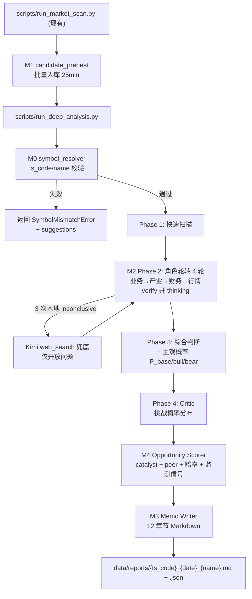

# P3.5 数据先行 + LLM 策略修正 + 输出形态升级 Design

**版本**：v1.0
**日期**：2026-05-18
**作者**：组织智能体（主会话）
**状态**：Draft → 待用户 review

## 0. 一句话目标

把 hypothesis_engine 从"拿到数据用不上 + 输出 JSON 字段集合"升级为"知识库预热充分 + LLM 用对工具 + 输出 IC Memo + 给出可执行机会识别"，覆盖前序 P3 plan 未实现内容，新增数据层和 LLM 策略修正。

## 1. 背景与诊断

### 1.1 上一版 P3 plan 状态

P3 plan（`c:\Users\18401\.cursor\plans\research-memo-and-opportunity-scorer_6f033c94.plan.md`）14 个 todos 全部未实现。所有应建的文件（symbol_resolver.py / market_behavior.py / peer_comparison.py / memo_writer.py / catalyst_scorer.py / risk_reward.py / signal_monitor.py / data/reports/ 等）一个都不存在。

### 1.2 实际事故现场（鼎龙股份 300054 + 20260515）

在 `data/week_20260515_deep_analysis.md` 中：

- 10 只候选股 hypothesis_engine 跑完，单股平均 12 分钟，总 122 分钟
- 文件本身 0 字节（聚合写入失败）
- 鼎龙股份 3 个 verifications 中 2 inconclusive + 1 partially_supported
- 真因：
  - LLM 先调 `search_knowledge` × 4 次全部"未找到"（知识库覆盖不全，近期研报未入库）
  - 调 `fetch_stock_reports` 拿到东海+国信研报摘要（**含光刻胶突破、营收 36.6 亿、毛利率 50.85%、Q1 营收 +23.82% 等关键数据**）
  - **但 LLM 没把这些数据用进 verifications 答案，也没去拉 PDF 全文**
- 同时遗留：`tier_router` 中 `hypothesis_verify = B_recall`（不开 thinking），验证阶段算力不足

### 1.3 根本问题三层


| 层次          | 问题                                                                                  | 优先级 |
| ----------- | ----------------------------------------------------------------------------------- | --- |
| **数据层**     | 知识库覆盖不全，scan 候选股从未深度入库；缺联网兜底                                                        | P0  |
| **LLM 策略层** | 工具优先级错（search 在 fetch 之前）；inconclusive 时不回拉 PDF；verify 不 thinking；单 prompt 多角度注意力稀释 | P0  |
| **输出形态层**   | JSON 字段集合不可读；缺同业/历史股价/赔率/监测信号                                                       | P1  |


P3 plan 仅覆盖输出形态层，遗漏前两层。本 spec 补全。

## 2. 设计决策（与用户对齐）


| #   | 决策点      | 选择                                         | 理由               |
| --- | -------- | ------------------------------------------ | ---------------- |
| 1   | 整合策略     | 废 P3，重写 P3.5                               | P3 没动过，重写不浪费     |
| 2   | M3 架构    | 单 hypothesis_engine + Phase 2 角色轮转（4 轮）    | 单股延时控制在 15-25min |
| 3   | 联网搜索     | 兜底式 + `[from_web]` 标签 + confidence × 0.7   | 防幻觉污染本地证据        |
| 4   | 知识预热     | scan 后自动批量预热                               | 实现简单、阶段清晰        |
| 5   | thinking | 关键阶段开（verify/judge/critic/memo），提供 env 可降级 | verify 是核心瓶颈     |


## 3. 整体架构




## 4. Milestone 拆分（6 个阶段，7.5 周）

### M0 紧急修复（1 周）

**目标**：消除 3 个阻塞性 bug，使现有市场扫描结果直接可用。

#### M0.1 修复 deep_analysis.md 0 字节聚合 bug

- **已定位文件**：`scripts/_compile_top10_report.py`
- **真因 hypothesis**（按概率从高到低）：
  1. main() 中段抛异常（如 `float(adj)` 在某个特殊字段上失败被吞），但 write_text 在异常路径上被跳过；而某次先前运行的失败 truncate 已写入空文件
  2. ctrl-C 中断发生在 write_text 调用前但 IDE 监听到 file change
  3. `summaries` 在某只股全部失败时变空 list（其实不会，因为已经 append 了 header）
- **修复策略**（不依赖具体真因）：
  - 用 atomic write：先写 `{path}.tmp`，成功后 `os.replace` 到目标路径
  - write 前 `assert len(out) > 50`（防空内容）
  - try/except 包住 main()，异常时不 truncate 现有文件且 print 明确错误
  - 添加 `--dry-run` 选项打印到 stdout
- **额外改进**（顺手做）：把 CANDIDATES 列表从 hardcode 改为读 scan 输出（`data/market_scan_{date}.json`），消除"扫一周 → 改 hardcode"的人肉步骤
- **文件**：`scripts/_compile_top10_report.py`（重命名为 `scripts/compile_deep_report.py` 顺便去掉下划线前缀，使其成为正式入口）

#### M0.2 DuckDB 文件锁拆分读写连接池

- **文件**：`src/sandboxes/data/duckdb_store.py`
- **改动**：
  - `_read_connections: dict[str, duckdb.Connection]` — `connect(path, read_only=True)`，可并发持有
  - `_write_connections: dict[str, duckdb.Connection]` — 独占，每次 upsert 完立即 close
  - `query()` / `query_safe()` → 路由到 `_get_read_conn(path)`
  - `upsert()` / `execute()` / `_ensure_table()` → 路由到 `_acquire_write_conn(path)` + finally close
- **风险**：read_only 模式下 DDL 失效。`_ensure_table` 必须走写连接
- **验收**：daily_data_prep 写入同时跑 hypothesis_engine，14 tools 0 失败

#### M0.3 symbol_resolver 入口校验

- **文件**：新建 `src/tools/symbol_resolver.py`
- **接口**：

```python
def validate(ts_code: str, expected_name: str = "") -> dict:
    """
    Returns: {
        "valid": bool,
        "actual_name": str,           # tushare 中该 ts_code 的真实名称
        "suggestions": list[str],     # 当 expected_name 与 actual_name 不匹配时返回模糊推荐
        "error": str                  # 错误说明
    }
    """

def resolve_by_name(name: str) -> list[dict]:
    """模糊查找：'华电辽能' → [{'ts_code': '600396.SH', 'name': '华电辽能'}]"""
```

- **数据源**：tushare `stock_basic` 全市场快照，缓存 DuckDB `stock_basic_cache` 表，月级刷新
- **集成**：`src/harness/hypothesis_engine.py` `run_hypothesis_analysis` 入口第一行调用，不通过直接 raise `SymbolMismatchError` 并把 suggestions 写入 result
- **验收**：误输入 000609.SZ + "华电辽能" 直接拒绝并推荐 600396.SH

#### M0.4 thinking 配置开关

- **文件**：`src/llm_clients/tier_router.py`
- **新增 env**：`KIMI_THINKING_LEVEL` ∈ {`full`, `lite`, `off`}
  - `full`：所有 agent 都按 AGENT_TIER_MAP 原样配置
  - `lite`（默认 P3.5 后）：仅 hypothesis_verify/judge/critic + memo_writer 强制 B_thinking
  - `off`：所有 agent 强制不 thinking，应急快速跑
- **实现**：在 `get_tier_config(agent_name)` 末尾按 env 覆盖

### M1 数据先行（1 周）

**目标**：让 search_knowledge 命中率从 ~10% 提升到 ~80%。

#### M1.1 候选股知识预热协调器

- **文件**：新建 `src/harness/candidate_preheat.py`
- **入口**：

```python
def preheat_candidates(candidate_list: list[dict], output_dir: str) -> dict:
    """
    candidate_list: [{"ts_code": "300054.SZ", "stock_name": "鼎龙股份", "trigger_reason": "..."}, ...]
    Returns: {
        "preheated": [{ts_code, announcement_count, report_count, industry_report_count, elapsed_sec}, ...],
        "failed": [{ts_code, error}, ...]
    }
    """
```

- **入库范围**（每只候选股，含限流规则）：

| 内容 | 数量上限 | 选择规则 | 来源工具 |
|---|---|---|---|
| 近 90 天个股公告 PDF | 最多 30 份 | 优先 `classify_events` 标记为"重大"+ 业绩预告/财报/重大投资；其余按时间倒序 | cninfo_client.query_announcements + fetch_announcement_text |
| 近 30 天个股研报 PDF | 最多 10 份 | 全量（研报量天然有限）| tushare research_report + PDF 下载 |
| 近 30 天所属行业研报 | 最多 20 份 | 按引用频次 + 时间倒序 | tushare research_report by industry |
| 相关政策 | 最多 5 份 | 基于业务关键词从已入库政策表筛选 | DuckDB 已有 policy_content 表查询 |

- **超量保护**：超 30 份公告时，prompt 中标注"已截断，请用 search_announcements 工具二次精确检索"
- **单股超时**：超过 5 分钟自动跳过（防 PDF 下载卡死阻塞整批）
- **失败策略**：单条入库失败 try/except + log，不阻塞批量
- **进度日志**：`data/preheat_{date}.log`（每只股完成时间、入库条数、失败原因）
- **复用**：`cninfo_client.query_announcements/fetch_announcement_text` / `knowledge_store.ingest_*` / `tushare_client.get_research_report` / `tushare_client.get_npr`

#### M1.2 scan → preheat → deep_analysis 流水线

- **入口脚本**：新建 `scripts/run_weekly_pipeline.py`（替代手动跑 _run_week_scan + _run_batch_top10 + _compile_top10_report 三步）
- **流程**：(1) 调 scan 输出候选池 JSON → (2) `preheat_candidates(候选池)` 同步阻塞 → (3) 调 batch deep_analysis → (4) 调 `compile_deep_report.py` 聚合 markdown
- **断点续跑**：每步完成写 marker 文件 `data/.pipeline_{step}_{date}.ok`，重跑时跳过已完成步骤
- **CLI 参数**：`--start-date YYYYMMDD --end-date YYYYMMDD --skip-preheat`（用于已预热过的批次）

#### M1.3 知识库增量去重

- **文件**：`src/sandboxes/data/knowledge_store.py` 改动
- **避免重复入库**：ingest 前检查 `(ts_code, title, ann_date)` 是否已存在；存在则跳过
- **存储成本估算**：10 只候选股 × 90 天公告（平均 20 份/股）× 平均 5KB 文本 ≈ 10MB embedding 数据，可控

### M2 LLM 策略修正（1 周）

**目标**：让 LLM 用对工具，inconclusive 比例从 ~70% 压到 ~30%。

#### M2.1 Phase 2 角色轮转（详细规格）

##### M2.1.1 整体执行流程

```
现有 Phase 2 (单一 prompt, 一次 LLM 调用循环 N 轮 tool_call)
                ↓ 重构
新 Phase 2 (单 LLM session, 顺序 4 轮，每轮独立 system prompt 切换)
  ├─ Round 1: business 角色   → key_facts_business + data_gaps_business
  ├─ Round 2: industry 角色   → key_facts_industry + data_gaps_industry
  ├─ Round 3: financial 角色  → key_facts_financial + data_gaps_financial
  └─ Round 4: market 角色     → key_facts_market + data_gaps_market
                ↓
组装 verifications（基于 4 个 role_sections + Phase 1 假设）
```

- **不拆 4 个独立 LLM client**：仅 1 个 KimiSync 实例 + 1 段 message history
- **轮间切换**：每轮开始前，向 messages 追加 `system` 角色消息切换身份；不重启 LLM session
- **轮内仍有 tool_call 循环**：每轮内允许 LLM 调 5 次工具（可配置）回答本角色问题
- **共享 context**：上轮的 tool_call 结果保留在 messages 中，但每轮结束时由 `_compress_phase2_history` 把 tool_call 结果压缩成 1-2 行 summary

##### M2.1.2 四个角色的明确规格

每个角色的"任务 / 工具子集 / 输入 / 输出"如下表：

###### Role 1: Business Researcher

| 项 | 内容 |
|---|---|
| **任务（要回答的问题）** | (1) 公司主营构成（5 年变迁）(2) 关键产品 / 产能 / 客户结构 (3) 近 90 天重大公告（投资、合同、股权变动） (4) 业务突变率（新业务占比变化） |
| **可用工具子集** | `get_mainbiz_detail`, `search_announcements`, `fetch_announcement_content`, `classify_events`, `search_knowledge`（兜底） |
| **禁用工具** | `get_industry_chain` / `find_stocks_in_chain`（产业链工具留给 industry 角色） |
| **输入** | Phase 1 result + 假设描述 |
| **输出 schema** | ```json {"key_products": [{"name", "revenue_share", "growth_yoy"}], "customer_structure": str, "recent_announcements": [{"date", "title", "type", "summary"}], "business_change_score": "0-5（5=剧变）", "evidence": [str], "data_gaps": [str]}``` |
| **prompt 文件** | `src/agents/prompts/phase2_role_business.md` |
| **预期工具调用数** | 3-6 次 |

###### Role 2: Industry Researcher

| 项 | 内容 |
|---|---|
| **任务（要回答的问题）** | (1) 行业定位（CR5/CR10、市场份额）(2) 上下游产业链 (3) 主要竞争对手（含技术路线对比）(4) 政策环境与产业趋势 |
| **可用工具子集** | `search_reports_by_industry`, `get_industry_chain`, `find_stocks_in_chain`, `search_policy_content`, `search_news`, `web_search`（兜底，仅"行业格局/技术路线/政策"开放问题）|
| **禁用工具** | `web_search` 查公司私有信息（产能/客户/良率/订单） |
| **输入** | Phase 1 result + business 角色输出 |
| **输出 schema** | ```json {"industry_position": {"market_share": str, "rank": int}, "value_chain_upstream": [str], "value_chain_downstream": [str], "competitors": [{"name", "tech_route", "share"}], "tech_route_analysis": str, "policy_env": str, "evidence": [str], "data_gaps": [str]}``` |
| **prompt 文件** | `src/agents/prompts/phase2_role_industry.md` |
| **预期工具调用数** | 3-6 次 |

###### Role 3: Financial Analyst

| 项 | 内容 |
|---|---|
| **任务（要回答的问题）** | (1) 5 年营收 / 净利 / 毛利率 / 净利率 / ROE 趋势 (2) 现金流质量（经营/投资/筹资）(3) 资产负债结构（资产负债率、商誉占比）(4) 关键比率（应收周转、存货周转）(5) 估值水平（PE/PB 历史分位） |
| **可用工具子集** | `get_financial_history`（新工具，M3.1.5 新增）, `fetch_stock_reports`, `fetch_announcement_content`（年报/季报）, `search_knowledge`（兜底） |
| **禁用工具** | `web_search`（财务数据必须用 tushare 权威源） |
| **输入** | Phase 1 result + business 输出（用于关联业务变化与财务表现） |
| **输出 schema** | ```json {"revenue_trend_5y": [{"year", "value", "yoy"}], "profit_trend_5y": [{"year", "value", "yoy"}], "margin_trend_5y": {"gross_margin": [float], "net_margin": [float], "roe": [float]}, "cashflow_quality": {"ocf_to_net_profit_ratio": float, "narrative": str}, "key_ratios": dict, "valuation": {"pe_ttm": float, "pe_percentile_1y": float, "pe_percentile_5y": float, "pb": float}, "evidence": [str], "data_gaps": [str]}``` |
| **prompt 文件** | `src/agents/prompts/phase2_role_financial.md` |
| **预期工具调用数** | 2-4 次（财务数据集中度高） |

###### Role 4: Market Behavior Analyst

| 项 | 内容 |
|---|---|
| **特殊设计** | 此角色 **70% 数据由代码生成（M3.1）**，LLM 只做 narrative 包装，不允许 tool_call |
| **任务（要回答的问题）** | (1) 1 年股价走势位置（顶部 / 中部 / 底部）(2) 近期动量（30D/90D 涨跌幅）(3) 北向资金流向 (4) 龙虎榜异动 (5) 板块对比 (6) 关键事件日股价反应 |
| **可用工具子集** | **不允许调用工具**（数据预先由 `market_behavior.fetch_market_behavior` 注入到 prompt） |
| **输入** | Phase 1 + 前 3 个 role 的输出 + `market_behavior.fetch_market_behavior(ts_code, trade_date)` 的完整指标 dict |
| **输出 schema** | ```json {"price_action": {"position_in_1y": "top|mid|bottom", "return_30d", "return_90d"}, "momentum": str, "capital_flow": {"northbound_30d_net": float, "dragon_list_appearances": int}, "peer_index_perf": dict, "key_event_reactions": [{"date", "event", "return_t_plus_3"}], "narrative": str, "evidence": [str], "data_gaps": [str]}``` |
| **prompt 文件** | `src/agents/prompts/phase2_role_market.md` |
| **预期工具调用数** | 0（数据预注入） |

##### M2.1.3 verifications 装配

4 轮跑完后，**追加第 5 步装配 verifications**：

- 把 Phase 1 假设中的每个 question 与 4 个 role_sections 的 evidence 做 mapping
- 装配时 LLM 调用 1 次（共享 session），用专门 prompt（`src/agents/prompts/phase2_synthesizer.md` 新建）
- 装配 prompt 强制要求：
  - 每个 verification 必须引用至少 1 条 `[from role:X]` 的 evidence
  - 仍 inconclusive 的 verification 触发 M2.3 硬规则

##### M2.1.4 输出结构

```json
{
  "verifications": [
    {"question": "光刻胶是否通过验证", "verdict": "supported", "evidence": "[from business] 一公告披露 X 通过 ...", "confidence": 0.7}
  ],
  "role_sections": {
    "business":  {... 详见 Role 1 schema},
    "industry":  {... 详见 Role 2 schema},
    "financial": {... 详见 Role 3 schema},
    "market":    {... 详见 Role 4 schema}
  },
  "tool_calls_made": [...]
}
```

##### M2.1.5 文件清单（M2.1 共新建 5 个 prompt + 改 1 个代码）

- 新建 `src/agents/prompts/phase2_role_business.md`
- 新建 `src/agents/prompts/phase2_role_industry.md`
- 新建 `src/agents/prompts/phase2_role_financial.md`
- 新建 `src/agents/prompts/phase2_role_market.md`
- 新建 `src/agents/prompts/phase2_synthesizer.md`（M2.1.3）
- 改 `src/harness/hypothesis_engine.py`：拆 `_run_phase2` → `_run_phase2_role(role_name)` × 4 + `_run_phase2_synthesize()`

##### M2.1.6 工期与单股延时估算

- 每个角色：1 次 LLM 推理（带 thinking）+ 3-6 次 tool_call ≈ 3-5 分钟
- 4 个角色串行：12-20 分钟
- 装配 + 压缩：1 分钟
- **单股 Phase 2 总时长：13-21 分钟**（vs 现状 ~8 分钟，+5-13 分钟换质量）
- 全链路单股：preheat（已完成）→ Phase1 (1min) → Phase2 (15min) → Phase3 (3min) → Critic (2min) → Memo (3min) = **24 分钟**
- 10 股 batch：25min 预热 + 240min 分析 = **265 分钟（约 4.5 小时）**

#### M2.2 工具优先级修正

- **改 phase2 prompt 工具调用策略章节**：

```
工具使用优先级（严格执行）：
1. 先调 fetch_announcement_content / fetch_stock_reports / search_reports_by_industry
   （这些工具返回完整摘要或全文）
2. 把上述返回结果中的关键数据写入答案
3. 上述工具完整摘要中仍缺数据时，才用 search_knowledge 做语义检索补充
4. 严禁直接以"search_knowledge 未找到"作为 inconclusive 理由
5. inconclusive 前必须确认已调用 fetch_announcement_content 拉过 PDF 全文
```

#### M2.3 inconclusive 硬规则（代码兜底）

- **文件**：`hypothesis_engine.py` 改 `_run_phase2` 末段
- **触发时机**：M2.1.3 synthesizer 装配 verifications 完成后立即触发
- **关键词提取算法**（无需 LLM，确定性）：
  - 取 verification 的 question 字段
  - 用 jieba 分词 → 过滤停用词 → 取长度 ≥ 2 的名词 / 专有名词 → 取 top 3 IDF 高词
  - 与 ts_code 拼成检索 query
- **逻辑**：
  - 解析 LLM 返回的 verifications
  - 对每个 verdict == "inconclusive" 的问题：
    1. 检查 tool_calls_made 是否调用过 `fetch_announcement_content`
    2. 没调用过 → 自动追加一次 `fetch_announcement_content(query=关键词, ts_code=ts_code)`，把返回结果作为 user message 追加 → 让 LLM 重新评估该问题（单次 LLM call）
    3. 调用过仍 inconclusive → 触发 M2.5 联网兜底分支（受 env `KIMI_WEB_SEARCH_ENABLE` 控制）
    4. 仍 inconclusive → 保留 inconclusive 但在 evidence 中明确写"已尝试 fetch_announcement + web_search 仍无数据"
- **重新评估次数**：每个 inconclusive question 最多 1 次重新评估（避免无限循环）

#### M2.4 hypothesis_verify 升 tier

- **文件**：`src/llm_clients/tier_router.py`
- **改动**：`"hypothesis_verify": "B_thinking"`（原 B_recall）
- 受 M0.4 的 `KIMI_THINKING_LEVEL` env 影响（off 时仍可降级）

#### M2.5 Kimi 联网搜索兜底

- **文件**：新建 `src/tools/web_search.py`
- **接入方式**（参考 https://platform.kimi.com/docs/guide/use-web-search）：
  - Kimi 提供 builtin tool `$web_search`，通过在 chat completion 的 `tools` 参数中加入 `{"type": "builtin_function", "function": {"name": "$web_search"}}` 启用
  - 由 Kimi 内部完成搜索 + 摘要，返回 tool_result 含 `search_results: [{title, url, snippet}]`
  - **不需要外部 SearchAPI/Tavily**，避免额外凭证
- **本地工具封装**：

```python
def web_search(query: str, allowed_domains: list[str] = None, max_results: int = 5) -> list[dict]:
    """
    本地包装层：
    1. 调 Kimi $web_search builtin tool
    2. 过滤结果，仅保留 url 命中 allowed_domains 的条目
    3. 给每条 snippet 加 [from_web] 前缀
    4. Returns: [{"title", "url", "snippet": "[from_web] ...", "from_web": True, "confidence_multiplier": 0.7}, ...]
    """
```

- **接入位置**：在 `src/tools/agent_tools.py` 工具注册表中加入 `web_search`，但默认 disabled
- **激活机制**：
  - 通过 env `KIMI_WEB_SEARCH_ENABLE=1` 全局启用
  - 通过 phase2 prompt 中的可用工具列表控制每个角色的可见性（Role 2 industry 角色可见，其他角色不可见）
- **域名白名单**（开放问题用，硬编码在 `web_search.py` 顶部 `ALLOWED_DOMAINS` 常量）：
  - 财经媒体：caixin.com / xueqiu.com / eastmoney.com / cls.cn / 21jingji.com / wallstreetcn.com
  - 行业研究：semiwiki.com / digitimes.com / 36kr.com / leiphone.com
  - 政策权威：gov.cn / sse.com.cn / szse.cn / csrc.gov.cn
  - 公司官网：仅候选股自身的 IR 站点（通过 stock_basic 字段 `website` 动态加入）
- **触发条件**：仅在 M2.3 的"调用过 fetch + search 仍 inconclusive"分支后才允许
- **结果标记**：返回结果 snippet 前缀 `[from_web]`，并在 verifications 的 evidence 中显式标注
- **置信度处理**：phase3 prompt 中要求，含 from_web 证据的 verification confidence 乘以 0.7
- **prompt 限制**：M2.1 phase2 prompt 明确"web_search 仅用于行业格局、技术路线、政策、宏观信息，禁查公司产能/客户名单/良率/订单等私有信息"
- **缓存**：DuckDB 表 `web_search_cache(query_hash, results_json, fetched_at)`，TTL 7 天

#### M2.6 多轮对话 context 管理

- **观察**：现有 `run_agent_with_tools` 已是多轮，但每轮塞完整 history。当 phase2 角色轮转到第 3 轮时，history 可能超 100K tokens
- **改造**：在 M2.1 角色切换时，把上轮工具结果做 summary 压缩（保留关键数据，丢弃失败 tool_call），减少 context 膨胀
- **文件**：`hypothesis_engine.py` 新增 `_compress_phase2_history(messages, max_tokens)`

### M3 输出形态升级（2 周）

#### M3.0 新工具 `get_financial_history`（M2.1 Role 3 依赖）

- **文件**：扩展 `src/tools/agent_tools.py`
- **入口**：`get_financial_history(ts_code, years=5) -> dict`
- **返回**：5 年的 fina_indicator（roe, gross_margin, net_margin, debt_ratio, ocf_to_net_profit）+ income（revenue, net_profit）+ cashflow（n_cashflow_act）合并为按年的 dict
- **数据源**：DuckDB 已有 `fina_indicator` / `income` / `cashflow` 表（daily_data_prep 已入库）
- **注册到工具表**：让 Role 3 Financial Analyst 可调用

#### M3.1 Market Behavior 数据收集（代码生成，不调 LLM）

- **文件**：新建 `src/agents/market_behavior.py`
- **入口**：`fetch_market_behavior(ts_code, trade_date) -> dict`
- **拉取数据**：
  - 1 年 K 线（`tushare_client.get_daily`）
  - 1 年 daily_basic（用于 PE/PB 历史分位）
  - 近 90 天北向（`hsgt_top10`）
  - 近 90 天龙虎榜（`top_list`）
  - 所属板块指数近 1 年（`index_daily` × 板块代码）
- **计算指标**：
  - `position_in_history`: 当前价格在 1Y 区间的分位（0-100%）
  - `pe_percentile_1y`: PE 历史分位
  - `pe_percentile_5y`: 5Y PE 历史分位（需扩展 daily_basic 历史）
  - `momentum_30d` / `momentum_90d`: 涨跌幅
  - `volume_percentile`: 换手率分位
  - `key_event_reactions`: 关键事件日（公告日/研报日）±3 日股价反应表
  - `peer_index_perf`: 板块指数 30D/90D 涨跌幅

#### M3.2 Peer Comparison

- **文件**：新建 `src/tools/peer_comparison.py`
- **入口**：`find_peers(ts_code, mainbz_keywords, n=5) -> dict`
- **策略**：
  - 用 `industry_map.find_stocks_in_chain` + 同花顺概念板块成员
  - 按市值就近 ±50% 范围取 n 只
  - 拉取每只 peer 的 PE_TTM / PB / 营收增速 / 30D / 90D 涨跌幅 / PE 历史分位
- **输出**：
  - `peers: [{ts_code, name, pe_ttm, pb, revenue_growth_yoy, return_30d, return_90d, pe_percentile_1y}, ...]`
  - `industry_momentum_rating`: 强/中/弱
  - `markdown_table`: 渲染好的 markdown 对比表

#### M3.3 Memo Writer（12 章节，混合策略）

- **文件**：新建 `src/agents/memo_writer.py` + `src/agents/prompts/memo_writer.md`
- **输入**：phase1 + phase2.role_sections + market_behavior + peer_comparison + phase3 + critic + opportunity_scorer
- **混合渲染策略**（避免全靠 LLM 导致格式不稳定）：

| 章节 | 渲染方式 | 数据源 |
|---|---|---|
| 1. Executive Summary | LLM narrative（1 次调用） | 综合所有上游 |
| 2. 标的速览 | 模板填充 | phase1 + financial.valuation |
| 3. 业务结构 | LLM narrative（短）+ 模板表 | business_section |
| 4. 产业逻辑 | LLM narrative | industry_section |
| 5. 财务画像 | LLM narrative（短）+ 模板表 | financial_section |
| 6. 估值 | 模板填充 + LLM narrative（短）| phase3.valuation + peer_comparison |
| 7. 行情与资金面 | 模板填充 | market_behavior（已结构化） |
| 8. 近期催化剂 | 模板填充 | catalyst_scorer.catalysts_list |
| 9. 风险与未解之谜 | 模板填充 | critic + data_gaps 合并 |
| 10. Opportunity Snapshot | 模板填充 | opportunity_snapshot 各字段 |
| 11. 投资建议 | 模板填充 | phase3 + critic |
| 12. 附录 | 模板填充 | tool_calls_made + evidence_pool |

- **LLM 调用总数**：1 次（仅 narrative 章节合成），输出 markdown 片段插入模板
- **模板渲染**：用 Python f-string + jinja2 字符串模板，不引入新依赖
- **输出**：

```markdown
# {stock_name} ({ts_code}) 投资研究 Memo
> 交易日: {trade_date} | 风格: {style} | 数据完整度: {data_completeness}% | 立场: {position_type}({confidence})

## 1. Executive Summary
{一句话立场 + 风格 + 赔率快报 + 关键催化剂 + 最大风险}

## 2. 标的速览
| 项目 | 值 |
|---|---|
| 公司 | {name} |
| 行业 | {industry} |
| 市值 | {market_cap} 亿 |
| PE_TTM / PB | {pe} / {pb} |
| 营收 / 净利 | {revenue} / {net_profit} 亿 |
| 5 年 CAGR | {cagr}% |

## 3. 业务结构与变化
（business section narrative + 5 年主营变迁表 + 突变率）

## 4. 产业逻辑
（industry section narrative + 上下游 + 竞争格局 + 技术路线 + 政策）

## 5. 财务画像
（financial section narrative + 5 年趋势表 + 关键比率 + 现金流）

## 6. 估值
（三场景 + 同业对比表 + 隐含增速 + 主观概率分布 + 期望值）

## 7. 行情与资金面
（market_behavior 渲染：1Y 股价复盘 + 历史分位 + 北向 + 龙虎榜 + 板块对比）

## 8. 近期催化剂
（按 catalyst_strength 排序的事件时间轴）

## 9. 风险与未解之谜
（Critic 5 维度挑战明细 + 数据缺口清单）

## 10. Opportunity Snapshot
| 维度 | 值 |
|---|---|
| 风格 | {style} |
| Catalyst | {catalyst_strength}/5 ({hard/soft 说明}) |
| 当前位置 | PE 历史分位 {pe_percentile}%, 1Y +{return_1y}% |
| 同业 Momentum | {industry_momentum_rating} |
| 赔率 | 上行 +X% × P_bull / 基准 -Y% × P_base / 下行 -Z% × P_bear |
| **期望值** | **{expected_return}%** |
| 监测信号 | (1) [HARD] {desc} (2) [HARD] {desc} (3) [SOFT] {desc} |
| 建议 | {actionable_signal} |

## 11. 投资建议
- position_type: {watch/satellite/core/avoid}
- confidence: {adjusted_confidence}
- upgrade_trigger: {trigger}
- kill_criteria: {criteria}

## 12. 附录
- 证据来源列表
- 工具调用日志（去重精简）
- 数据完整度明细
```

- **数据完整度计算**：每个 section 自评 0-100%，加权平均
- **持久化**：M3.4 中处理

#### M3.4 报告落盘

- **文件**：`src/harness/hypothesis_engine.py` 末尾新增 `_persist_memo`
- **路径**：
  - `data/reports/{ts_code}_{trade_date}_{stock_name}.md`
  - `data/reports/{ts_code}_{trade_date}_{stock_name}.json`
- **同日重跑冲突策略**：
  - 默认 `overwrite`：直接覆盖（适合反复迭代调试）
  - 提供 `archive_on_overwrite=True` 选项：旧版本先移到 `data/reports/archive/{ts_code}_{trade_date}_{stock_name}_{timestamp}.md`，再写新版本
  - CLI 可控：`--keep-versions`/`--overwrite`
- **JSON 字段兼容**：
  - 保留所有现有 `demo_p2_*.json` 字段（hypothesis/evidence_for/valuation/critic_challenges/...）
  - 新增字段：`style` / `style_rationale` / `data_completeness` / `role_sections` / `market_behavior` / `peer_comparison` / `opportunity_snapshot`
- **目录管理**：`data/reports/` 加入 `.gitignore`（仅保留 `.gitkeep`）

### M4 机会识别（2 周）

#### M4.1 Catalyst Strength Scorer（规则引擎主导，LLM 仅做 description 包装）

- **文件**：新建 `src/tools/catalyst_scorer.py`
- **入口**：`score_catalysts(ts_code, trade_date, days=30) -> dict`
- **实现策略**：80% 规则引擎打分（关键词 + 金额阈值 + classify_events 类别） + 20% LLM 包装 description 文本（不影响打分），共调 1 次 LLM
- **评分规则（确定性）**：

| Catalyst 类型 | 强度 | 触发条件（规则引擎判断） | 来源工具 |
|---|---|---|---|
| Hard - 重大投资 / 资产注入 / 重组 | 4-5 | classify_events 标"重大资产重组/对外投资" + 金额 ≥ 营收 20% | search_announcements |
| Hard - 业绩超预期 / 重大合同 / 股权变动 | 4 | classify_events 标 "业绩快报/重大合同/股权变动" + 金额或同比 ≥ 30% | classify_events + announcement |
| Hard - 业绩预告（翻倍 / 扭亏）| 3 | forecast_vip 字段 p_change_min ≥ 100% 或 type ∈ {扭亏,续亏} | get_forecast_vip |
| Soft - 券商集中增持评级（≥2 家 7 天内）| 2 | research_report 同一 ts_code 7 天内 ≥ 2 家不同机构评级"买入" | get_report_rating |
| Soft - 政策利好 / 题材热度 | 1-2 | policy_content 命中行业关键词，或同花顺概念板块 7 天涨幅 > 10% | search_policy + 板块涨跌 |
| Soft - 单家研报 / 普通新闻 | 1 | 兜底 | search_reports |

- **最终 catalyst_strength**：所有命中条目的 **max**（不累加，避免虚高）
- **输出**：

```json
{
  "catalyst_strength": 4,
  "catalysts_list": [
    {"type": "hard", "strength": 4, "date": "2026-05-12",
     "description": "1.89 亿元投资扩产 InP 产线（占 2025 营收 28%）",
     "source_tool": "search_announcements", "raw_title": "..."}
  ],
  "narrative": "近 30 天 1 hard + 1 soft 催化剂"
}
```

#### M4.2 Risk/Reward Calculator + Phase 3 概率注入

- **文件**：新建 `src/tools/risk_reward.py` + 改 `src/agents/prompts/hypothesis_phase3.md`
- **Phase 3 prompt 新增要求**：

```
在 valuation 的 base/bull/bear 三场景外，额外给出主观概率分布：
{
  "probability": {
    "base": 0.5,
    "bull": 0.3,
    "bear": 0.2,
    "rationale": "明确解释为何这样分布，须引用前序证据"
  }
}
约束：和必须等于 1.0；不允许 base 概率小于 0.3；偏离 base 50% 须有理由
```

- **risk_reward 计算函数**：

```python
def compute_risk_reward(valuation: dict, current_mv: float) -> dict:
    """
    valuation: phase3 的 valuation 字段（含 base/bull/bear 各场景 fair_value_mv + probability）
    Returns: {
        "expected_return": float,  # Σ P_i × (fair_value_i / current - 1)
        "max_drawdown_risk": float,  # P_bear × bear_return（始终为负）
        "upside_potential": float,   # P_bull × bull_return
        "asymmetry": str             # "对称" | "偏上" | "偏下"
    }
    """
```

- **Critic 新增挑战维度**（改 `prompts/hypothesis_critic.md`）："概率分布合理性" — 挑战 P_bull/P_bear 是否系统性乐观/悲观

#### M4.3 Monitoring Signal Extractor

- **文件**：新建 `src/tools/signal_monitor.py` + `src/agents/prompts/monitoring_signal_extractor.md`
- **入口**：`extract_signals(upgrade_trigger: str, kill_criteria: str, ts_code: str) -> list[dict]`
- **输出 schema**：

```json
[
  {
    "id": "yunnan_h1_compound_revenue",
    "description": "2026 H1 化合物半导体营收同比增速 > 50%",
    "type": "fundamental | announcement | northbound | dragon_list | price | peer",
    "metric": "化合物半导体_营收_同比增速",
    "threshold_op": "> | < | == | >=",
    "threshold_value": 0.5,
    "data_source": "fina_mainbz",
    "next_check_date": "2026-08-31",
    "weight": "hard | soft"
  }
]
```

- **数量要求**：每个 case 输出 ≥ 3 条（混合 hard + soft）
- **暂不接 daily_runner 自动监测**（留给 Phase D）

#### M4.4 Opportunity Snapshot 渲染

- 在 M3.3 memo_writer 的第 10 章节渲染上述所有字段
- 渲染逻辑直接代码生成（不调 LLM），保证格式稳定

### M5 集成验收（0.5 周）

#### M5.1 4 个金标准 case 端到端测试


| Case                           | trade_date | 验收项                                                           |
| ------------------------------ | ---------- | ------------------------------------------------------------- |
| 鼎龙股份 300054.SZ                 | 20260515   | 3 verifications 中 inconclusive ≤ 1；search_knowledge 命中率 ≥ 60% |
| 云南锗业 002428.SZ                 | 20260407   | IC Memo 12 章节齐全；catalyst ≥ 4；监测信号 ≥ 3；期望值显示                   |
| 金山股份 600396.SH                 | 20260309   | DuckDB 锁修复后 14 tools 0 失败；β/α 拆解清晰；peer 含华电国际                 |
| 华电辽能错位 000609.SZ + name="华电辽能" | 任意         | symbol_resolver 直接拒绝 + 推荐 600396.SH                           |


#### M5.2 文档与经验沉淀

- 更新 `docs/product_overview.md` 章节 4.3/4.5/8（新增 preheat / 角色轮转 / IC Memo / Opportunity Snapshot 说明）
- 新增 `docs/research_memo_format.md`（12 章节规范 + 字段定义 + 样例）
- 追加 `docs/learnings.md`（M0-M5 全程经验，重点：DuckDB 读写连接陷阱、Kimi web_search 域名白名单实战、角色轮转 context 压缩策略）

## 5. 文件结构清单

### 新建（9 个代码 + 7 个 prompt + 1 个新脚本 + 1 个目录 + 1 个文档）

```
src/tools/                              共 6 个
  symbol_resolver.py            M0.3
  web_search.py                 M2.5
  peer_comparison.py            M3.2
  catalyst_scorer.py            M4.1
  risk_reward.py                M4.2
  signal_monitor.py             M4.3

src/harness/                            共 1 个
  candidate_preheat.py          M1.1

src/agents/                             共 2 个
  market_behavior.py            M3.1 (纯代码，不调 LLM)
  memo_writer.py                M3.3

src/agents/prompts/                     共 7 个
  phase2_role_business.md       M2.1.2
  phase2_role_industry.md       M2.1.2
  phase2_role_financial.md      M2.1.2
  phase2_role_market.md         M2.1.2
  phase2_synthesizer.md         M2.1.3 (verifications 装配)
  memo_writer.md                M3.3
  monitoring_signal_extractor.md M4.3

scripts/                                共 1 个新脚本
  run_weekly_pipeline.py        M1.2 (scan + preheat + analyze + compile 一体化)

docs/                                   共 1 个
  research_memo_format.md       M5.2

data/                                   共 1 个目录
  reports/                      M3.4 (gitignore)
```

### 改动（8 个）

```
src/sandboxes/data/duckdb_store.py    M0.2 (读写连接池)
src/sandboxes/data/knowledge_store.py  M1.3 (增量去重)
src/llm_clients/tier_router.py         M0.4 + M2.4
src/harness/hypothesis_engine.py       M0.3 集成 + M2.1 角色轮转 + M2.3 硬规则 + M2.6 context 压缩 + M3.4 持久化
src/tools/agent_tools.py               M3.0 新增 get_financial_history + M2.5 注册 web_search
src/agents/prompts/hypothesis_phase3.md M4.2 (主观概率)
src/agents/prompts/hypothesis_critic.md M4.2 (概率挑战)
scripts/_compile_top10_report.py       M0.1 修聚合 (重命名为 compile_deep_report.py)
```

### 文档（3 个 + 1 个追加）

```
docs/product_overview.md          更新 (M5.2)
docs/research_memo_format.md      新建 (M5.2)
docs/learnings.md                 追加 (全程)
```

## 6. 关键设计原则

1. **数据先于策略**：M1 完成才动 M2，确保 LLM 第一次 search_knowledge 命中率高
2. **单 LLM session 共享 context**：角色轮转避免重复启动开销；Context 超长时主动 summary 压缩
3. **联网兜底有边界**：白名单域名 + 仅开放问题 + 标签 + 置信度衰减
4. **thinking 可降级**：env 配置应急关闭
5. **JSON + Markdown 双输出**：JSON 程序追溯（向后兼容），Markdown 人类可读
6. **失败不阻塞**：单股入库/分析失败 try/except，不影响 batch
7. **进度可观察**：preheat 和 deep_analysis 都有详细日志文件
8. **研究员定位**：不输出"建仓 X%"指令；只给赔率 + 监测信号 + 升级条件

## 7. 风险与缓解


| 风险                                           | 概率  | 影响            | 缓解                                   |
| -------------------------------------------- | --- | ------------- | ------------------------------------ |
| Phase 2 角色轮转 context 膨胀超 100K tokens         | 中   | LLM 推理变慢/失败   | M2.6 主动 summary 压缩                   |
| Kimi web_search 频率限制                         | 低   | 兜底失败          | 加 retry + 缓存搜索结果到 DuckDB 表           |
| 知识预热单股耗时不稳定（10s ~ 5min）                      | 高   | batch 总时长不可预测 | 单股超 3 分钟超时跳过 + 记录                    |
| LLM 主观概率虚高                                   | 中   | 期望值失真         | Critic 显式挑战概率分布                      |
| DuckDB read_only 模式破坏现有 DDL                  | 中   | 旧测试失败         | M0.2 强制 _ensure_table 走写连接；全量回归      |
| Memo 内容被 prompt injection 污染（公告含恶意 markdown） | 低   | 输出污染          | memo_writer 输出前对 ``` 等敏感字符做转义        |
| 角色轮转每轮独立判断导致逻辑割裂                             | 中   | 矛盾结论          | phase3 综合时强制要求一致性检查                  |
| token 成本上升                                   | 高   | 月成本翻倍         | thinking lite/off 应急；后续 batch API 优化 |


## 8. 验收标准

### 各 Milestone 独立验收（按 M0 → M5 顺序）

- **M0**: 误输入 case 被拒绝；DuckDB 同时读写不冲突；KIMI_THINKING_LEVEL env 三档可切换；scan 聚合文件 > 0 字节
- **M1**: 跑一次 candidate_preheat(10 候选股) 完成 ≥ 25 分钟内；每股入库公告 ≥ 5 份、研报 ≥ 3 份；search_knowledge **命中率从 ~10% → ≥ 70%**（命中率定义见下）
- **M2**: 鼎龙股份 case 重跑后 verifications inconclusive ≤ 1；web_search 兜底实际被触发 + 标签正确显示
- **M3**: 云南锗业产出完整 12 章节 markdown memo；JSON 字段向后兼容现有测试
- **M4**: 4 case 全部产出 Opportunity Snapshot；catalyst/赔率/监测信号字段齐全
- **M5**: 4 case 端到端通过；docs 更新；learnings 沉淀 ≥ 10 条新经验

### search_knowledge 命中率定义（M1 验收口径）

```
命中率 = (返回 results.length > 0 的 search_knowledge 调用数) / (总 search_knowledge 调用数)
```

- 在 hypothesis_engine 中加 metric 收集，写入 result 的 `metrics.search_knowledge_hit_rate`
- 单股汇总后再算 10 股平均

### 主观验收（用户视角）

- 让 3 个用户分别读 DeepSeek 直接输出 vs 本系统 Memo（同股票同日），本系统胜出 ≥ 2 票

## 9. 不做的事

- ❌ 不接 daily_runner 自动监测（M4.3 只做提取，自动监测留 Phase D）
- ❌ 不重写 hypothesis_engine 主流程（增量扩展）
- ❌ 不引入新 LLM 客户端（仍用 Kimi K2.6 + OpenAI 兼容接口）
- ❌ 不接技术指标（MACD/RSI/布林）— Phase D
- ❌ 不接 L2 数据 — 不在能力范围
- ❌ 不做组合优化 — 单股研究
- ❌ 不给"建仓 X%"明确指令 — 研究员定位
- ❌ 不接入模拟交易（paper_trading 不动）

## 10. 与现有计划的关系

- 本 spec 完全替代 `c:\Users\18401\.cursor\plans\research-memo-and-opportunity-scorer_6f033c94.plan.md`（P3 plan）
- 本 spec 完全替代项目根目录 `投资研究Memo与机会识别_P3.plan.md`
- 本 spec 是对 `a股投资agent系统计划_83544566_V2.plan.md` Phase 2 假设驱动模式的产品化升级
- 本 spec 不影响 V2 计划中 Phase 3（模拟盘）/ Phase 4（迭代）

## 11. Phase D 候选（不在本 spec 范围）

如果 P3.5 验收通过后继续增强：

1. **监测信号自动检测**：daily_runner 每日扫描 watchlist 所有 stock 的 monitoring_signals，触发后 handoff 通知
2. **事件回测数据库**：统计 A 股历史"重大公告类"事件的 T+5/T+10/T+30 胜率，给 catalyst 评分加历史先验
3. **技术指标补全**：Market Behavior 加 MACD/RSI/突破/缠论分型
4. **组合优化**：跨多只 watchlist 股票做风险平价 / 仓位分配建议
5. **Kimi Batch API 异步化**：preheat 和 phase2 角色轮转都走 batch，10 股延时从 5h → 1.5h
6. **多 agent 真并行**：异步化后再考虑拆 4 独立研究员 agent

## 12. 协同开发规范（遵循 .cursor/rules/orchestrator.mdc）

- 主会话：只做任务拆分、派发、审查
- 每个子任务派 generalPurpose 执行 + code-reviewer 审查
- 执行智能体 prompt 必含：任务描述（完整文本） + 文件结构 + 约束 + 读 docs/learnings.md + 报告格式
- 凭证：tushare token / Kimi API key 只在 .env
- 每个 milestone 完成必追加 docs/learnings.md

